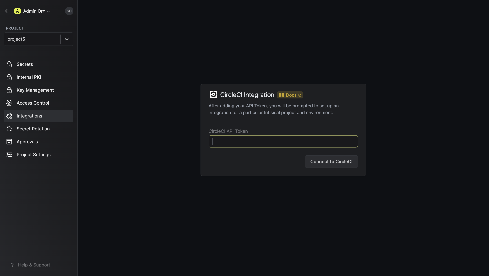
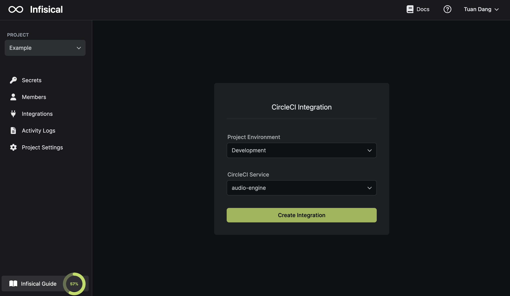
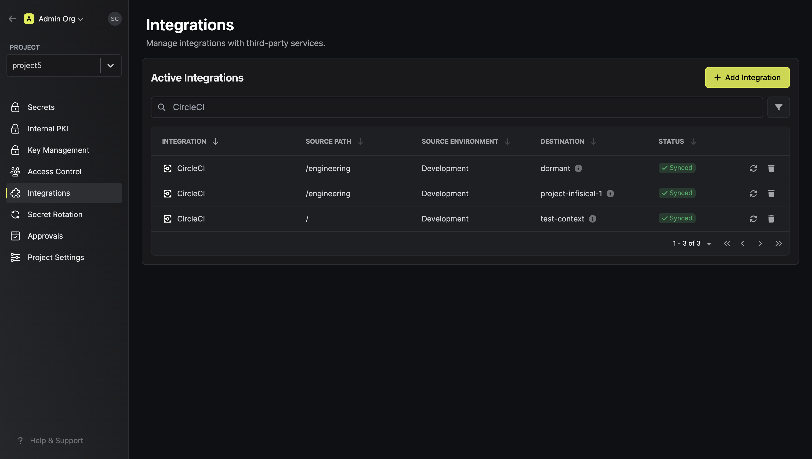

Prerequisites:

- Set up and add envars to [Infisical Cloud](https://app.infisical.com)

<Steps>
  <Step title="Authorize Infisical for CircleCI">
    Obtain an API token in User Settings > Personal API Tokens

    

    Navigate to your project's integrations tab in Infisical.

    

    Press on the CircleCI tile and input your CircleCI API token to grant Infisical access to your CircleCI account.

    

  </Step>
  <Step title="Start integration">
    Select which Infisical environment secrets you want to sync to which CircleCI project and press create integration to start syncing secrets to CircleCI.

    
    
  </Step>
</Steps>