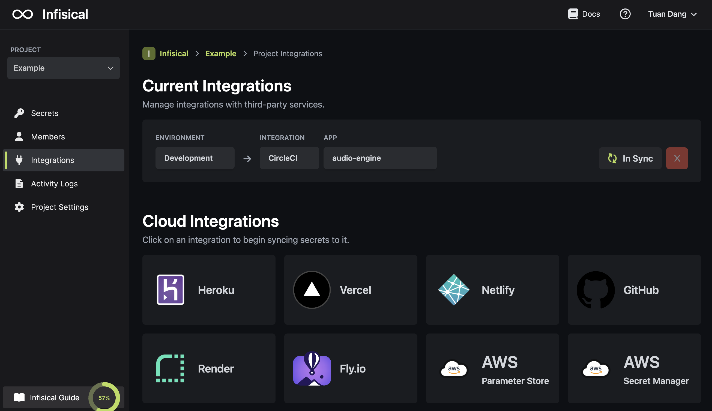

Prerequisites:

- Set up and add envars to [Infisical Cloud](https://app.infisical.com)

## Navigate to your project's integrations tab

## Authorize Infisical for CircleCI

Obtain an API token in User Settings > Personal API Tokens

Press on the CircleCI tile and input your CircleCI API token to grant Infisical access to your CircleCI account.

<Info>
  If this is your project's first cloud integration, then you'll have to grant
  Infisical access to your project's environment variables. Although this step
  breaks E2EE, it's necessary for Infisical to sync the environment variables to
  the cloud platform.
</Info>

## Start integration

Select which Infisical environment secrets you want to sync to which CircleCI project and press create integration to start syncing secrets to CircleCI.

