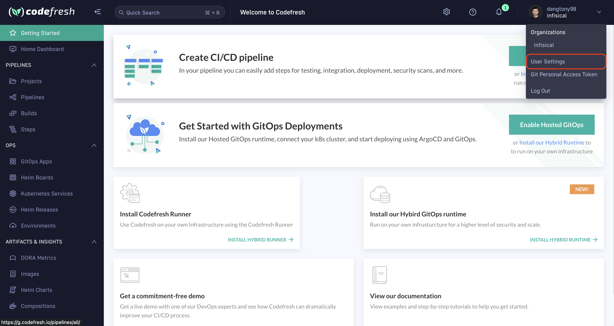
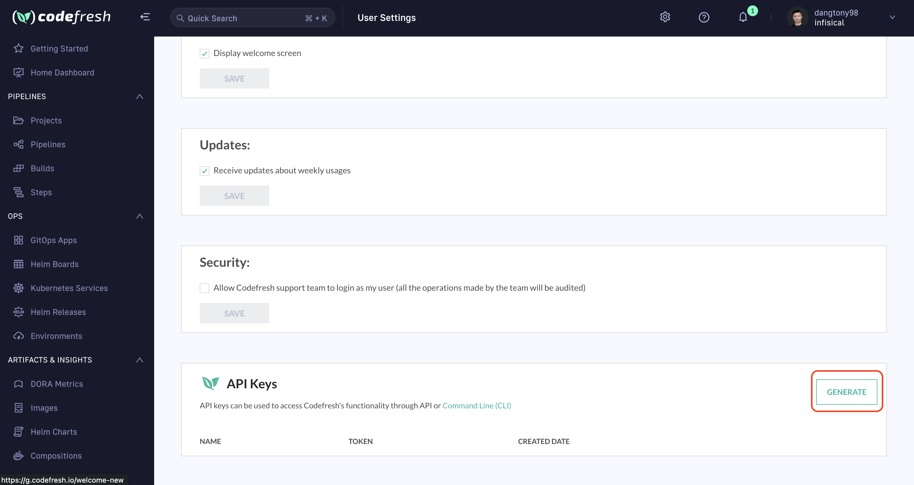
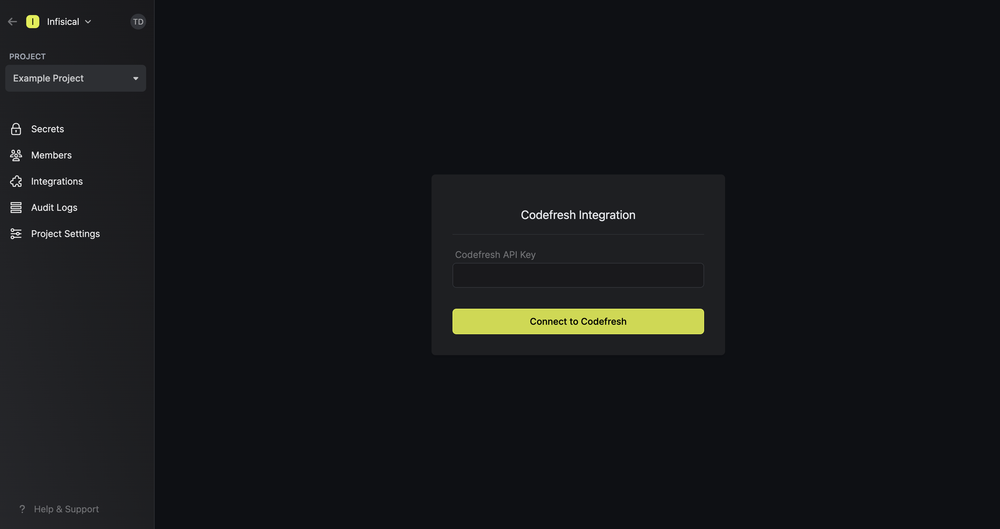
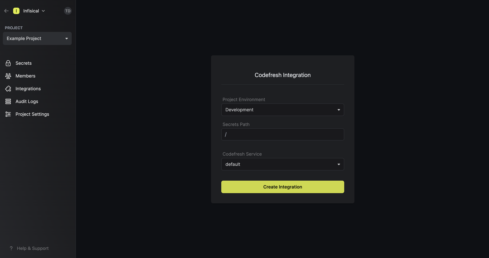

Prerequisites:

- Set up and add envars to [Infisical Cloud](https://app.infisical.com)

<Steps>
  <Step title="Authorize Infisical for Codefresh">
    Obtain an API key in User Settings > API Keys

    
    
    
    Navigate to your project's integrations tab in Infisical.

    
    
    Press on the Codefresh tile and input your Codefresh API key to grant Infisical access to your Codefresh account.

    

  </Step>
  <Step title="Start integration">
    Select which Infisical environment secrets you want to sync to which Codefresh service and press create integration to start syncing secrets to Codefresh.

    
    
  </Step>
</Steps>