<Note>
  Alternatively, you can use Infisical's official GitHub Action
  [here](https://github.com/Infisical/secrets-action).
</Note>

Infisical lets you sync secrets to GitHub at the organization-level, repository-level, and repository environment-level.

## Connecting with GitHub App (Recommended)

<Tabs>
  <Tab title="Usage">
    <Steps>
      <Step title="Authorize GitHub Infisical App">
        Navigate to your project's integrations tab in Infisical and press on the GitHub tile.

        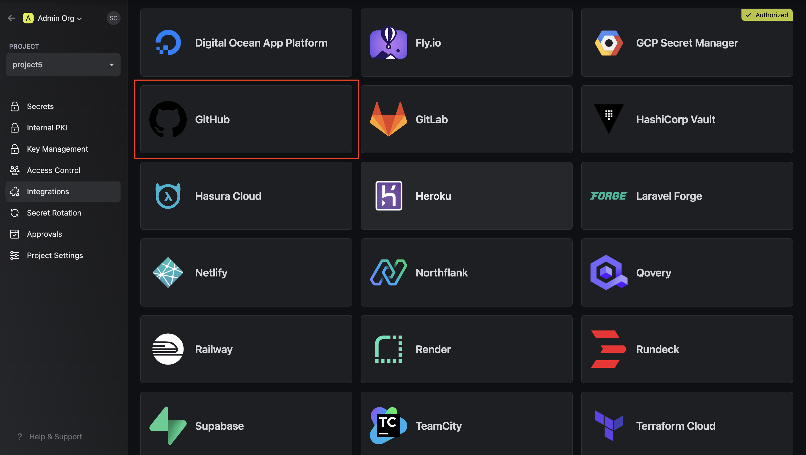

        Select GitHub App as the authentication method and click **Connect to GitHub**.

        

        You will then be redirected to the GitHub app installation page.

        

        Install and authorize the GitHub application. This will redirect you back to the Infisical integration page.

      </Step>
      <Step title="Configure Infisical GitHub integration">
        Select which Infisical environment secrets you want to sync to which GitHub organization, repository, or repository environment.

        <Tabs>
          <Tab title="Repository">
            
          </Tab>
          <Tab title="Organization">
            

            When using the organization scope, your secrets will be saved in the top-level of your GitHub Organization.

            You can choose the visibility, which defines which repositories can access the secrets. The options are:
            - **All public repositories**: All public repositories in the organization can access the secrets.
            - **All private repositories**: All private repositories in the organization can access the secrets.
            - **Selected repositories**: Only the selected repositories can access the secrets. This gives a more fine-grained control over which repositories can access the secrets. You can select _both_ private and public repositories with this option.
          </Tab>
          <Tab title="Repository Environment">
          
          </Tab>
        </Tabs>

        Finally, press create integration to start syncing secrets to GitHub.

        
      </Step>
    </Steps>

  </Tab>
  <Tab title="Self-Hosted Setup">
    Using the GitHub integration with app authentication on a self-hosted instance of Infisical requires configuring an application on GitHub
    and registering your instance with it.
    <Steps>
      <Step title="Create an application on GitHub">
        Navigate to the GitHub app settings [here](https://github.com/settings/apps). Click **New GitHub App**.
        
        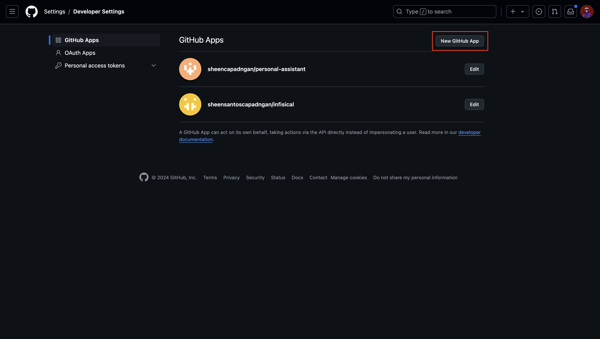

        Give the application a name, a homepage URL (your self-hosted domain i.e. `https://your-domain.com`), and a callback URL (i.e. `https://your-domain.com/integrations/github/oauth2/callback`).

        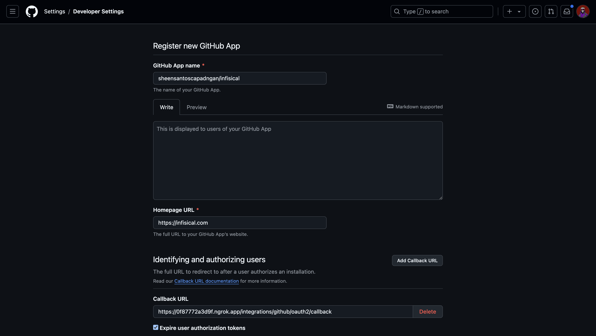

        Enable request user authorization during app installation.
        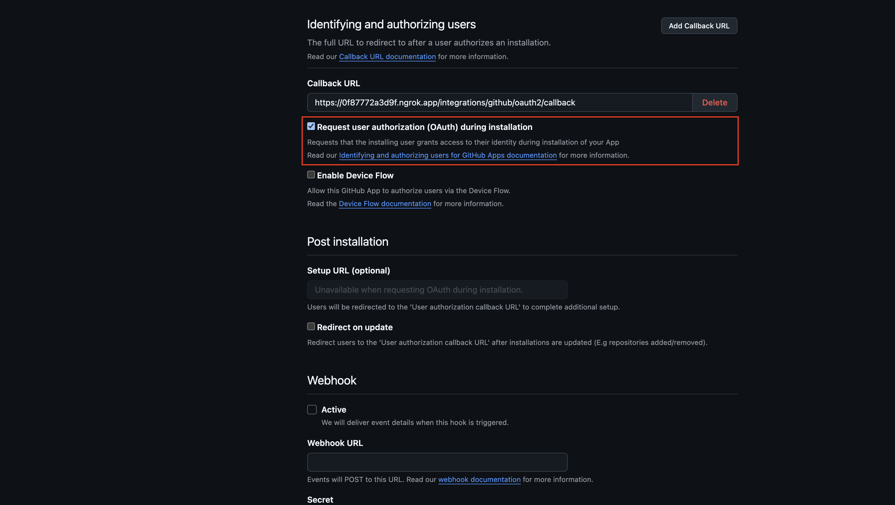

        Disable webhook by unchecking the Active checkbox.
        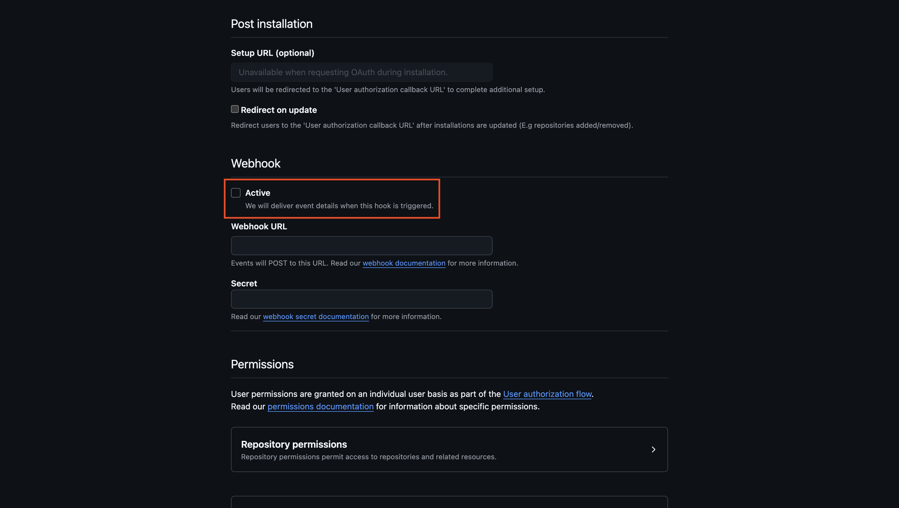

        Set the repository permissions as follows: Metadata: Read-only, Secrets: Read and write, Environments: Read and write, Actions: Read.
        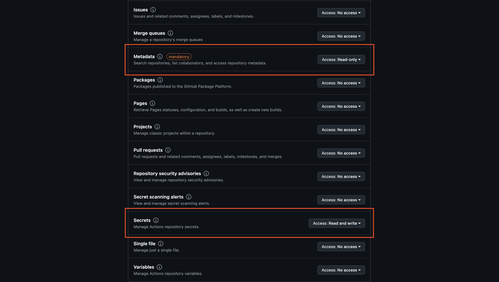

        Similarly, set the organization permissions as follows: Secrets: Read and write.
        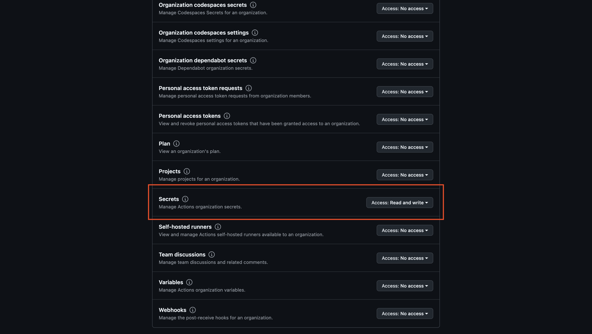

        Create the Github application.
        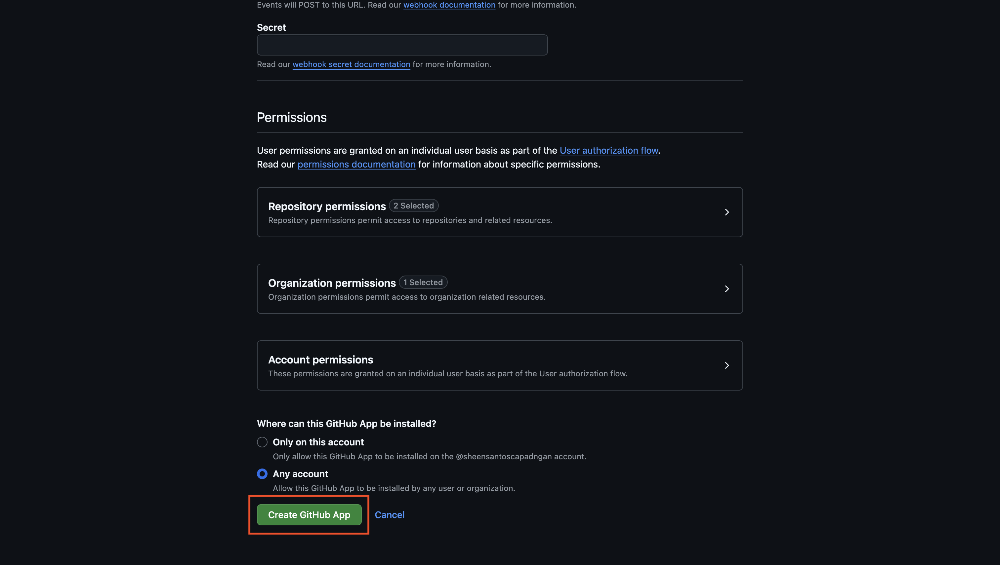

        <Note>
          If you have a GitHub organization, you can create an application under it
          in your organization Settings > Developer settings > GitHub Apps > New GitHub App.
        </Note>
      </Step>
      <Step title="Add your application credentials to Infisical">
        Generate a new **Client Secret** for your GitHub application.
        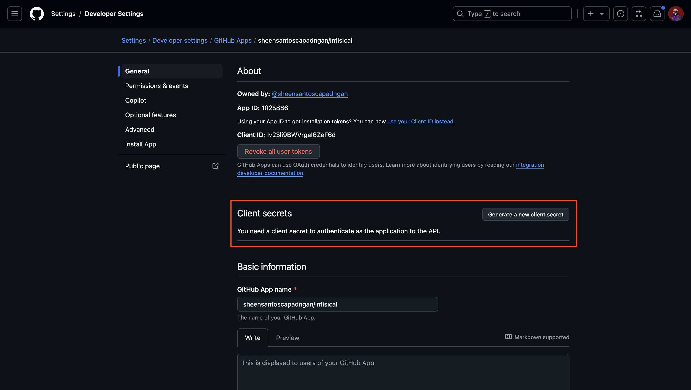

        Generate a new **Private Key** for your Github application.
        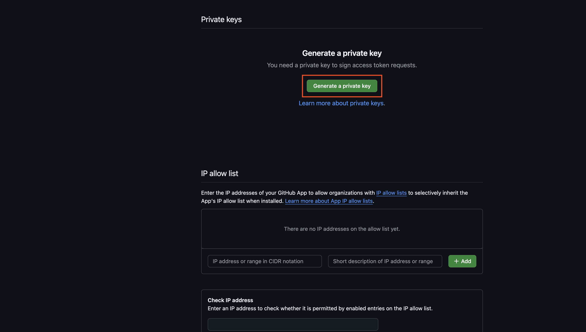

        Obtain the necessary Github application credentials. This would be the application slug, client ID, app ID, client secret, and private key.
        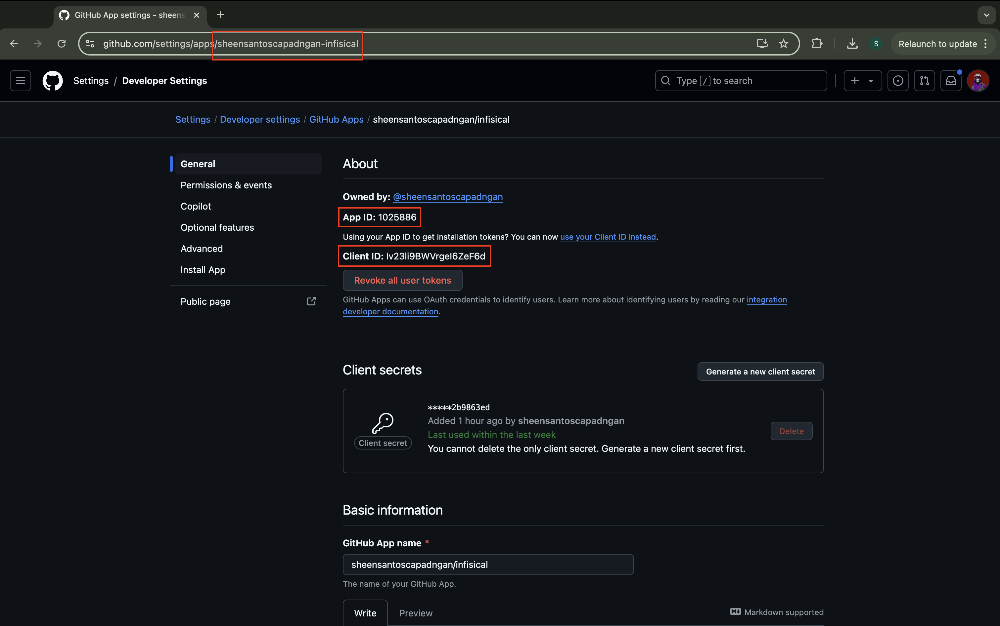

        Back in your Infisical instance, add the five new environment variables for the credentials of your GitHub application:

        - `CLIENT_ID_GITHUB_APP`: The **Client ID** of your GitHub application.
        - `CLIENT_SECRET_GITHUB_APP`: The **Client Secret** of your GitHub application.
        - `CLIENT_SLUG_GITHUB_APP`: The **Slug** of your GitHub application. This is the one found in the URL.
        - `CLIENT_APP_ID_GITHUB_APP`: The **App ID** of your GitHub application.
        - `CLIENT_PRIVATE_KEY_GITHUB_APP`: The **Private Key** of your GitHub application.

        Once added, restart your Infisical instance and use the GitHub integration via app authentication.
      </Step>
    </Steps>

  </Tab>
</Tabs>

## Connecting with GitHub OAuth

Prerequisites:

- Set up and add envars to [Infisical Cloud](https://app.infisical.com)
- Ensure that you have admin privileges to the repository you want to sync secrets to.

<Tabs>
  <Tab title="Usage">
    <Steps>
      <Step title="Authorize Infisical for GitHub">
        Navigate to your project's integrations tab in Infisical and press on the GitHub tile.
        

        Select OAuth as the authentication method and click **Connect to GitHub**.
        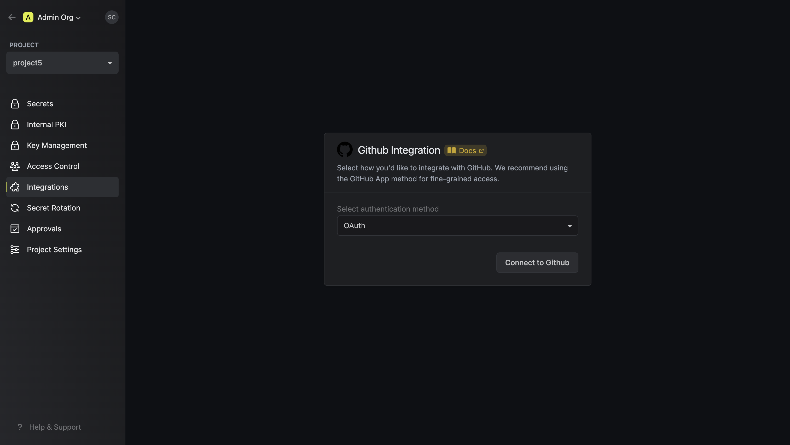

        Grant Infisical access to your GitHub account (organization and repo privileges).
        

      </Step>
      <Step title="Configure Infisical GitHub integration">
        Select which Infisical environment secrets you want to sync to which GitHub organization, repository, or repository environment.

        <Tabs>
          <Tab title="Repository">
            
          </Tab>
          <Tab title="Organization">
            

            When using the organization scope, your secrets will be saved in the top-level of your GitHub Organization.

            You can choose the visibility, which defines which repositories can access the secrets. The options are:
            - **All public repositories**: All public repositories in the organization can access the secrets.
            - **All private repositories**: All private repositories in the organization can access the secrets.
            - **Selected repositories**: Only the selected repositories can access the secrets. This gives a more fine-grained control over which repositories can access the secrets. You can select _both_ private and public repositories with this option.
          </Tab>
          <Tab title="Repository Environment">
          
          </Tab>
        </Tabs>

        Finally, press create integration to start syncing secrets to GitHub.

        
      </Step>
    </Steps>

  </Tab>
  <Tab title="Self-Hosted Setup">
    Using the GitHub integration on a self-hosted instance of Infisical requires configuring an OAuth application in GitHub
    and registering your instance with it.
    <Steps>
      <Step title="Create an OAuth application in GitHub">
        Navigate to your user Settings > Developer settings > OAuth Apps to create a new GitHub OAuth application.
        
         
         
        

        Create the OAuth application. As part of the form, set the **Homepage URL** to your self-hosted domain `https://your-domain.com`
        and the **Authorization callback URL** to `https://your-domain.com/integrations/github/oauth2/callback`.

        

        <Note>
          If you have a GitHub organization, you can create an OAuth application under it
          in your organization Settings > Developer settings > OAuth Apps > New Org OAuth App.
        </Note>
      </Step>
      <Step title="Add your OAuth application credentials to Infisical">
        Obtain the **Client ID** and generate a new **Client Secret** for your GitHub OAuth application.

        

        Back in your Infisical instance, add two new environment variables for the credentials of your GitHub OAuth application:

        - `CLIENT_ID_GITHUB`: The **Client ID** of your GitHub OAuth application.
        - `CLIENT_SECRET_GITHUB`: The **Client Secret** of your GitHub OAuth application.

        Once added, restart your Infisical instance and use the GitHub integration.
      </Step>
    </Steps>

  </Tab>
</Tabs>
