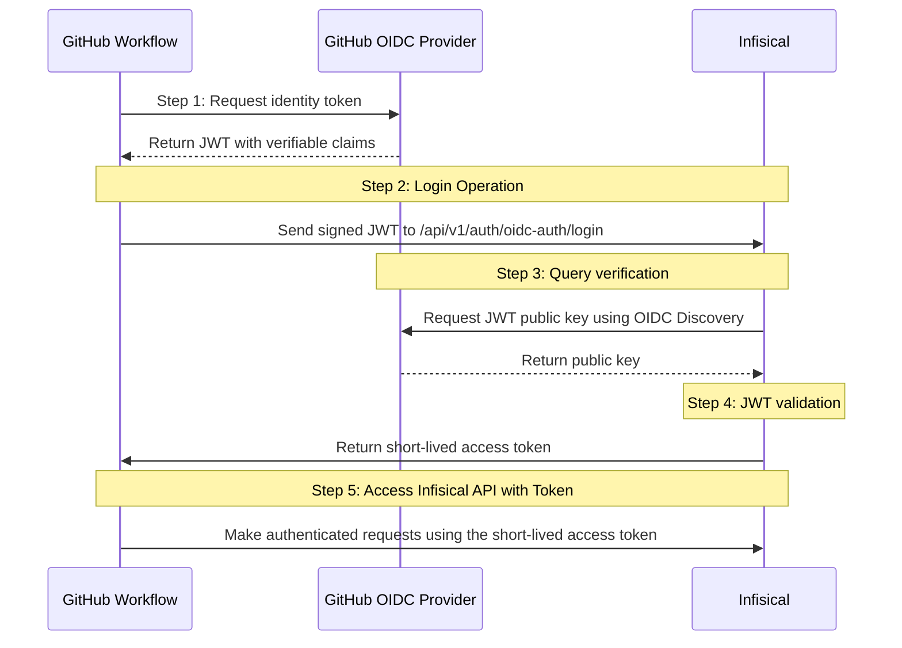

<Note>
  For syncing secrets **from Infisical to GitHub** (one-way sync to GitHub Secrets), use our 
  [GitHub Secret Syncs](../secret-syncs/github) instead.
</Note>

## Concept

The [Infisical Secrets Action](https://github.com/Infisical/secrets-action) enables GitHub Actions workflows to fetch secrets from Infisical at runtime using [OpenID Connect (OIDC)](/documentation/platform/identities/oidc-auth/github) authentication with [machine identities](/documentation/platform/identities/machine-identities).

Instead of storing long-lived credentials in GitHub Secrets, workflows authenticate to Infisical using short-lived OIDC tokens issued by GitHub. This eliminates the need for static API keys or tokens while providing fine-grained access control based on repository, workflow, and execution context.

Secrets are fetched dynamically during workflow execution and exposed as environment variables, existing only for the lifetime of the job. This approach centralizes secret management in Infisical while maintaining security through identity-based authentication.

The short video below provides a guided overview of using Infisical with GitHub Actions and OIDC authentication, helping you build the right mental model before diving into the diagram and setup steps.

<iframe
  width="560"
  height="315"
  src="https://www.youtube.com/embed/9PQmd_aoRWA"
  title="YouTube video player"
  frameborder="0"
  allow="accelerometer; autoplay; clipboard-write; encrypted-media; gyroscope; picture-in-picture; web-share"
  allowfullscreen
></iframe>


## Diagram

The following sequence diagram illustrates the OIDC authentication workflow. The authentication flow is the same for all OIDC providers; for GitHub Actions, the client is a GitHub workflow and the identity provider is GitHub's OIDC service.



<Note>
  In GitHub Actions, the [Infisical Secrets Action](https://github.com/Infisical/secrets-action) handles steps 1-2 and 5, automatically fetching secrets after authentication and injecting them as environment variables into your workflow.
</Note>

## Workflow

A typical workflow for using Infisical with GitHub Actions consists of the following steps:

1. Create a [machine identity](/documentation/platform/identities/machine-identities) in Infisical with OIDC authentication configured for your GitHub repository and workflow context.
2. Add the machine identity to your Infisical project with appropriate permissions to access the required secrets.
3. Configure your GitHub Actions workflow to use the [Infisical Secrets Action](https://github.com/Infisical/secrets-action) with OIDC authentication.
4. The workflow authenticates using GitHub's OIDC token, fetches secrets from Infisical, and exposes them as environment variables for the duration of the job.

## How It Works

GitHub Actions uses [OpenID Connect (OIDC)](/documentation/platform/identities/oidc-auth/github) to authenticate workflows without storing long-lived credentials.

At a high level, the flow looks like this:

1. **GitHub Issues an [OIDC Token](https://docs.github.com/en/actions/concepts/security/openid-connect)**  
   When a workflow starts, GitHub issues a short-lived OIDC token containing identity claims about the repository, workflow, and execution context.

2. **Workflow Presents Its Identity**  
   The [Infisical Secrets Action](https://github.com/Infisical/secrets-action) sends this token to Infisical as proof of the workflow’s identity.

3. **Infisical Verifies Trust**  
   Infisical validates the token signature using GitHub’s OIDC provider and checks the token’s subject, audience, and claims against the configured [machine identity](/documentation/platform/identities/machine-identities).

4. **Secrets Are Issued at Runtime**  
   If the identity matches, Infisical issues a short-lived access token. The action then uses this token to fetch only the secrets the identity is authorized to access for the requested project and environment.

Secrets are exposed to the workflow as environment variables and exist only for the lifetime of the job.

## Prerequisites

Before you begin, ensure you have:

- An [Infisical project](/documentation/platform/project) ([Infisical Cloud](https://app.infisical.com) or [self-hosted instance](/self-hosting/overview))
- Secrets stored in your Infisical project
- A GitHub repository with Actions enabled

## Guide

In the following steps, we explore how to configure GitHub Actions to authenticate with Infisical using OIDC and fetch secrets at runtime.

<Steps>
  <Step title="Configure secrets in Infisical">
    Ensure the secrets your workflow needs are stored in your Infisical project and environment (e.g., `dev`, `staging`, `prod`).

    For example, a pipeline that builds and pushes a Docker image might require:

    - `DOCKER_USERNAME`
    - `DOCKER_PASSWORD`

    <Note>
      Secrets are scoped to an environment. Ensure they exist in the environment your workflow will access.
    </Note>
  </Step>
  <Step title="Create a machine identity with OIDC authentication">
    A [machine identity](/documentation/platform/identities/machine-identities) represents a non-human workload (such as a CI/CD pipeline, server, or automated job) and defines what that workload is authorized to access without being tied to a user account.

    To create a machine identity with OIDC authentication:

    1. Navigate to your project in Infisical
    2. Go to your project > **Access Control** > **Machine Identities**
    3. Click **Add Machine Identity to Project**
    4. Provide a name for the identity (e.g., `github-actions-workflow`)
    5. Select an organization-level role that defines what the identity can access
    6. Click **Create**

    By default, the identity will be configured with [Universal Auth](/documentation/platform/identities/universal-auth). For CI/CD workflows, we want to avoid long-lived credentials, so we'll switch to OIDC authentication.
  </Step>
  <Step title="Configure OIDC authentication">
    1. Click on your machine identity 
    2. Remove the default Universal Auth configuration
    3. Click **Add auth method** and select **OIDC Auth**

    Configure the following fields:

    - **OIDC Discovery URL**: `https://token.actions.githubusercontent.com`
    - **Issuer**: `https://token.actions.githubusercontent.com`
    - **CA Certificate**: Leave blank for GitHub Actions
    - **Subject**: The expected principal that is the subject of the JWT. The format is:
      ```
      repo:<owner>/<repo>:<context>
      ```
      
      For example:
      - `repo:octocat/example-repo:ref:refs/heads/main` (specific branch)
      - `repo:octocat/example-repo:environment:production` (specific environment)
      - `repo:octocat/example-repo:*` (any context in the repository)
      
      <Tip>
        If you're unsure about the exact subject format, you can use [github/actions-oidc-debugger](https://github.com/github/actions-oidc-debugger) to inspect the OIDC token claims from your workflow.
      </Tip>

    - **Audiences**: A list of intended recipients. Set this to your GitHub organization URL, for example: `https://github.com/octo-org`
    - **Claims**: (Optional) Additional attributes that should be present in the JWT. Refer to GitHub's [OIDC token documentation](https://docs.github.com/en/actions/deployment/security-hardening-your-deployments/about-security-hardening-with-openid-connect#understanding-the-oidc-token) for supported claims.

    <Warning>
      Restrict access by configuring the Subject, Audiences, and Claims fields carefully. The Subject, Audiences, and Claims fields support glob pattern matching, but we highly recommend using hardcoded values whenever possible for better security.
    </Warning>

    <Info>
      Together, the Subject and Audience settings make the trust relationship explicit. Only workflows that match the repository, context, and audience you've defined will be able to authenticate and fetch secrets.
    </Info>
  </Step>
  <Step title="Add identity to project">
    To enable the identity to access project-level resources (like secrets), add it to your project:

    1. In your project, go to **Access Control** > **Machine Identities**
    2. Click **Add identity**
    3. Select the identity you created
    4. Choose a project-level role that determines what project resources this identity can access
    5. Click **Add identity**
  </Step>
  <Step title="Copy the identity ID">
    After configuring OIDC authentication, Infisical provides an **Identity ID**. This is what you'll reference in your GitHub Actions workflow.

    Copy this value — you'll need it in the next step.

    <Note>
      The Identity ID is **not a secret**. It's a public identifier that's safe to commit directly into your workflow YAML files.
    </Note>
  </Step>
</Steps>

## Configure GitHub Actions Workflow

Now let's configure your GitHub Actions workflow to fetch secrets from Infisical.

### Basic Workflow Example

Create or update a workflow file in `.github/workflows/` (e.g., `.github/workflows/infisical-demo.yml`):

```yaml
name: Build and Push Docker Image

on:
  workflow_dispatch:  # Manual trigger for testing

permissions:
  id-token: write  # Required for OIDC authentication
  contents: read   # Required for checking out code

jobs:
  build:
    runs-on: ubuntu-latest
    steps:
      - name: Checkout code
        uses: actions/checkout@v4

      - name: Fetch secrets from Infisical
        uses: Infisical/secrets-action@v1.0.9
        with:
          method: "oidc"
          identity-id: "your-identity-id-here"  # From Step 5
          project-slug: "your-project-slug"      # Your Infisical project slug
          env-slug: "dev"                        # Your environment slug

      - name: Login to Docker Registry
        run: |
          echo "$DOCKER_PASSWORD" | docker login -u "$DOCKER_USERNAME" --password-stdin

      - name: Build and push Docker image
        run: |
          docker build -t my-image:latest .
          docker push my-image:latest
```

### Key Configuration Points

**Permissions Block**: The `id-token: write` permission is **required** for OIDC authentication. Without it, GitHub won't issue an OIDC token for the workflow run.

**Infisical Secrets Action**: The [Infisical Secrets Action](https://github.com/Infisical/secrets-action) step handles:
- Requesting the OIDC token from GitHub
- Authenticating with Infisical using OIDC
- Fetching secrets for the specified project and environment
- Injecting secrets as environment variables

**Action Parameters**:
- `method: "oidc"` - Specifies OIDC authentication
- `identity-id` - The machine identity ID from Infisical (safe to commit)
- `project-slug` - Your Infisical project slug (found in project settings)
- `env-slug` - The environment to fetch secrets from (e.g., `dev`, `staging`, `prod`)

<Note>
This workflow uses OIDC authentication with short-lived tokens. The `identity-id` is a public identifier that can be safely committed to your repository. 
Authentication occurs at runtime using GitHub's OIDC token, eliminating the need to store long-lived credentials.
</Note>


### Using Secrets in Workflows

After the Infisical Secrets Action completes, secrets are available as environment variables for subsequent steps in the job. Reference them using standard environment variable syntax:

```yaml
- name: Run tests with database connection
  run: |
    npm run test -- --database-url="$DATABASE_URL"
```

<Warning>
  Never print full secret values in workflow logs. GitHub Actions will mask secrets automatically, but avoid using `echo $SECRET` or similar commands that expose values.
</Warning>


## Troubleshooting

### Authentication Failures

If authentication fails, check:

1. **Permissions**: Ensure `id-token: write` is set in the workflow permissions
2. **Subject Match**: Verify the Subject in your machine identity matches the repository and context
3. **Audience Match**: Confirm the Audience matches your GitHub organization
4. **Identity Scope**: Ensure the identity has access to the project and environment you're requesting
5. **Project Slug**: Verify the `project-slug` matches your Infisical project slug exactly. You can find this in your project settings.
6. **Environment Slug**: Confirm the `env-slug` matches the exact environment name in Infisical (e.g., `dev`, `staging`, `prod`). Environment slugs are case-sensitive and must match exactly.

### Debugging OIDC Tokens

To inspect OIDC token claims from your workflow, use GitHub's [actions-oidc-debugger](https://github.com/github/actions-oidc-debugger) tool. This tool helps you verify that the token claims match your machine identity configuration.

<Info>
  For more detailed OIDC configuration options and troubleshooting, see [OIDC Auth for GitHub Actions](/documentation/platform/identities/oidc-auth/github).
</Info>

## Alternative Approaches

### GitHub Secret Syncs

If you prefer to **push secrets from Infisical to GitHub** (one-way sync), use [GitHub Secret Syncs](../secret-syncs/github). This approach syncs secrets to GitHub at the organization-level, repository-level, or repository environment-level, making them available as GitHub Secrets.

<Note>
  Secret Syncs push secrets **to** GitHub, while this guide shows how to fetch secrets **from** Infisical at runtime. Choose the approach that best fits your security and operational requirements.
</Note>

## Related Documentation

- [OIDC Auth for GitHub Actions](/documentation/platform/identities/oidc-auth/github) - Detailed OIDC configuration guide
- [Machine Identities Overview](/documentation/platform/identities/machine-identities) - Understanding machine identities
- [GitHub Secret Syncs](../secret-syncs/github) - Syncing secrets to GitHub
- [Infisical Secrets Action](https://github.com/Infisical/secrets-action) - Official GitHub Action repository
