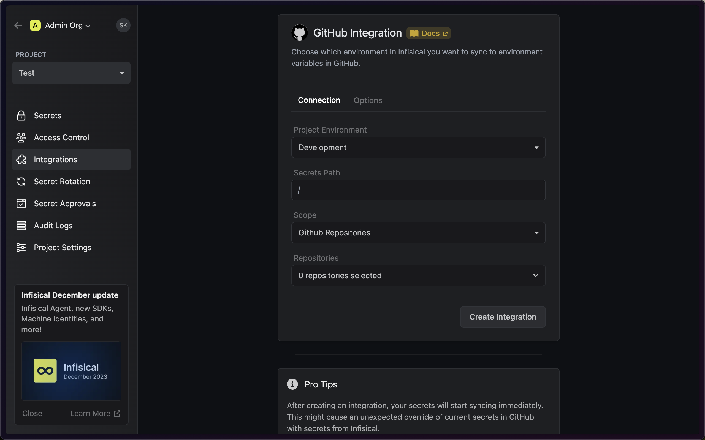
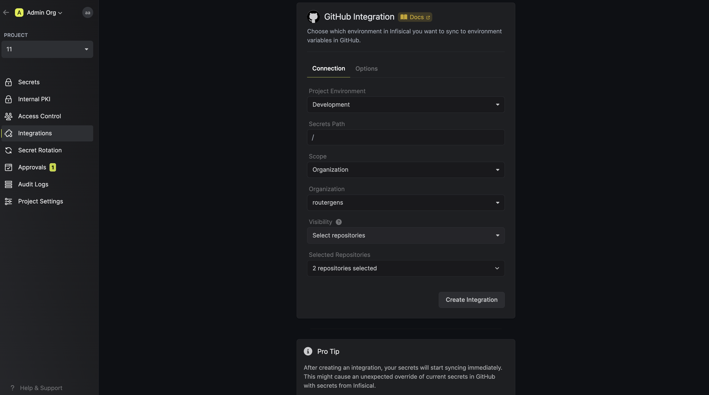
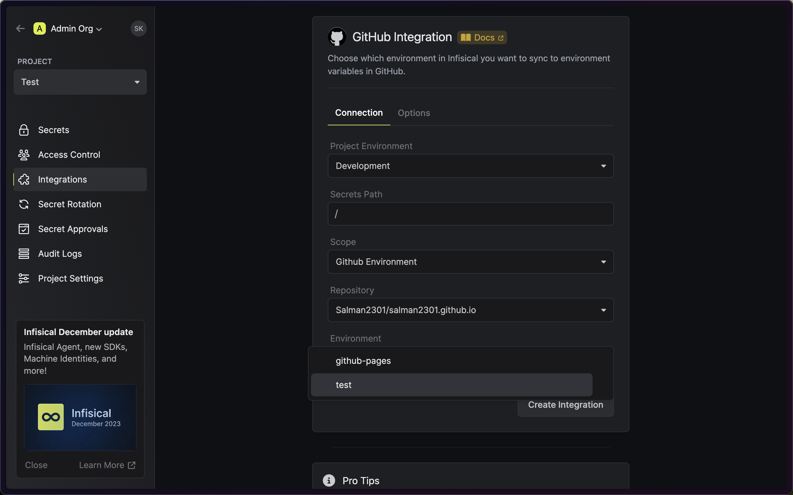
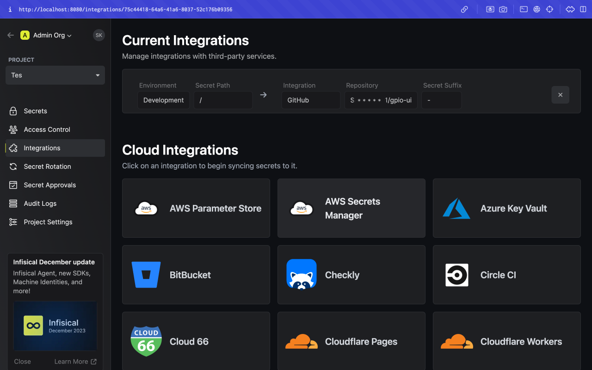

<Note>
  Alternatively, you can use Infisical's official Github Action
  [here](https://github.com/Infisical/secrets-action).
</Note>

Infisical lets you sync secrets to GitHub at the organization-level, repository-level, and repository environment-level.

Prerequisites:

- Set up and add envars to [Infisical Cloud](https://app.infisical.com)
- Ensure that you have admin privileges to the repository you want to sync secrets to.

<Tabs>
  <Tab title="Usage">
    <Steps>
      <Step title="Authorize Infisical for GitHub">
        Navigate to your project's integrations tab in Infisical.

        

        Press on the GitHub tile and grant Infisical access to your GitHub account (repo privileges only).

        

        <Info>
          If this is your project's first cloud integration, then you'll have to grant Infisical access to your project's environment variables.
          Although this step breaks E2EE, it's necessary for Infisical to sync the environment variables to the cloud platform.
        </Info>
      </Step>
      <Step title="Configure Infisical GitHub integration">
        Select which Infisical environment secrets you want to sync to which GitHub organization, repository, or repository environment.

        <Tabs>
          <Tab title="Repository">
            
          </Tab>
          <Tab title="Organization">
            

            When using the organization scope, your secrets will be saved in the top-level of your Github Organization.

            You can choose the visibility, which defines which repositories can access the secrets. The options are:
            - **All public repositories**: All public repositories in the organization can access the secrets.
            - **All private repositories**: All private repositories in the organization can access the secrets.
            - **Selected repositories**: Only the selected repositories can access the secrets. This gives a more fine-grained control over which repositories can access the secrets. You can select _both_ private and public repositories with this option.
          </Tab>
          <Tab title="Repository Environment">
          
          </Tab>
        </Tabs>

        Finally, press create integration to start syncing secrets to GitHub.

        
      </Step>
    </Steps>

  </Tab>
  <Tab title="Self-Hosted Setup">
    Using the GitHub integration on a self-hosted instance of Infisical requires configuring an OAuth application in GitHub
    and registering your instance with it.
    <Steps>
      <Step title="Create an OAuth application in GitHub">
        Navigate to your user Settings > Developer settings > OAuth Apps to create a new GitHub OAuth application.
        
         
         
        

        Create the OAuth application. As part of the form, set the **Homepage URL** to your self-hosted domain `https://your-domain.com`
        and the **Authorization callback URL** to `https://your-domain.com/integrations/github/oauth2/callback`.

        

        <Note>
          If you have a GitHub organization, you can create an OAuth application under it
          in your organization Settings > Developer settings > OAuth Apps > New Org OAuth App.
        </Note>
      </Step>
      <Step title="Add your OAuth application credentials to Infisical">
        Obtain the **Client ID** and generate a new **Client Secret** for your GitHub OAuth application.

        

        Back in your Infisical instance, add two new environment variables for the credentials of your GitHub OAuth application:

        - `CLIENT_ID_GITHUB`: The **Client ID** of your GitHub OAuth application.
        - `CLIENT_SECRET_GITHUB`: The **Client Secret** of your GitHub OAuth application.

        Once added, restart your Infisical instance and use the GitHub integration.
      </Step>
    </Steps>

  </Tab>
</Tabs>
