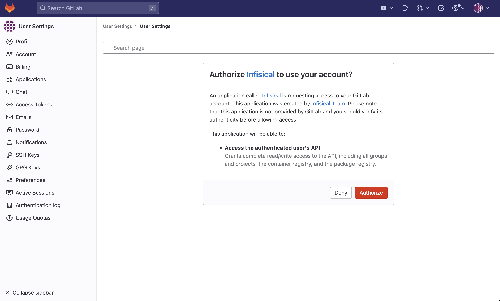
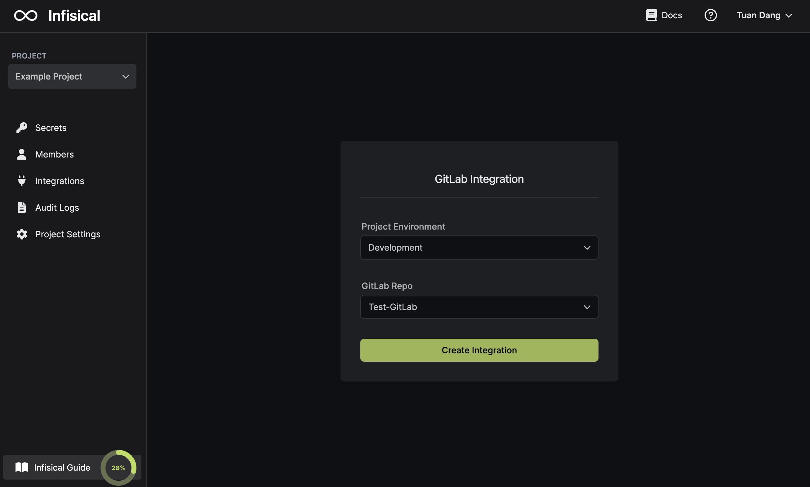

Prerequisites:

- Set up and add envars to [Infisical Cloud](https://app.infisical.com)

<Tabs>
  <Tab title="Standard">
  ## Navigate to your project's integrations tab


## Authorize Infisical for GitLab

Press on the GitLab tile and grant Infisical access to your GitLab account.



<Info>
  If this is your project's first cloud integration, then you'll have to grant
  Infisical access to your project's environment variables. Although this step
  breaks E2EE, it's necessary for Infisical to sync the environment variables to
  the cloud platform.
</Info>
## Start integration

Select which Infisical environment secrets you want to sync to which GitLab repository and press create integration to start syncing secrets to GitLab.




  </Tab>
  <Tab title="Pipeline">

## Generate service token

Generate an [Infisical Token](../../getting-started/dashboard/token) for the specific project and environment in Infisical.

## Set the Infisical Token in Gitlab

Create a new variable called `INFISICAL_TOKEN` with the value set to the token from the previous step in Settings > CI/CD > Variables of your GitLab repository.

## Configure Infisical in your pipeline

Edit your `.gitlab-ci.yml` to include the Infisical CLI installation. This will allow you to use the CLI for fetching and injecting secrets into any script or command within your Gitlab CI/CD process.

#### Example

```yaml
image: ubuntu

stages:
  - build
  - test
  - deploy

build-job:
  stage: build
  script:
    - apt update && apt install -y curl
    - curl -1sLf 'https://dl.cloudsmith.io/public/infisical/infisical-cli/setup.deb.sh' | bash
    - apt-get update && apt-get install -y infisical
    - infisical run -- npm run build
```

  </Tab>
</Tabs>
