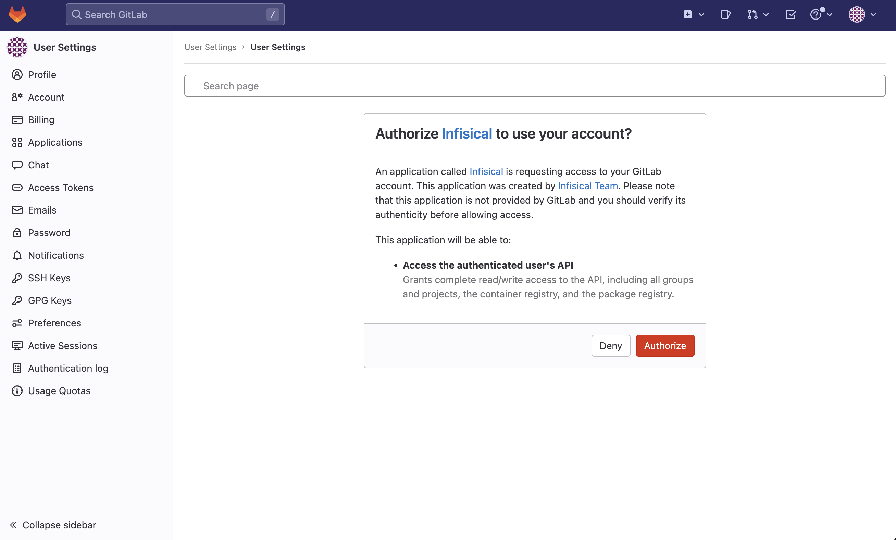
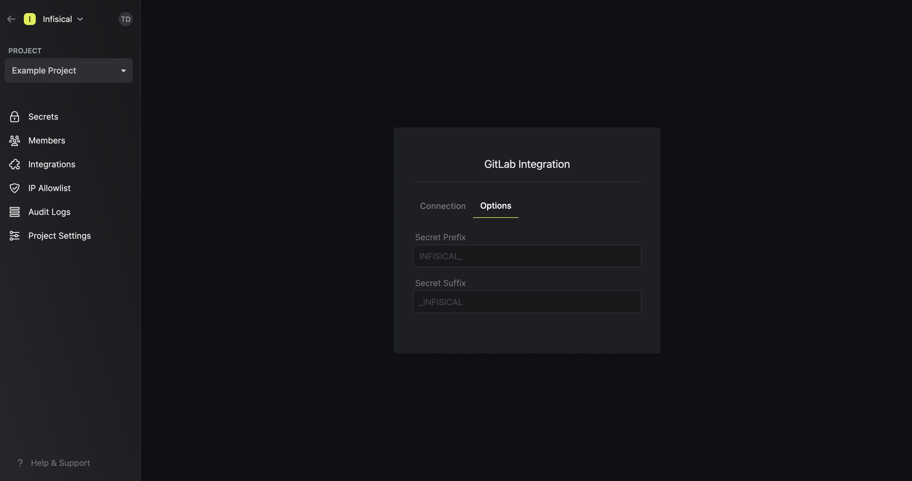
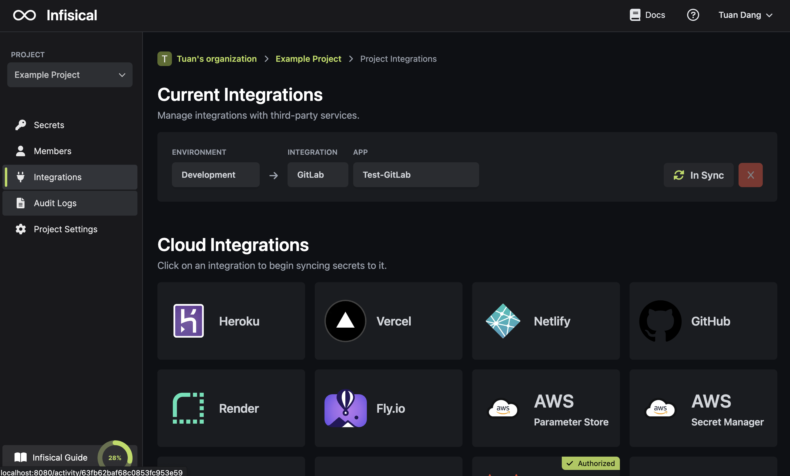
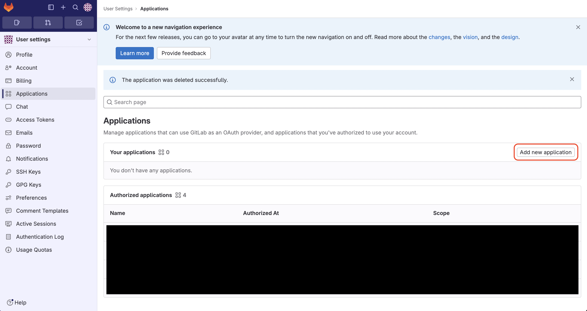
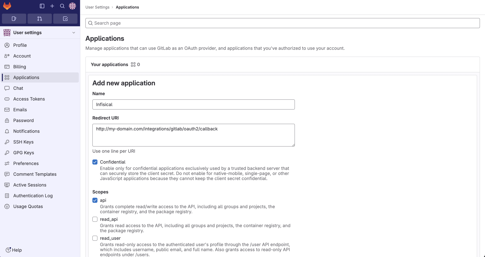
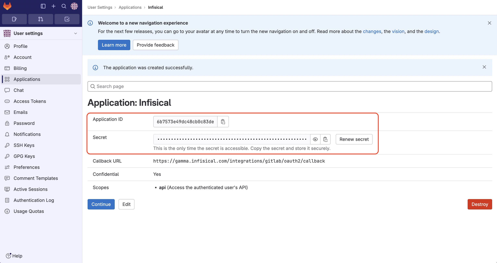

<Tabs>
  <Tab title="Usage">
    Prerequisites:
    - Set up and add envars to [Infisical Cloud](https://app.infisical.com)

    <AccordionGroup>
      <Accordion title="Standard">
        <Steps>
          <Step title="Authorize Infisical for GitLab">
            Navigate to your project's integrations tab in Infisical.

            

            Press on the GitLab tile and grant Infisical access to your GitLab account.

            

          </Step>
          <Step title="Start integration">
            Select which Infisical environment secrets you want to sync to which GitLab repository and press create integration to start syncing secrets to GitLab.

            

            Note that the GitLab integration supports a few options in the **Options** tab:

            - Secret Prefix: If inputted, the prefix is appended to the front of every secret name prior to being synced.
            - Secret Suffix: If inputted, the suffix to appended to the back of every name of every secret prior to being synced.

            Setting a secret prefix or suffix ensures that existing secrets in GitLab are not overwritten during the sync. As part of this process, Infisical abstains from mutating any secrets in GitLab without the specified prefix or suffix.

            

            
          </Step>
        </Steps>
      </Accordion>
      <Accordion title="Pipeline">
        <Steps>
          <Step title="Authorize Infisical for GitLab">
            Generate an [Infisical Token](/documentation/platform/token) for the specific project and environment in Infisical.

            Next, create a new variable called `INFISICAL_TOKEN` with the value set to the token from the previous step in Settings > CI/CD > Variables of your GitLab repository.
          </Step>
          <Step title="Configure Infisical in your pipeline">
            Edit your `.gitlab-ci.yml` to include the Infisical CLI installation. This will allow you to use the CLI for fetching and injecting secrets into any script or command within your Gitlab CI/CD process.

            #### Example

            ```yaml
            image: ubuntu

            stages:
              - build
              - test
              - deploy

            build-job:
              stage: build
              script:
                - apt update && apt install -y curl
                - curl -1sLf 'https://dl.cloudsmith.io/public/infisical/infisical-cli/setup.deb.sh' | bash
                - apt-get update && apt-get install -y infisical
                - infisical run -- npm run build
            ```
          </Step>
        </Steps>
      </Accordion>
    </AccordionGroup>

  </Tab>
  <Tab title="Self-Hosted Setup">
    Using the GitLab integration on a self-hosted instance of Infisical requires configuring an application in GitLab
    and registering your instance with it.
    <Tip>If you're self-hosting Gitlab with custom certificates, you will have to configure your Infisical instance to trust these certificates. To learn how, please follow [this guide](../../self-hosting/guides/custom-certificates).</Tip>
    <Steps>
      <Step title="Create an OAuth application in GitLab">
        Navigate to your user Settings > Applications to create a new GitLab application.
      
         
         
        
        Create the application. As part of the form, set the **Redirect URI** to `https://your-domain.com/integrations/gitlab/oauth2/callback`.

        

        <Note>
          If you have a GitLab group, you can create an OAuth application under it
          in your group Settings > Applications.
        </Note>
      </Step>
      <Step title="Add your OAuth application credentials to Infisical">
        Obtain the **Application ID** and **Secret** for your GitLab application.

        

        Back in your Infisical instance, add two new environment variables for the credentials of your GitLab application:

        - `CLIENT_ID_GITLAB`: The **Client ID** of your GitLab application.
        - `CLIENT_SECRET_GITLAB`: The **Secret** of your GitLab application.

        Once added, restart your Infisical instance and use the GitLab integration.
      </Step>
    </Steps>

  </Tab>
</Tabs>
