**Objective**: Fetch secrets from Infisical to Jenkins pipelines

In this guide, we'll outline the steps to deliver secrets from Infisical to Jenkins via the Infisical CLI.
At a high level, the Infisical CLI will be executed within your build environment and use a service token to authenticate with Infisical. 
This token must be added as a Jenkins Credential and then passed to the Infisical CLI as an environment variable, enabling it to access and retrieve secrets within your workflows.

Prerequisites:

- Set up and add secrets to [Infisical](https://app.infisical.com).
- You have a working Jenkins installation with the [credentials plugin](https://plugins.jenkins.io/credentials/) installed.
- You have the [Infisical CLI](/cli/overview) installed on your Jenkins executor nodes or container images.


## Add Infisical Service Token to Jenkins

After setting up your project in Infisical and installing the Infisical CLI to the environment where your Jenkins builds will run, you will need to add the Infisical Service Token to Jenkins.

To generate a Infisical service token, follow the guide [here](/documentation/platform/token). 
Once you have generated the token, navigate to **Manage Jenkins > Manage Credentials** in your Jenkins instance.

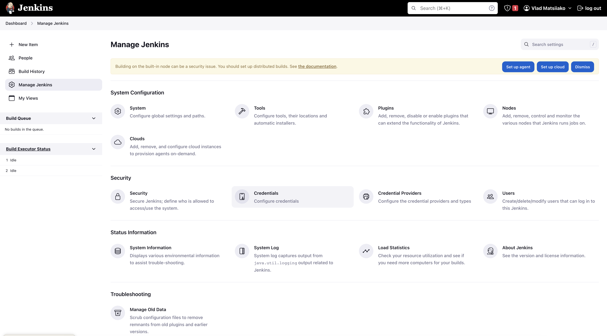

Click on the credential store you want to store the Infisical Service Token in. In this case, we're using the default Jenkins global store.

<Info>
  Each of your projects will have a different `INFISICAL_TOKEN`.
  As a result, it may make sense to spread these out into separate credential domains depending on your use case.
</Info>

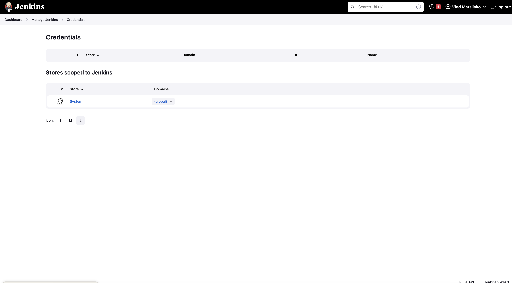

Now, click Add Credentials.

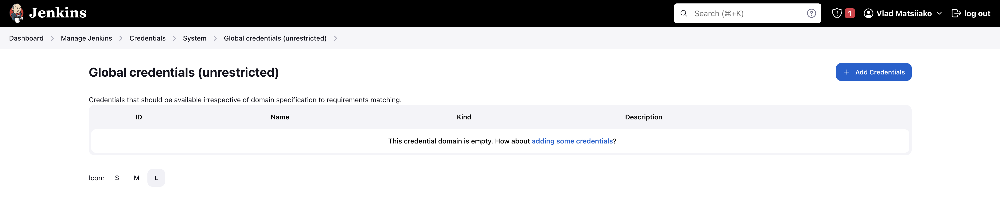

Choose **Secret text** for the **Kind** option from the dropdown list and enter the Infisical Service Token in the **Secret** field.
Although the **ID** can be any value, we'll set it to `infisical-service-token` for the sake of this guide.
The description is optional and can be any text you prefer.


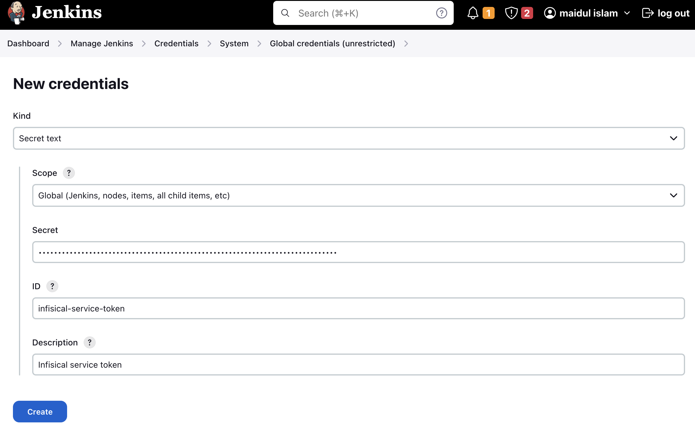

When you're done, you should see a credential similar to the one below:

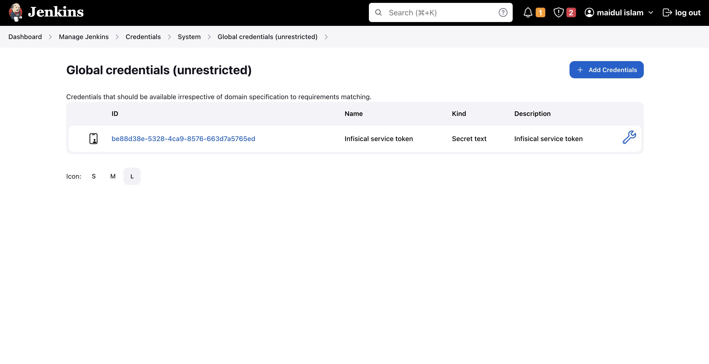


## Use Infisical in a Freestyle Project

To fetch secrets with Infisical in a Freestyle Project job, you'll need to expose the credential you created above as an environment variable to the Infisical CLI. 
To do so, first click **New Item** from the dashboard navigation sidebar:

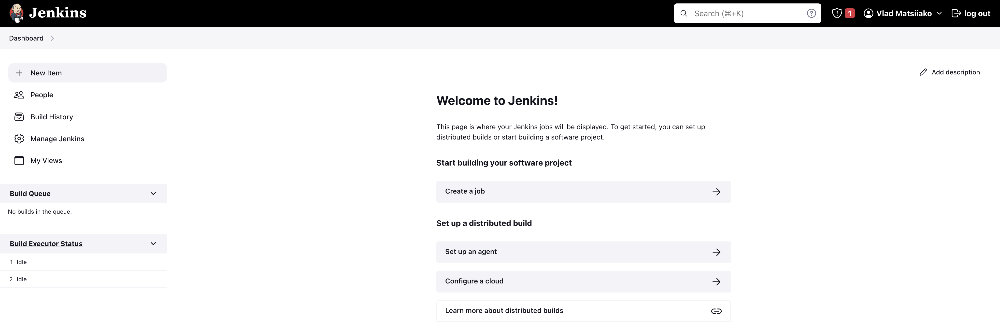

Enter the name of the job, choose the **Freestyle Project** option, and click **OK**.

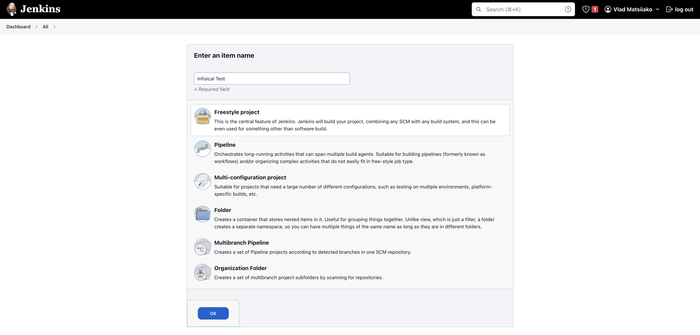

Scroll down to the **Build Environment** section and enable the **Use secret text(s) or file(s)** option. Then click **Add** under the **Bindings** section and choose **Secret text** from the dropdown menu.

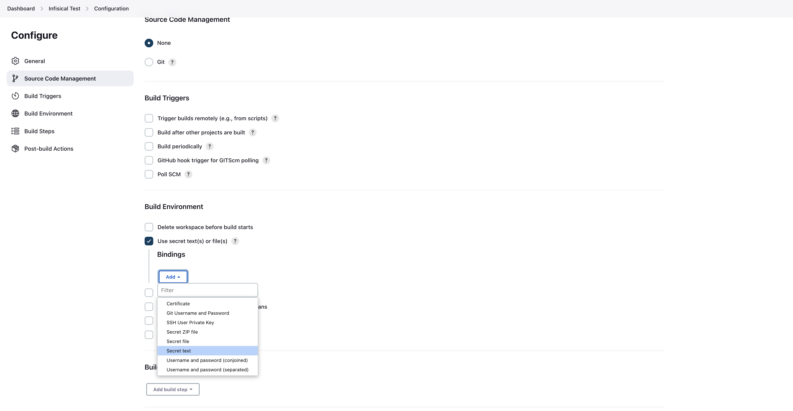

Enter `INFISICAL_TOKEN` in the **Variable** field then click the **Specific credentials** option from the Credentials section and select the credential you created earlier. 
In this case, we saved it as `Infisical service token` so we'll choose that from the dropdown menu.

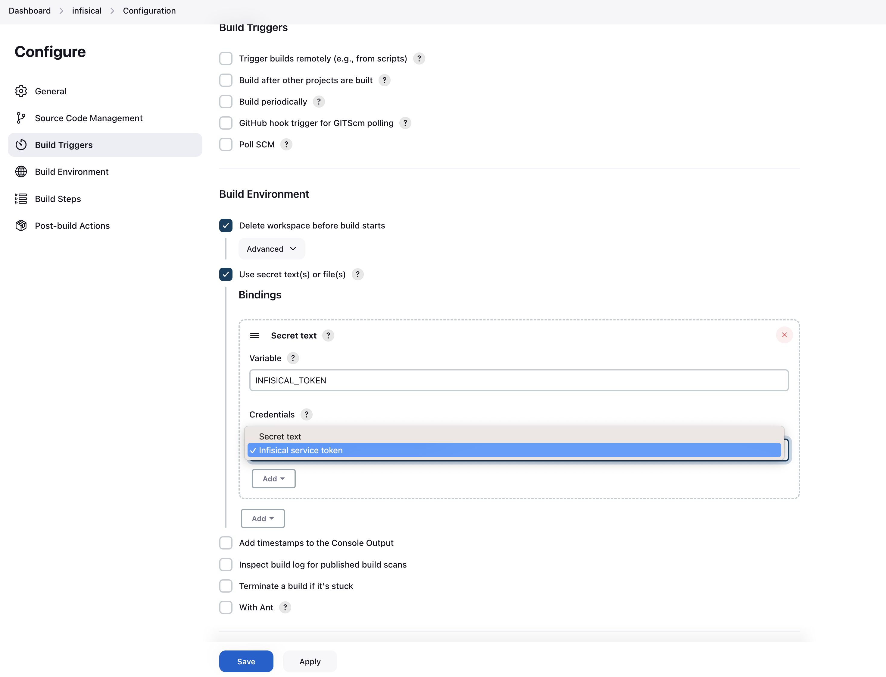

Scroll down to the **Build** section and choose **Execute shell** from the **Add build step** menu.

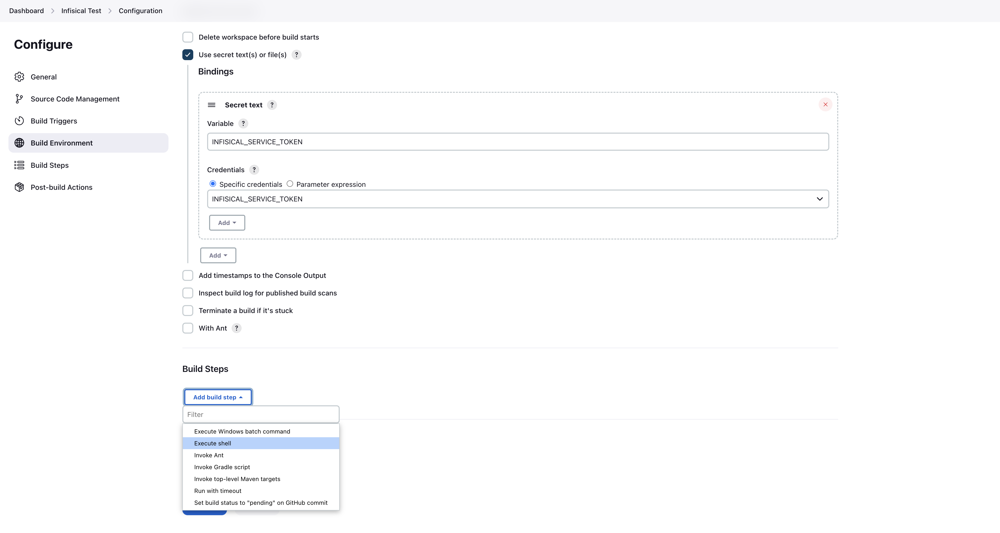

In the command field, you can now use the Infisical CLI to fetch secrets. 
The example command below will print the secrets using the service token passed as a credential. When done, click  **Save**.

```
infisical secrets --env=dev --path=/
```

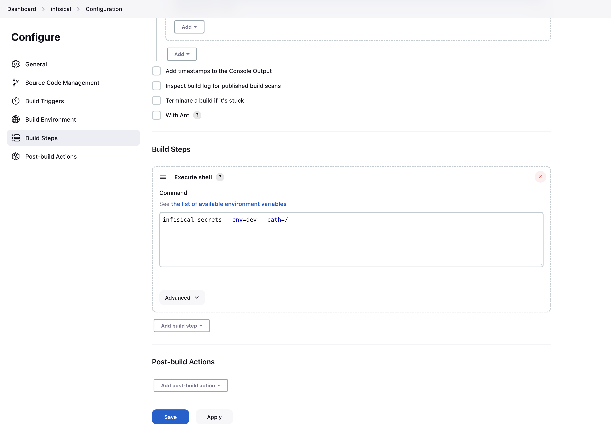

Finally, click **Build Now** from the navigation sidebar to run your new job.

<Info>
  Running into issues? Join Infisical's [community Slack](https://infisical.com/slack) for quick support.
</Info>


## Use Infisical in a Jenkins Pipeline

To fetch secrets using Infisical in a Pipeline job, you'll need to expose the Jenkins credential you created above as an environment variable.
To do so, click **New Item** from the dashboard navigation sidebar:


Enter the name of the job, choose the **Pipeline** option, and click OK.

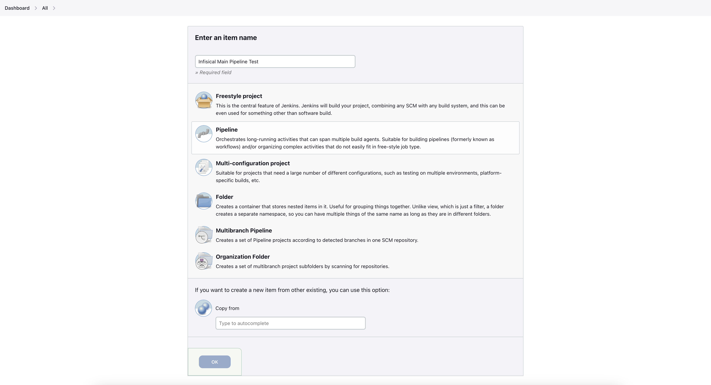

Scroll down to the **Pipeline** section, paste the following into the **Script** field, and click **Save**.

```
pipeline {
    agent any

    environment {
        INFISICAL_TOKEN = credentials('infisical-service-token')
    }

    stages {
        stage('Run Infisical') {
            steps {
                sh("infisical secrets --env=dev --path=/")

                // doesn't work
                // sh("docker run --rm test-container infisical secrets")

                // works
                // sh("docker run -e INFISICAL_TOKEN=${INFISICAL_TOKEN} --rm test-container infisical secrets --env=dev --path=/")

                // doesn't work
                // sh("docker-compose up -d")

                // works
                // sh("INFISICAL_TOKEN=${INFISICAL_TOKEN} docker-compose up -d")
            }
        }
    }
}
```

The example provided above serves as an initial guide. It shows how Jenkins adds the `INFISICAL_TOKEN` environment variable, which is configured in the pipeline, into the shell for executing commands.
There may be instances where this doesn't work as expected in the context of running Docker commands. 
However, the list of working examples should provide some insight into how this can be handled properly.
