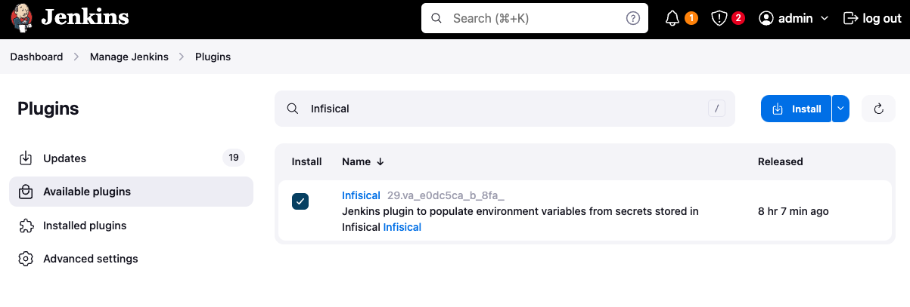
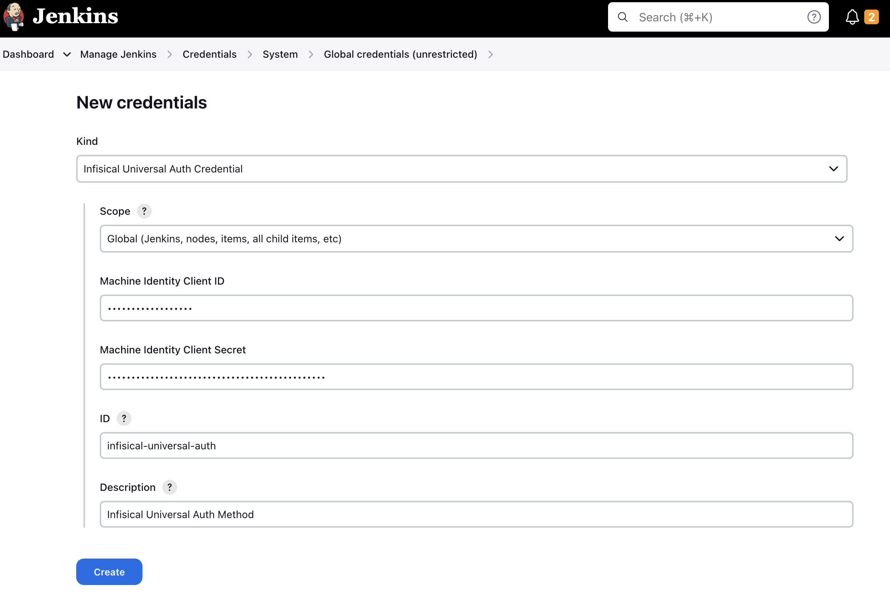
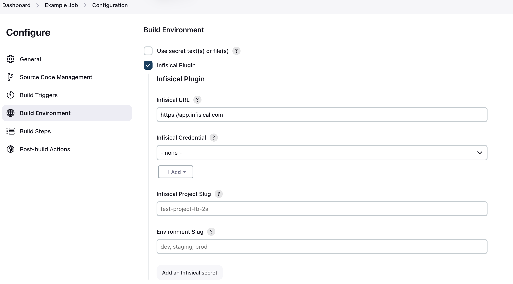
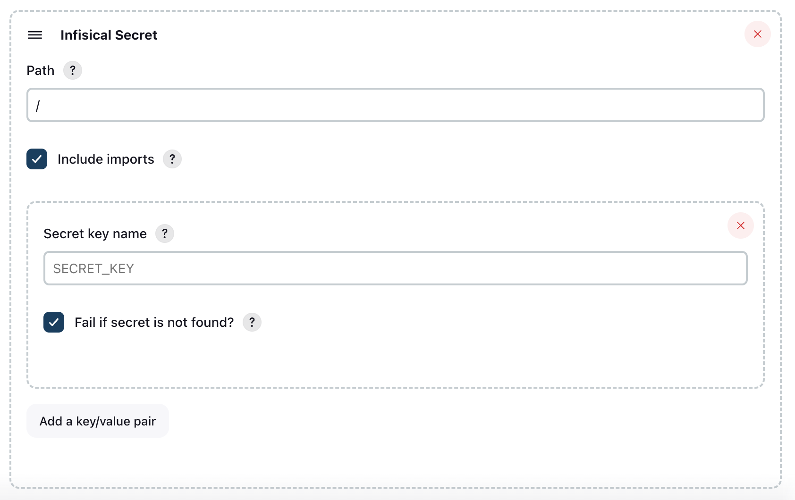

**Objective**: Fetch secrets from Infisical to Jenkins pipelines

In this guide, we'll outline the steps to deliver secrets from Infisical to Jenkins via the Infisical CLI.
At a high level, the Infisical CLI will be executed within your build environment and use a machine identity to authenticate with Infisical.
This token must be added as a Jenkins Credential and then passed to the Infisical CLI as an environment variable, enabling it to access and retrieve secrets within your workflows.

Prerequisites:

- Set up and add secrets to [Infisical](https://app.infisical.com).
- Create a [machine identity](/documentation/platform/identities/machine-identities) (Recommended), or a service token in Infisical.
- You have a working Jenkins installation with the [credentials plugin](https://plugins.jenkins.io/credentials/) installed.
- You have the [Infisical CLI](/cli/overview) installed on your Jenkins executor nodes or container images.

<Tabs>

  <Tab title="Using Plugin with Machine Identities (Recommended)">
     
    ## Jenkins Infisical Plugin

    This plugin adds a build wrapper to set environment variables from [Infisical](https://infisical.com). Secrets are generally masked in the build log, so you can't accidentally print them.

    ## Installation

    To install the plugin, navigate to `Manage Jenkins -> Plugins -> Available plugins` and search for `Infisical`. Install the plugin and restart Jenkins.

    

    ## Infisical Authentication

    Authenticating with Infisical is done through the use of [Machine Identities](https://infisical.com/docs/documentation/platform/identities/machine-identities).
    Currently the Jenkins plugin only supports [Universal Auth](https://infisical.com/docs/documentation/platform/identities/universal-auth) for authentication. More methods will be added soon.

    ### How does Universal Auth work?
    To use Universal Auth, you'll need to create a new Credential _(Infisical Universal Auth Credential)_. The credential should contain your Universal Auth client ID, and your Universal Auth client secret.
    Please [read more here](https://infisical.com/docs/documentation/platform/identities/universal-auth) on how to setup a Machine Identity to use universal auth.


    ### Creating a Universal Auth credential

    Creating a universal auth credential inside Jenkins is very straight forward.

    Simply navigate to<br/>
    `Dashboard -> Manage Jenkins -> Credentials -> System -> Global credentials (unrestricted)`.

    Press the `Add Credentials` button and select `Infisical Universal Auth Credential` in the `Kind` field.

    The `ID` and `Description` field doesn't matter much in this case, as they won't be read anywhere. The description field will be displayed as the credential name during the plugin configuration.

    


    ## Plugin Usage
    ### Configuration

    Configuration takes place on a job-level basis.

    Inside your job, you simply tick the `Infisical Plugin` checkbox under "Build Environment". After enabling the plugin, you'll see a new section appear where you'll have to configure the plugin.

    

    You'll be prompted with 4 options to fill:
    * Infisical URL
        * This defaults to https://app.infisical.com. This field is only relevant if you're running a managed or self-hosted instance. If you are using Infisical Cloud, leave this as-is, otherwise enter the URL of your Infisical instance.
    * Infisical Credential
        * This is where you select your Infisical credential to use for authentication. In the step above [Creating a Universal Auth credential](#creating-a-universal-auth-credential), you can read on how to configure the credential. Simply select the credential you have created for this field.
    * Infisical Project Slug
        * This is the slug of the project you wish to fetch secrets from. You can find this in your project settings on Infisical by clicking "Copy project slug".
    * Environment Slug
        * This is the slug of the environment to fetch secrets from. In most cases it's either `dev`, `staging`, or `prod`. You can however create custom environments in Infisical. If you are using custom environments, you need to enter the slug of the custom environment you wish to fetch secrets from.
      
    That's it! Now you're ready to select which secrets you want to fetch into Jenkins.
    By clicking the `Add an Infisical secret` in the Jenkins UI like seen in the screenshot below.

    

    You need to select which secrets that should be pulled into Jenkins.
    You start by specifying a [folder path from Infisical](https://infisical.com/docs/documentation/platform/folder#comparing-folders). The root path is simply `/`. You also need to select wether or not you want to [include imports](https://infisical.com/docs/documentation/platform/secret-reference#secret-imports). Now you can add secrets the secret keys that you want to pull from Infisical into Jenkins. If you want to add multiple secrets, press the "Add key/value pair".

    If you wish to pull secrets from multiple paths, you can press the "Add an Infisical secret" button at the bottom, and configure a new set of secrets to pull.


    ## Pipeline usage


    ### Generating pipeline block

    Using the Infisical Plugin in a Jenkins pipeline is very straight forward. To generate a block to use the Infisical Plugin in a Pipeline, simply to go `{JENKINS_URL}/jenkins/job/{JOB_ID}/pipeline-syntax/`.

    You can find a direct link on the Pipeline configuration page in the very bottom of the page, see image below.

    

    On the Snippet Generator page, simply configure the Infisical Plugin like it's documented in the [Configuration documentation](#configuration) step.

    Once you have filled out the configuration, press `Generate Pipeline Script`, and it will generate a block you can use in your pipeline.

    

    ### Using Infisical in a Pipeline

    Using the generated block in a pipeline is very straight forward. There's a few approaches on how to implement the block in a Pipeline script.
    Here's an example of using the generated block in a pipeline script. Make sure to replace the placeholder values with your own values.

    The script is formatted for clarity. All these fields will be pre-filled for you if you use the `Snippet Generator` like described in the [step above](#generating-pipeline-block).
    ```groovy
    node {
        withInfisical(
            configuration: [
                infisicalCredentialId: 'YOUR_CREDENTIAL_ID',
                infisicalEnvironmentSlug: 'PROJECT_ENV_SLUG', 
                infisicalProjectSlug: 'PROJECT_SLUG', 
                infisicalUrl: 'https://app.infisical.com' // Change this to your Infisical instance URL if you aren't using Infisical Cloud.
            ], 
            infisicalSecrets: [
                infisicalSecret(
                    includeImports: true, 
                    path: '/', 
                    secretValues: [
                        [infisicalKey: 'DATABASE_URL'],
                        [infisicalKey: "API_URL"],
                        [infisicalKey: 'THIS_KEY_MIGHT_NOT_EXIST', isRequired: false],
                    ]
                )
            ]
        ) {
            // Code runs here
            sh "printenv"
        }     
    }
    ```


  </Tab>

  <Tab title="Using CLI with Service Tokens">
    ## Add Infisical Service Token to Jenkins

    After setting up your project in Infisical and installing the Infisical CLI to the environment where your Jenkins builds will run, you will need to add the Infisical Service Token to Jenkins.

    To generate a Infisical service token, follow the guide [here](/documentation/platform/token).
    Once you have generated the token, navigate to **Manage Jenkins > Manage Credentials** in your Jenkins instance.

    

    Click on the credential store you want to store the Infisical Service Token in. In this case, we're using the default Jenkins global store.

    <Info>
      Each of your projects will have a different `INFISICAL_TOKEN`.
      As a result, it may make sense to spread these out into separate credential domains depending on your use case.
    </Info>

    

    Now, click Add Credentials.

    

    Choose **Secret text** for the **Kind** option from the dropdown list and enter the Infisical Service Token in the **Secret** field.
    Although the **ID** can be any value, we'll set it to `infisical-service-token` for the sake of this guide.
    The description is optional and can be any text you prefer.


    

    When you're done, you should see a credential similar to the one below:

    


    ## Use Infisical in a Freestyle Project

    To fetch secrets with Infisical in a Freestyle Project job, you'll need to expose the credential you created above as an environment variable to the Infisical CLI.
    To do so, first click **New Item** from the dashboard navigation sidebar:

    

    Enter the name of the job, choose the **Freestyle Project** option, and click **OK**.

    

    Scroll down to the **Build Environment** section and enable the **Use secret text(s) or file(s)** option. Then click **Add** under the **Bindings** section and choose **Secret text** from the dropdown menu.

    

    Enter `INFISICAL_TOKEN` in the **Variable** field then click the **Specific credentials** option from the Credentials section and select the credential you created earlier.
    In this case, we saved it as `Infisical service token` so we'll choose that from the dropdown menu.

    

    Scroll down to the **Build** section and choose **Execute shell** from the **Add build step** menu.

    

    In the command field, you can now use the Infisical CLI to fetch secrets.
    The example command below will print the secrets using the service token passed as a credential. When done, click  **Save**.

    ```
    infisical secrets --env=dev --path=/
    ```

    

    Finally, click **Build Now** from the navigation sidebar to run your new job.

    <Info>
      Running into issues? Join Infisical's [community Slack](https://infisical.com/slack) for quick support.
    </Info>


    ## Use Infisical in a Jenkins Pipeline

    To fetch secrets using Infisical in a Pipeline job, you'll need to expose the Jenkins credential you created above as an environment variable.
    To do so, click **New Item** from the dashboard navigation sidebar:

    

    Enter the name of the job, choose the **Pipeline** option, and click OK.

    

    Scroll down to the **Pipeline** section, paste the following into the **Script** field, and click **Save**.

    ```
    pipeline {
        agent any

        environment {
            INFISICAL_TOKEN = credentials('infisical-service-token')
        }

        stages {
            stage('Run Infisical') {
                steps {
                    sh("infisical secrets --env=dev --path=/")

                    // doesn't work
                    // sh("docker run --rm test-container infisical secrets")

                    // works
                    // sh("docker run -e INFISICAL_TOKEN=${INFISICAL_TOKEN} --rm test-container infisical secrets --env=dev --path=/")

                    // doesn't work
                    // sh("docker-compose up -d")

                    // works
                    // sh("INFISICAL_TOKEN=${INFISICAL_TOKEN} docker-compose up -d")
                }
            }
        }
    }
    ```

  </Tab>

</Tabs>

The example provided above serves as an initial guide. It shows how Jenkins adds the `INFISICAL_TOKEN` environment variable, which is configured in the pipeline, into the shell for executing commands.
There may be instances where this doesn't work as expected in the context of running Docker commands.
However, the list of working examples should provide some insight into how this can be handled properly.
