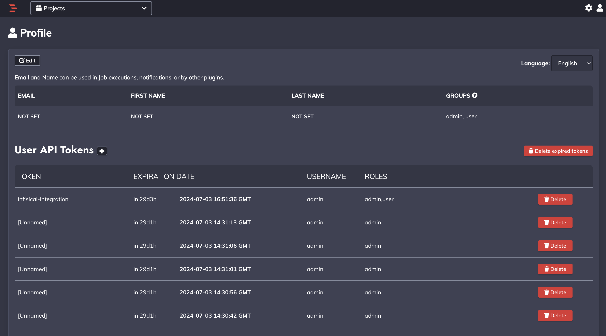
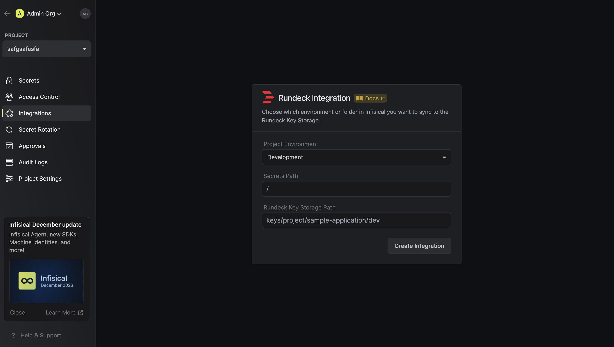
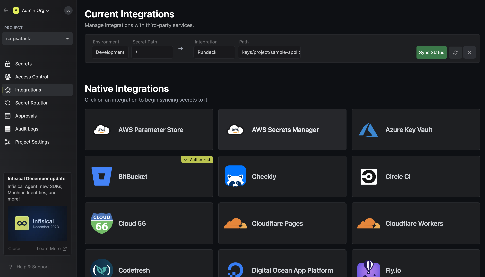

Prerequisites:

- Set up and add envars to [Infisical Cloud](https://app.infisical.com)

<Steps>
  <Step title="Authorize Infisical for Rundeck">
    Obtain a User API Token in the Profile settings of Rundeck

    

    Navigate to your project's integrations tab in Infisical.

    

    Press on the Rundeck tile and input your Rundeck instance Base URL and User API token to grant Infisical access to manage Rundeck keys

    

    <Info>
      If this is your project's first cloud integration, then you'll have to grant
      Infisical access to your project's environment variables. Although this step
      breaks E2EE, it's necessary for Infisical to sync the environment variables to
      the cloud platform.
    </Info>

  </Step>
  <Step title="Start integration">
    Select which Infisical environment secrets you want to sync to a Rundeck Key Storage Path and press create integration to start syncing secrets to Rundeck.

    
    

  </Step>
</Steps>
