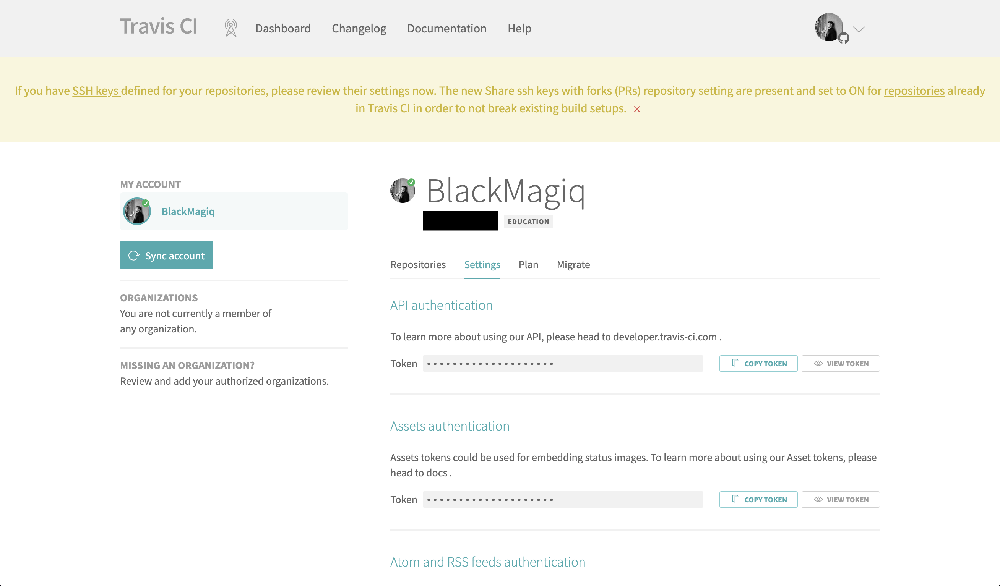

Prerequisites:

- Set up and add envars to [Infisical Cloud](https://app.infisical.com)

<Steps>
  <Step title="Authorize Infisical for Travis CI">
    Obtain your API token in User Settings > API authentication > Token

    

    Navigate to your project's integrations tab in Infisical.

    

    Press on the Travis CI tile and input your Travis CI API token to grant Infisical access to your Travis CI account.

    

  </Step>
  <Step title="Start integration">
    Select which Infisical environment secrets you want to sync to which Travis CI repository and press create integration to start syncing secrets to Travis CI.

    
    
  </Step>
</Steps>