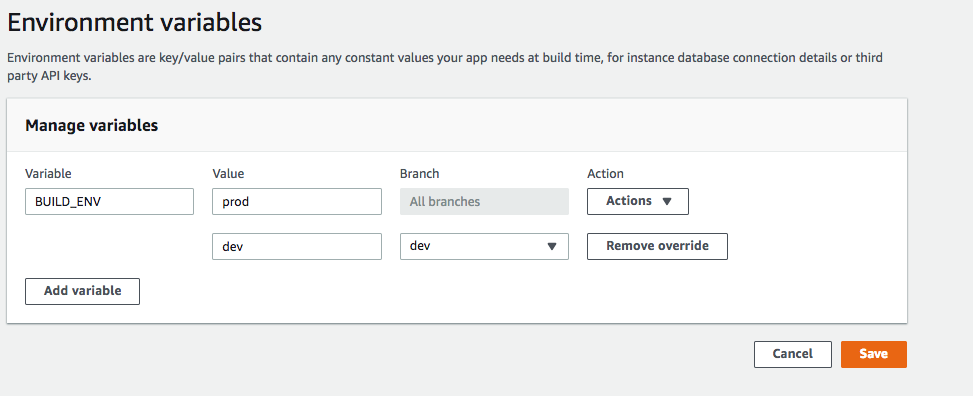

Prerequisites:

- Set up and add envars to [Infisical Cloud](https://app.infisical.com)

## Sync Secrets On Build

This approach enables the synchronization of secrets from Infisical to AWS Amplify during container build.

<Steps>
  <Step title="Generate a service token">
    Go to your project settings in the Infisical dashboard to generate a [service token](/documentation/platform/token). This service token will allow you to authenticate and fetch secrets from Infisical. Once you have created a service token with the required permissions, you’ll need to provide the token to the CLI installed in your Docker container.
  </Step>
  <Step title="Set the service token as an Amplify environment variable">
    
    1. In the Amplify console, choose App Settings, and then select Environment variables.
    2. In the Environment variables section, select Manage variables.
    3. Under Variable, enter the key **INFISICAL_TOKEN**. For the value, enter the generated service token from the previous step.
    4. Click save.
  </Step>
  <Step title="Install Infisical CLI to the Amplify build step">
    In the prebuild phase, add the command in AWS Amplify to install the Infisical CLI.

    ```yaml
    build:
      phases:
        preBuild:
          commands:
            - sudo curl -1sLf 'https://dl.cloudsmith.io/public/infisical/infisical-cli/setup.rpm.sh' | sh && yum install -y infisical
    ```
  </Step>
  <Step title="Modify the build command">
    You can now pull secrets from Infisical using the CLI and save them as a `.env` file. To do this, modify the build commands.

    ```yaml
    build:
      phases:
        build:
          commands:
            - INFISICAL_TOKEN=${INFISICAL_TOKEN}
            - infisical export --format=dotenv > .env
            - <rest of the commands>
    ```
  </Step>
</Steps>

## Sync Secrets Using AWS SSM Parameter Store

[Environment secrets](https://docs.aws.amazon.com/amplify/latest/userguide/environment-variables.html#environment-secrets) are similar to environment variables, but they are AWS Systems Manager (SSM) Parameter Store key-value pairs that can be encrypted. By using Infisical AWS SSM integration, you can synchronize secrets from Infisical to SSM, which in turn synchronizes secrets to your AWS Amplify environment secrets.

<Steps>
  <Step title="Follow the AWS SSM Parameter Store Integration guide">
    Follow the [Infisical AWS SSM Parameter Store Integration Guide](./aws-parameter-store) to set up Infisical integration, up to the path option.
  </Step>
  <Step title="Find your Amplify App ID">
    
    1. Open your AWS Amplify App console.
    2. Go to **Actions >> View App Settings**
    3. The App ID will be the last part of the App ARN field after the slash.
  </Step>
  <Step title="Set AWS SSM Parameter Store path">
    You need to set the path in the format `/amplify/[amplify_app_id]/[environment]` as the path option in AWS SSM Parameter Infisical Integration.
  </Step>
</Steps>

<Info>
Accessing an environment secret during a build is similar to accessing environment variables, except that environment secrets are stored in `process.env.secrets` as a JSON string.
</Info>
