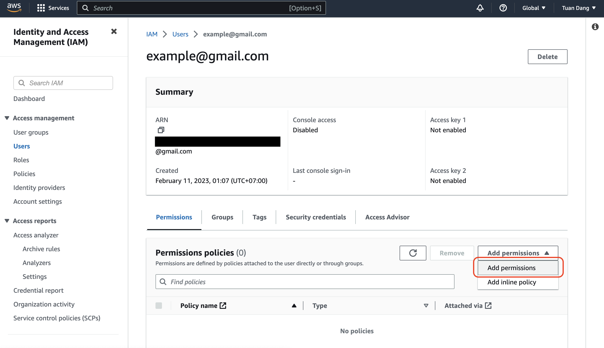
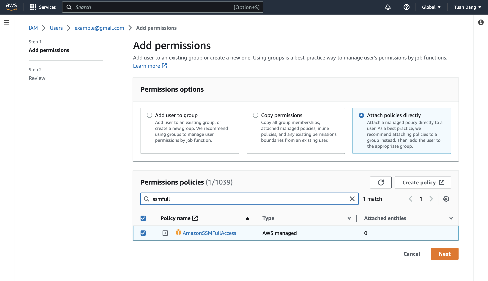
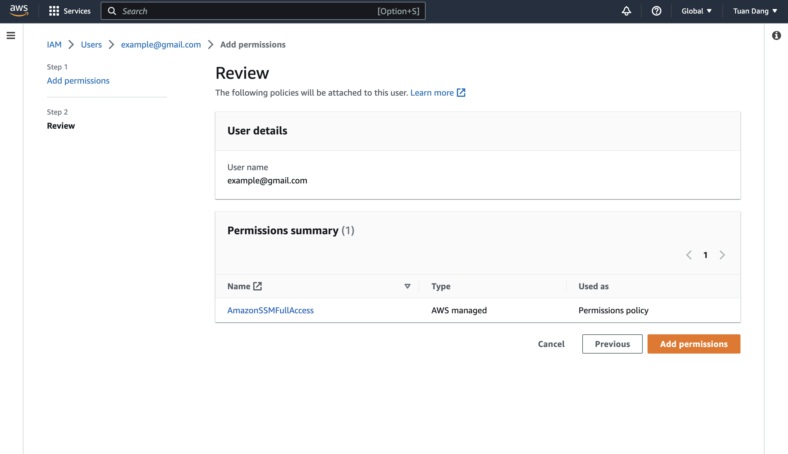
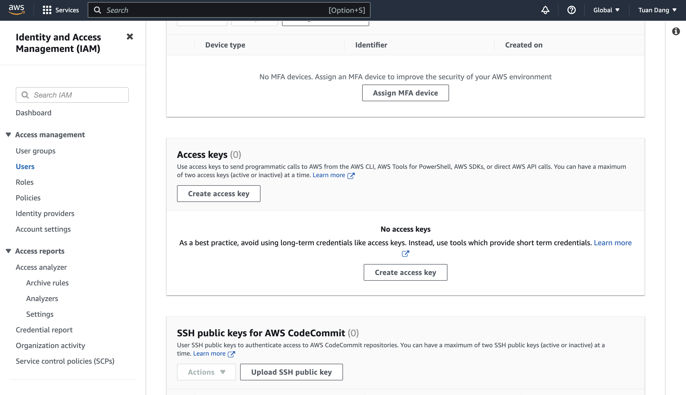
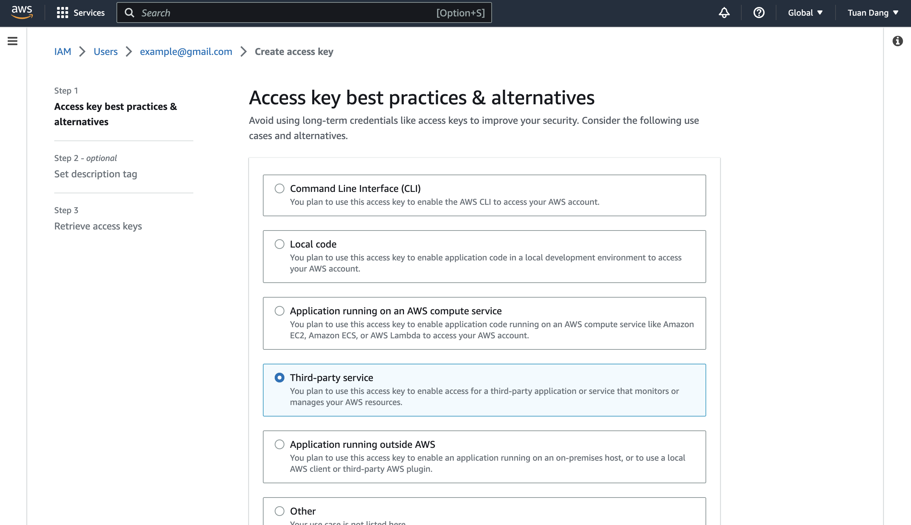
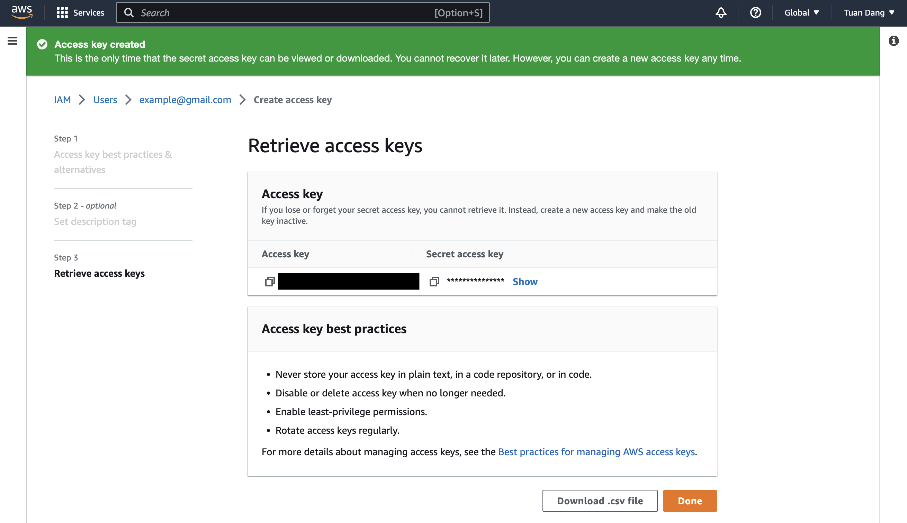
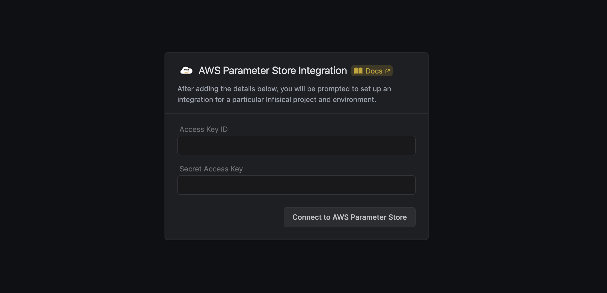
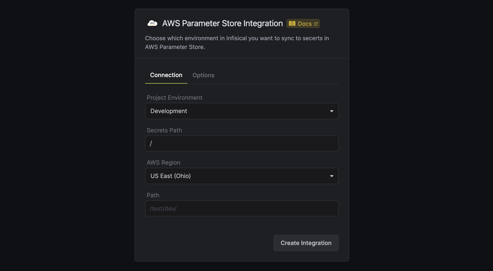

Prerequisites:

- Set up and add envars to [Infisical Cloud](https://app.infisical.com)
- Set up AWS and have/create an IAM user

<Steps>
  <Step title="Grant the IAM user permissions to access AWS Parameter Store">
    Navigate to your IAM user permissions and add a permission policy to grant access to AWS Parameter Store.

    
    
    

    For enhanced security, here's a custom policy containing the minimum permissions required by Infisical to sync secrets to AWS Parameter Store for the IAM user that you can use:

    ```json
    {
      "Version": "2012-10-17",
      "Statement": [
        {
          "Sid": "AllowSSMAccess",
          "Effect": "Allow",
          "Action": [
            "ssm:PutParameter",
            "ssm:DeleteParameter",
            "ssm:GetParameters",
            "ssm:GetParametersByPath",
            "ssm:DescribeParameters",
            "ssm:DeleteParameters",
            "ssm:AddTagsToResource", // if you need to add tags to secrets
            "kms:ListKeys", // if you need to specify the KMS key
            "kms:ListAliases", // if you need to specify the KMS key
            "kms:Encrypt", // if you need to specify the KMS key
            "kms:Decrypt" // if you need to specify the KMS key
          ],
          "Resource": "*"
        }
      ]
    }
    ```

  </Step>
  <Step title="Authorize Infisical for AWS Parameter store">
    Obtain a AWS access key ID and secret access key for your IAM user in IAM > Users > User > Security credentials > Access keys

      
      
      

      Navigate to your project's integrations tab in Infisical.

      

      Press on the AWS Parameter Store tile and input your AWS access key ID and secret access key from the previous step.

      

  </Step>
  <Step title="Start integration">
    Select which Infisical environment secrets you want to sync to which AWS Parameter Store region and indicate the path for your secrets. Then, press create integration to start syncing secrets to AWS Parameter Store.

    

    <Tip>
      Infisical requires you to add a path for your secrets to be stored in AWS
      Parameter Store and recommends setting the path structure to
      `/[project_name]/[environment]/` according to best practices. This enables a
      secret like `TEST` to be stored as `/[project_name]/[environment]/TEST` in AWS
      Parameter Store.
    </Tip>

  </Step>
</Steps>
