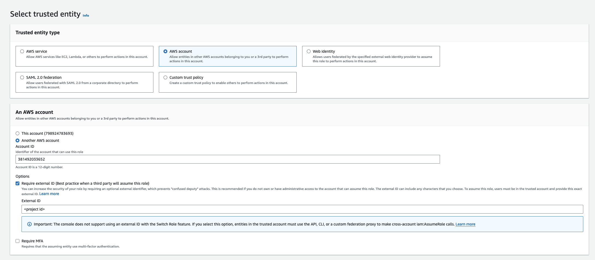

<Tabs>
  <Tab title="Assume Role (Recommended)">
    Infisical will assume the provided role in your AWS account securely, without the need to share any credentials.

    Prerequisites:

    - Set up and add envars to [Infisical Cloud](https://app.infisical.com)

    <Accordion title="Self-Hosted Users">
      To connect your Infisical instance with AWS, you need to set up an AWS IAM User account that can assume the AWS IAM Role for the integration.

    If your instance is deployed on AWS, the aws-sdk will automatically retrieve the credentials. Ensure that you assign the provided permission policy to your deployed instance, such as ECS or EC2.

    The following steps are for instances not deployed on AWS
    <Steps>
        <Step title="Create an IAM User">
          Navigate to [Create IAM User](https://console.aws.amazon.com/iamv2/home#/users/create) in your AWS Console.
        </Step>
        <Step title="Create an Inline Policy">
          Attach the following inline permission policy to the IAM User to allow it to assume any IAM Roles:
    ```json
    {
      "Version": "2012-10-17",
      "Statement": [
        {
          "Sid": "AllowAssumeAnyRole",
          "Effect": "Allow",
          "Action": "sts:AssumeRole",
          "Resource": "arn:aws:iam::*:role/*"
        }
      ]
    }
    ```
    </Step>
    <Step title="Obtain the IAM User Credentials">
      Obtain the AWS access key ID and secret access key for your IAM User by navigating to IAM > Users > [Your User] > Security credentials > Access keys.

      
      
      
    </Step>
    <Step title="Set Up Integration Keys">
      1. Set the access key as **CLIENT_ID_AWS_INTEGRATION**.
      2. Set the secret key as **CLIENT_SECRET_AWS_INTEGRATION**.
    </Step>
    </Steps>
    </Accordion>

    <Steps>
        <Step title="Create the Managing User IAM Role for AWS Parameter Store">
        1. Navigate to the [Create IAM Role](https://console.aws.amazon.com/iamv2/home#/roles/create?step=selectEntities) page in your AWS Console.
          

        2. Select **AWS Account** as the **Trusted Entity Type**.
        3. Choose **Another AWS Account** and enter **381492033652** (Infisical AWS Account ID). This restricts the role to be assumed only by Infisical. If self-hosting, provide your AWS account number instead.
        4. Optionally, enable **Require external ID** and enter your **project ID** to further enhance security.
      </Step>

      <Step title="Add Required Permissions for the IAM Role">
        
        Use the following custom policy to grant the minimum permissions required by Infisical to sync secrets to AWS Parameter Store:

        ```json
        {
          "Version": "2012-10-17",
          "Statement": [
            {
              "Sid": "AllowSSMAccess",
              "Effect": "Allow",
              "Action": [
                "ssm:PutParameter",
                "ssm:DeleteParameter",
                "ssm:GetParameters",
                "ssm:GetParametersByPath",
                "ssm:DescribeParameters",
                "ssm:DeleteParameters",
                "ssm:AddTagsToResource", // if you need to add tags to secrets
                "kms:ListKeys", // if you need to specify the KMS key
                "kms:ListAliases", // if you need to specify the KMS key
                "kms:Encrypt", // if you need to specify the KMS key
                "kms:Decrypt" // if you need to specify the KMS key
              ],
              "Resource": "*"
            }
          ]
        }
        ```
      </Step>

      <Step title="Copy the AWS IAM Role ARN">
        
      </Step>

      <Step title="Authorize Infisical for AWS Parameter Store">
        1. Navigate to your project's integrations tab in Infisical.
        2. Click on the **AWS Parameter Store** tile.
          

        3. Select the **AWS Assume Role** option.
          

        4. Provide the **AWS IAM Role ARN** obtained from the previous step and press connect.
      </Step>
        <Step title="Start integration">
          Select which Infisical environment secrets you want to sync to which AWS Parameter Store region and indicate the path for your secrets. Then, press create integration to start syncing secrets to AWS Parameter Store.

          

          <Tip>
            Infisical requires you to add a path for your secrets to be stored in AWS
            Parameter Store and recommends setting the path structure to
            `/[project_name]/[environment]/` according to best practices. This enables a
            secret like `TEST` to be stored as `/[project_name]/[environment]/TEST` in AWS
            Parameter Store.
          </Tip>
        </Step>
    </Steps>

  </Tab>
  <Tab title="Access Key">
    Prerequisites:

    - Set up and add envars to [Infisical Cloud](https://app.infisical.com)

    <Steps>
      <Step title="Grant the IAM user permissions to access AWS Parameter Store">
        Navigate to your IAM user permissions and add a permission policy to grant access to AWS Parameter Store.

        
        
        

        For enhanced security, here's a custom policy containing the minimum permissions required by Infisical to sync secrets to AWS Parameter Store for the IAM user that you can use:

        ```json
        {
          "Version": "2012-10-17",
          "Statement": [
            {
              "Sid": "AllowSSMAccess",
              "Effect": "Allow",
              "Action": [
                "ssm:PutParameter",
                "ssm:DeleteParameter",
                "ssm:GetParameters",
                "ssm:GetParametersByPath",
                "ssm:DescribeParameters",
                "ssm:DeleteParameters",
                "ssm:AddTagsToResource", // if you need to add tags to secrets
                "kms:ListKeys", // if you need to specify the KMS key
                "kms:ListAliases", // if you need to specify the KMS key
                "kms:Encrypt", // if you need to specify the KMS key
                "kms:Decrypt" // if you need to specify the KMS key
              ],
              "Resource": "*"
            }
          ]
        }
        ```

      </Step>
      <Step title="Authorize Infisical for AWS Parameter store">
        Obtain a AWS access key ID and secret access key for your IAM user in IAM > Users > User > Security credentials > Access keys

          
          
          

          Navigate to your project's integrations tab in Infisical.

          

          Press on the AWS Parameter Store tile and select Access Key as the authentication mode. Input your AWS access key ID and secret access key from the previous step.

          

      </Step>
      <Step title="Start integration">
        Select which Infisical environment secrets you want to sync to which AWS Parameter Store region and indicate the path for your secrets. Then, press create integration to start syncing secrets to AWS Parameter Store.

        

        <Tip>
          Infisical requires you to add a path for your secrets to be stored in AWS
          Parameter Store and recommends setting the path structure to
          `/[project_name]/[environment]/` according to best practices. This enables a
          secret like `TEST` to be stored as `/[project_name]/[environment]/TEST` in AWS
          Parameter Store.
        </Tip>
      </Step>
    </Steps>

  </Tab>
</Tabs>
