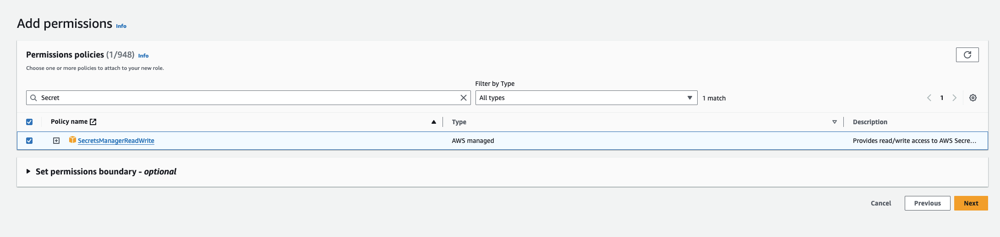
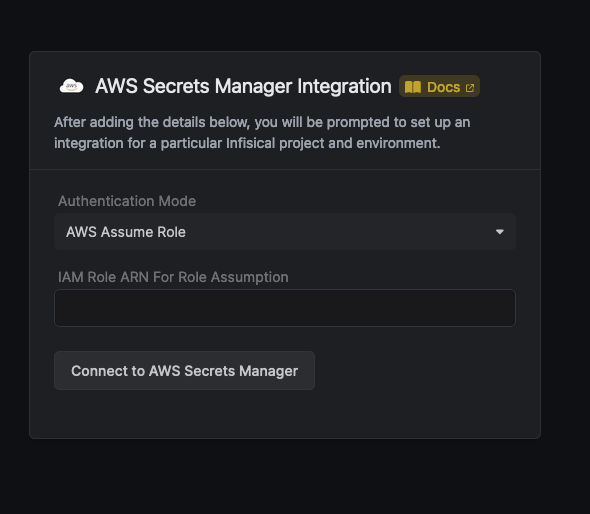
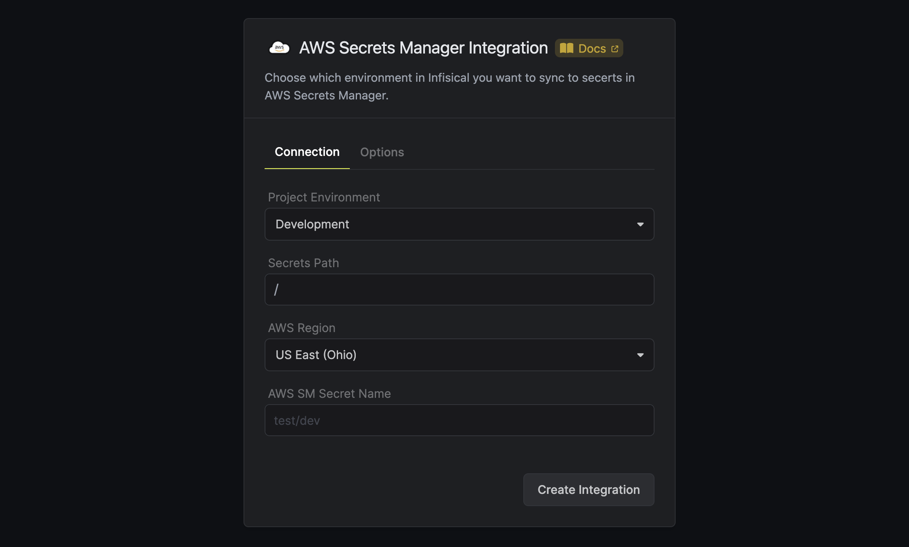
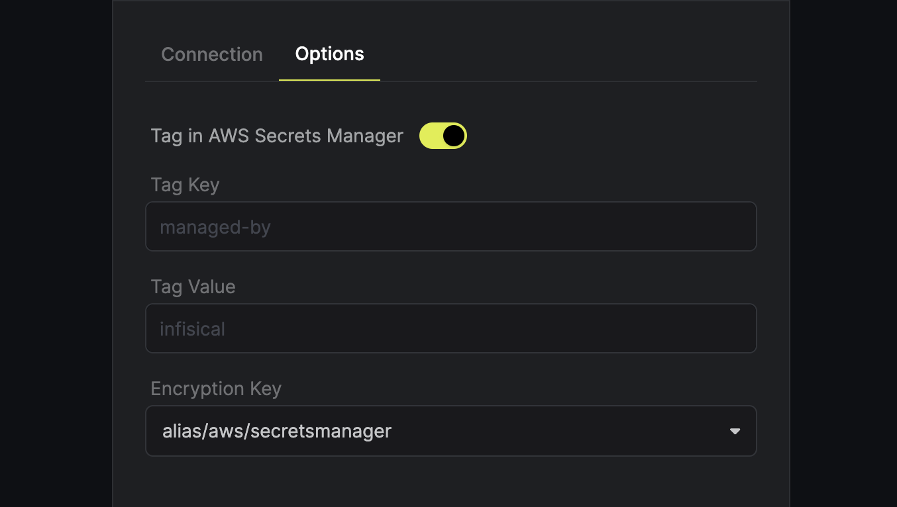
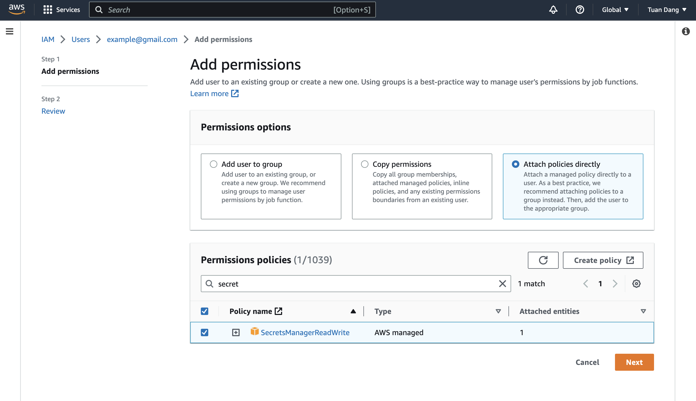
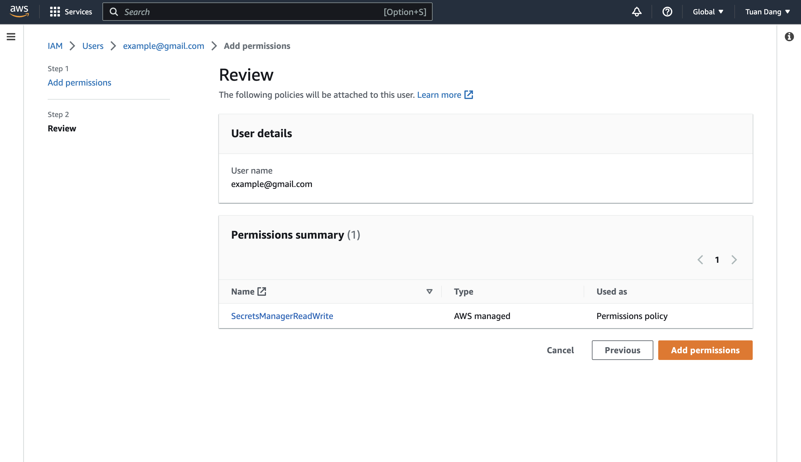
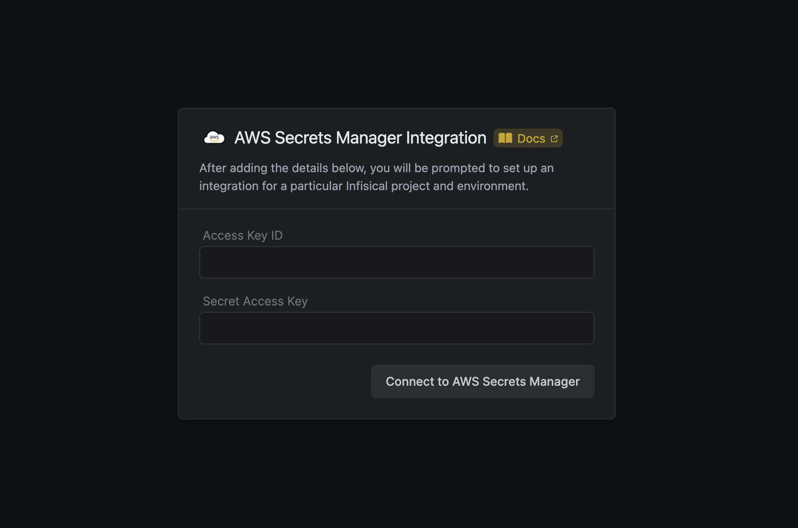

<Tabs>
  <Tab title="Assume Role (Recommended)">
Infisical will assume the provided role in your AWS account securely, without the need to share any credentials.

Prerequisites:

- Set up and add envars to [Infisical Cloud](https://app.infisical.com)

<Accordion title="Self-Hosted Users">
  To connect your Infisical instance with AWS, you need to set up an AWS IAM User account that can assume the AWS IAM Role for the integration.

If your instance is deployed on AWS, the aws-sdk will automatically retrieve the credentials. Ensure that you assign the provided permission policy to your deployed instance, such as ECS or EC2.

The following steps are for instances not deployed on AWS

<Steps>
    <Step title="Create an IAM User">
      Navigate to [Create IAM User](https://console.aws.amazon.com/iamv2/home#/users/create) in your AWS Console.
    </Step>
    <Step title="Create an Inline Policy">
      Attach the following inline permission policy to the IAM User to allow it to assume any IAM Roles:
```json
{
  "Version": "2012-10-17",
  "Statement": [
    {
      "Sid": "AllowAssumeAnyRole",
      "Effect": "Allow",
      "Action": "sts:AssumeRole",
      "Resource": "arn:aws:iam::*:role/*"
    }
  ]
}
```
</Step>
<Step title="Obtain the IAM User Credentials">
  Obtain the AWS access key ID and secret access key for your IAM User by navigating to IAM > Users > [Your User] > Security credentials > Access keys.


</Step>
<Step title="Set Up Integration Keys">
  1. Set the access key as **CLIENT_ID_AWS_INTEGRATION**.
  2. Set the secret key as **CLIENT_SECRET_AWS_INTEGRATION**.
</Step>
</Steps>
</Accordion>

<Steps>
    <Step title="Create the Managing User IAM Role for AWS Secrets Manager">
    1. Navigate to the [Create IAM Role](https://console.aws.amazon.com/iamv2/home#/roles/create?step=selectEntities) page in your AWS Console.
       

    2. Select **AWS Account** as the **Trusted Entity Type**.
    3. Choose **Another AWS Account** and enter **381492033652** (Infisical AWS Account ID). This restricts the role to be assumed only by Infisical. If self-hosting, provide your AWS account number instead.
    4. Optionally, enable **Require external ID** and enter your **project ID** to further enhance security.

  </Step>

  <Step title="Add Required Permissions for the IAM Role">
    
    Use the following custom policy to grant the minimum permissions required by Infisical to sync secrets to AWS Secrets Manager:

    ```json
    {
      "Version": "2012-10-17",
      "Statement": [
        {
          "Sid": "AllowSecretsManagerAccess",
          "Effect": "Allow",
          "Action": [
            "secretsmanager:GetSecretValue",
            "secretsmanager:CreateSecret",
            "secretsmanager:UpdateSecret",
            "secretsmanager:DescribeSecret",
            "secretsmanager:TagResource",
            "secretsmanager:UntagResource",
            "kms:ListKeys",
            "kms:ListAliases",
            "kms:Encrypt",
            "kms:Decrypt"
          ],
          "Resource": "*"
        }
      ]
    }
    ```

  </Step>

<Step title="Copy the AWS IAM Role ARN">
  
</Step>

  <Step title="Authorize Infisical for AWS Secrets Manager">
    1. Navigate to your project's integrations tab in Infisical.
    2. Click on the **AWS Secrets Manager** tile.
       

    3. Select the **AWS Assume Role** option.
       

    4. Provide the **AWS IAM Role ARN** obtained from the previous step.

  </Step>  <Step title="Start integration">
    Select how you want to integration to work by specifying a number of parameters:

    <ParamField path="Project Environment" type="string" required>
      The environment in Infisical from which you want to sync secrets to AWS Secrets Manager.
    </ParamField>
    <ParamField path="Secrets Path" type="string" required>
      The path within the preselected environment form which you want to sync secrets to AWS Secrets Manager.
    </ParamField>
    <ParamField path="AWS Region" type="string" required>
      The region that you want to integrate with in AWS Secrets Manager.
    </ParamField>
    <ParamField path="Mapping Behavior" type="string" required>
      How you want the integration to map the secrets. The selected value could be either one to one or one to many.
    </ParamField>
    <ParamField path="AWS SM Secret Name" type="string" required>
      The secret name/path in AWS into which you want to sync the secrets from Infisical.
    </ParamField>

    

    Optionally, you can add tags or specify the encryption key of all the secrets created via this integration:

    <ParamField path="Tag Sync Mode" type="string" optional>
      The sync mode for AWS tags. The supported options are `Secret Metadata` and `Custom`. If `Secret Metadata` is selected,
      the metadata of the Infisical secrets are used as tags in AWS. If custom is selected, then the key/value of the **Secret Tag** field is used. `Secret Metadata` mode
      is only supported for one-to-one integrations.
     </ParamField>

    <ParamField path="Secret Tag" type="string" optional>
      The Key/Value of a tag that will be added to secrets in AWS. Please note that it is possible to add multiple tags via API.
    </ParamField>
    <ParamField path="Encryption Key" type="string" optional>
      The alias/ID of the AWS KMS key used for encryption. Please note that key should be enabled in order to work and the IAM user should have access to it.
    </ParamField>
    

    Then, press `Create Integration` to start syncing secrets to AWS Secrets Manager.

    <Info>
      Infisical currently syncs environment variables to AWS Secrets Manager as
      key-value pairs under one secret. We're actively exploring ways to help users
      group environment variable key-pairs under multiple secrets for greater
      control.
    </Info>
    <Info>
      Please note that upon deleting secrets in Infisical, AWS Secrets Manager immediately makes the secrets inaccessible but only schedules them for deletion after at least 7 days.
    </Info>

  </Step>
</Steps>
  </Tab>
  <Tab title="Access Key">
Infisical will access your account using the provided AWS access key and secret key.

Prerequisites:

- Set up and add envars to [Infisical Cloud](https://app.infisical.com)
- Set up AWS and have/create an IAM user

<Steps>
  <Step title="Grant the IAM user permissions to access AWS Secrets Manager">
    Navigate to your IAM user permissions and add a permission policy to grant access to AWS Secrets Manager.

    
    
    

    For better security, here's a custom policy containing the minimum permissions required by Infisical to sync secrets to AWS Secrets Manager for the IAM user that you can use:

    ```json
    {
      "Version": "2012-10-17",
      "Statement": [
        {
          "Sid": "AllowSecretsManagerAccess",
          "Effect": "Allow",
          "Action": [
            "secretsmanager:GetSecretValue",
            "secretsmanager:CreateSecret",
            "secretsmanager:UpdateSecret",
            "secretsmanager:DescribeSecret", // if you need to add tags to secrets
            "secretsmanager:TagResource", // if you need to add tags to secrets
            "secretsmanager:UntagResource", // if you need to add tags to secrets
            "kms:ListKeys", // if you need to specify the KMS key
            "kms:ListAliases", // if you need to specify the KMS key
            "kms:Encrypt", // if you need to specify the KMS key
            "kms:Decrypt" // if you need to specify the KMS key
          ],
          "Resource": "*"
        }
      ]
    }
    ```

  </Step>
  <Step title="Authorize Infisical for AWS Secrets Manager">
    Obtain a AWS access key ID and secret access key for your IAM user in IAM > Users > User > Security credentials > Access keys

    
    
    

    1. Navigate to your project's integrations tab in Infisical.
    2. Click on the **AWS Secrets Manager** tile.
       

    3. Select the **Access Key** option for Authentication Mode.
       
    4. Provide the **access key** and **secret key** for the AWS Iam User.

  </Step>
  <Step title="Start integration">
    Select how you want to integration to work by specifying a number of parameters:

    <ParamField path="Project Environment" type="string" required>
      The environment in Infisical from which you want to sync secrets to AWS Secrets Manager.
    </ParamField>
    <ParamField path="Secrets Path" type="string" required>
      The path within the preselected environment form which you want to sync secrets to AWS Secrets Manager.
    </ParamField>
    <ParamField path="AWS Region" type="string" required>
      The region that you want to integrate with in AWS Secrets Manager.
    </ParamField>
    <ParamField path="Mapping Behavior" type="string" required>
      How you want the integration to map the secrets. The selected value could be either one to one or one to many.
    </ParamField>
    <ParamField path="AWS SM Secret Name" type="string" required>
      The secret name/path in AWS into which you want to sync the secrets from Infisical.
    </ParamField>

    

    Optionally, you can add tags or specify the encryption key of all the secrets created via this integration:

    <ParamField path="Secret Tag" type="string" optional>
      The Key/Value of a tag that will be added to secrets in AWS. Please note that it is possible to add multiple tags via API.
    </ParamField>
    <ParamField path="Encryption Key" type="string" optional>
      The alias/ID of the AWS KMS key used for encryption. Please note that key should be enabled in order to work and the IAM user should have access to it.
    </ParamField>
    

    Then, press `Create Integration` to start syncing secrets to AWS Secrets Manager.

    <Info>
      Infisical currently syncs environment variables to AWS Secrets Manager as
      key-value pairs under one secret. We're actively exploring ways to help users
      group environment variable key-pairs under multiple secrets for greater
      control.
    </Info>
    <Info>
      Please note that upon deleting secrets in Infisical, AWS Secrets Manager immediately makes the secrets inaccessible but only schedules them for deletion after at least 7 days.
    </Info>

  </Step>
</Steps>
  </Tab>
</Tabs>
