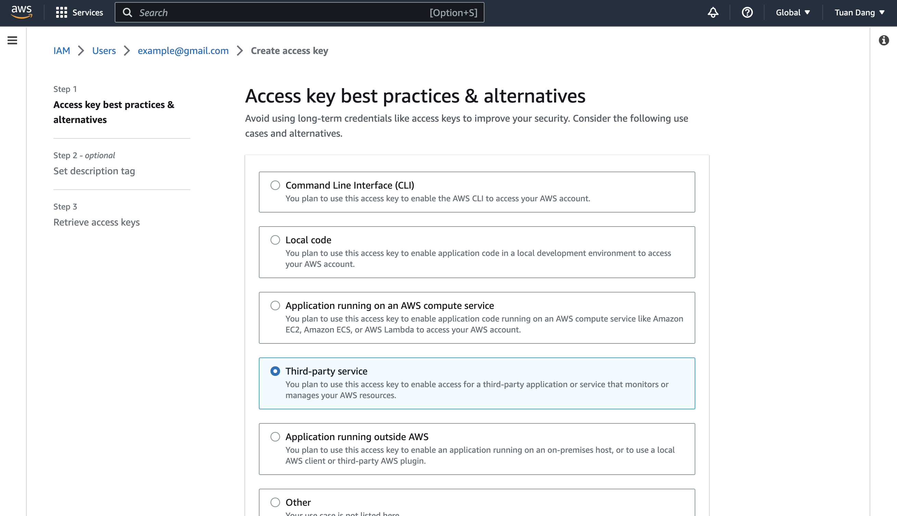

Prerequisites:

- Set up and add envars to [Infisical Cloud](https://app.infisical.com)
- Set up AWS and have/create an IAM user

## Grant the IAM user permissions to access AWS Secrets Manager

Navigate to your IAM user permissions and add a permission policy to grant access to AWS Secrets Manager.


For better security, here's a custom policy containing the minimum permissions required by Infisical to sync secrets to AWS Secrets Manager for the IAM user that you can use:

```json
{
  "Version": "2012-10-17",
  "Statement": [
    {
      "Sid": "AllowSecretsManagerAccess",
      "Effect": "Allow",
      "Action": [
        "secretsmanager:GetSecretValue",
        "secretsmanager:CreateSecret",
        "secretsmanager:UpdateSecret"
      ],
      "Resource": "*"
    }
  ]
}
```

## Navigate to your project's integrations tab


## Authorize Infisical for AWS Secrets Manager

Obtain a AWS access key ID and secret access key for your IAM user in IAM > Users > User > Security credentials > Access keys





Press on the AWS Secrets Manager tile and input your AWS access key ID and secret access key from the previous step.


<Info>
  If this is your project's first cloud integration, then you'll have to grant
  Infisical access to your project's environment variables. Although this step
  breaks E2EE, it's necessary for Infisical to sync the environment variables to
  the cloud platform.
</Info>

## Start integration

Select which Infisical environment secrets you want to sync to which AWS Secrets Manager region and under which secret name. Then, press create integration to start syncing secrets to AWS Secrets Manager.


<Info>
  Infisical currently syncs environment variables to AWS Secrets Manager as
  key-value pairs under one secret. We're actively exploring ways to help users
  group environment variable key-pairs under multiple secrets for greater
  control.
</Info>
