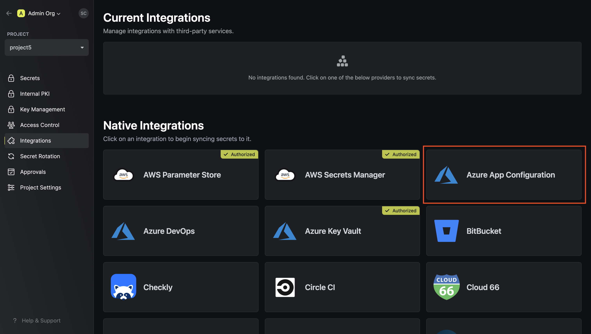
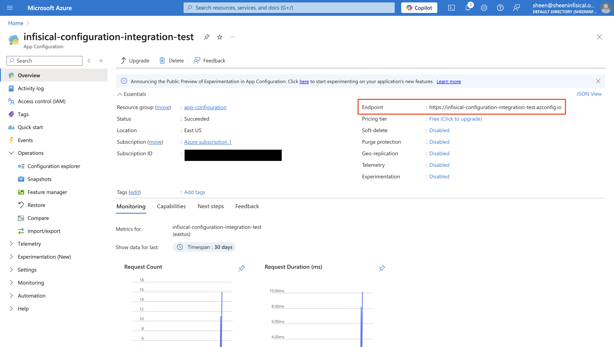
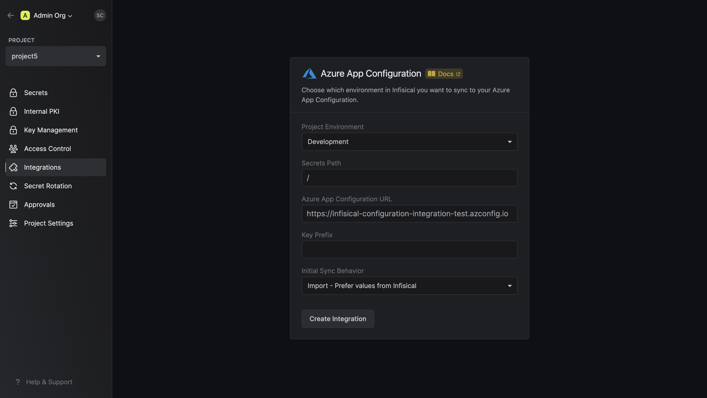
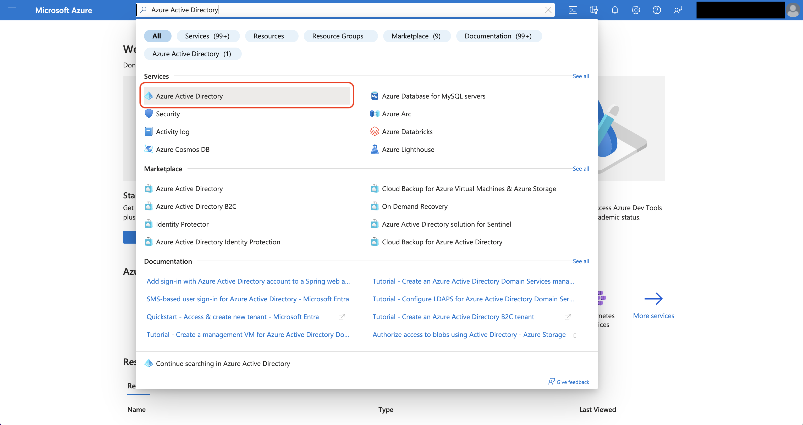
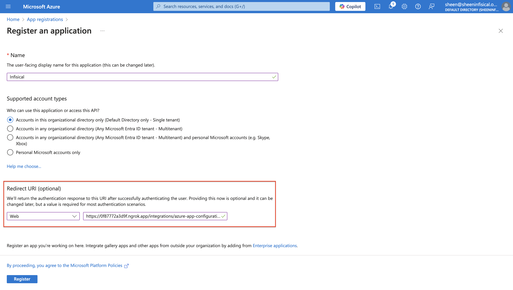
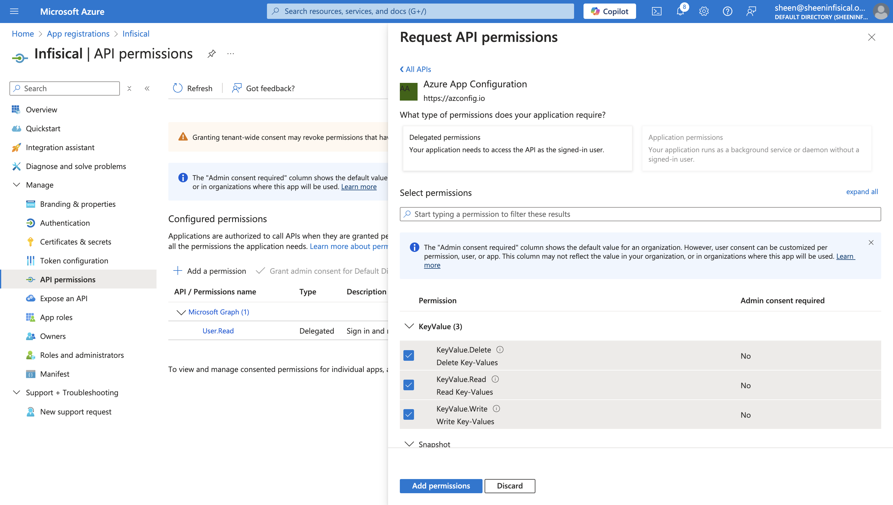

<Tabs>
  <Tab title="Usage">
    **Prerequisites:**

    - Set up and add envars to [Infisical Cloud](https://app.infisical.com).
    - Set up Azure and have an existing App Configuration instance.
    - User setting up the integration on Infisical must have the `App Configuration Data Owner` role for the intended Azure App Configuration instance.
    - Azure App Configuration instance must be reachable by Infisical.

    <Steps>
      <Step title="Authorize Infisical for Azure App Configuration">
        Navigate to your project's integrations tab

        

        Press on the Azure App Configuration tile and grant Infisical access to App Configuration.
      </Step>
      <Step title="Start integration">
        Obtain the Azure App Configuration endpoint from the overview tab.
        

        Select which Infisical environment secrets you want to sync to your Azure App Configuration. Then, input your App Configuration instance endpoint. Optionally, you can define a prefix for your secrets which will be appended to the keys upon syncing.

        

        Press create integration to start syncing secrets to Azure App Configuration.

        <Warning>
          The Azure App Configuration integration requires the following permissions to be set on the user / service principal
          for Infisical to sync secrets to Azure App Configuration: `Read Key-Value`, `Write Key-Value`, `Delete Key-Value`.

          Any role with these permissions would work such as the **App Configuration Data Owner** role. Alternatively, you can use the
          **App Configuration Data Reader** role for read-only access or **App Configuration Data Contributor** role for read/write access.
        </Warning>

      </Step>
      <Step title="Additional Configuration">

        #### Azure references
          When adding secrets in Infisical that reference Azure Key Vault secrets, Infisical will automatically sets the content type to `application/vnd.microsoft.appconfig.keyvaultref+json;charset=utf-8` in Azure App Configuration. 
          The following reference formats are automatically detected when added on Infisical's side:
          - `{ "uri": "https://my-key-vault.vault.azure.net/secrets/my-secret" }`
          - `https://my-key-vault.vault.azure.net/secrets/my-secret`

        #### Azure Labels 
          You can sync secrets from Infisical to Azure with custom labels by enabling the `Use Labels` option during setup:

          **When enabled**: Secrets will be pushed to Azure with your specified label

          **When disabled**: Secrets will be pushed with an empty (null) label

        <Info>
          If you have set the initial sync to `import` have behavior, the label selection affects which secrets are imported from Azure:
          - With `Use Labels` disabled: Only secrets with empty labels are imported on initial sync
          - With `Use Labels` enabled: Only secrets matching your specified label are imported on initial sync
        </Info>
      </Step>
    </Steps>

  </Tab>
  <Tab title="Self-Hosted Setup">
    Using the Azure App Configuration integration on a self-hosted instance of Infisical requires configuring an application in Azure
    and registering your instance with it.

    **Prerequisites:**

    - Set up Azure and have an existing App Configuration instance.

    <Steps>
      <Step title="Create an application in Azure">
        Navigate to Azure Active Directory > App registrations to create a new application.

        <Info>
          Azure Active Directory is now Microsoft Entra ID.
        </Info>
        
        

        Create the application. As part of the form, set the **Redirect URI** to `https://your-domain.com/integrations/azure-app-configuration/oauth2/callback`.
        <Tip>
          The domain you defined in the Redirect URI should be equivalent to the `SITE_URL` configured in your Infisical instance.
        </Tip>

        

        After registration, set the API permissions of the app to include the following Azure App Configuration permissions: KeyValue.Delete, KeyValue.Read, and KeyValue.Write.
        

      </Step>
      <Step title="Add your application credentials to Infisical">
        Obtain the **Application (Client) ID** in Overview and generate a **Client Secret** in Certificate & secrets for your Azure application.

        
        
        

        Back in your Infisical instance, add two new environment variables for the credentials of your Azure application.

        - `CLIENT_ID_AZURE`: The **Application (Client) ID** of your Azure application.
        - `CLIENT_SECRET_AZURE`: The **Client Secret** of your Azure application.

        Once added, restart your Infisical instance and use the Azure App Configuration integration.
      </Step>
    </Steps>

  </Tab>
</Tabs>
