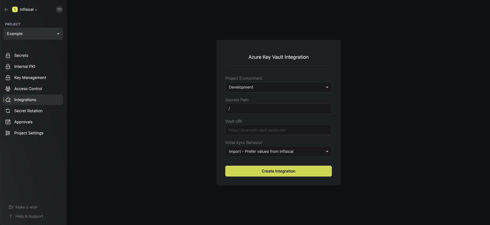
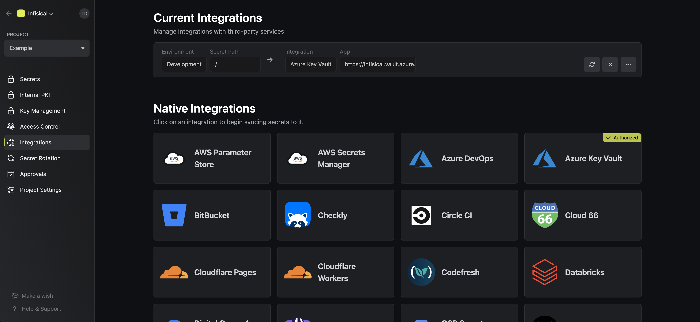
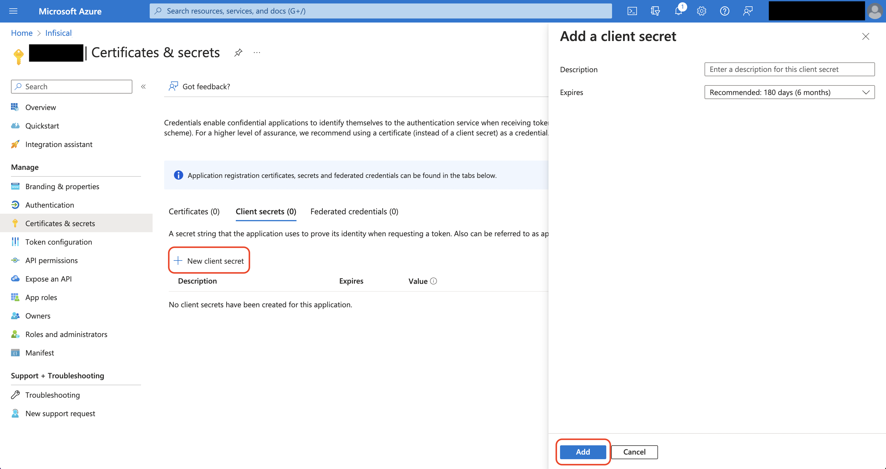
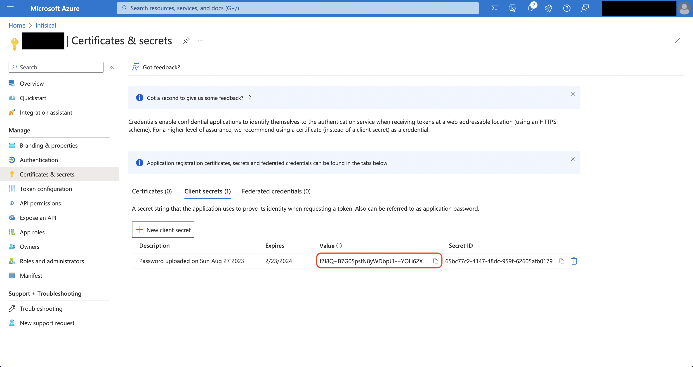

<Tabs>
  <Tab title="Usage">
    Prerequisites:

    - Set up and add envars to [Infisical Cloud](https://app.infisical.com)
    - Set up Azure and have an existing key vault

    <Steps>
      <Step title="Authorize Infisical for Azure Key Vault">
        Navigate to your project's integrations tab

        

        Press on the Azure Key Vault tile and grant Infisical access to Azure Key Vault.
      </Step>
      <Step title="Start integration">
        Obtain the Vault URI of your key vault in the Overview tab.

        

        Select which Infisical environment secrets you want to sync to your key vault. Then, input your Vault URI from the previous step. Finally, press create integration to start syncing secrets to Azure Key Vault.

        

        

      </Step>
    </Steps>
  </Tab>
  <Tab title="Self-Hosted Setup">
    Using the Azure KV integration on a self-hosted instance of Infisical requires configuring an application in Azure
    and registering your instance with it.

    <Steps>
      <Step title="Create an application in Azure">
        Navigate to Azure Active Directory > App registrations to create a new application.

        <Info>
          Azure Active Directory is now Microsoft Entra ID.
        </Info>
         
         

        Create the application. As part of the form, set the **Redirect URI** to `https://your-domain.com/integrations/azure-key-vault/oauth2/callback`.
        
         
      </Step>
      <Step title="Add your application credentials to Infisical">
        Obtain the **Application (Client) ID** in Overview and generate a **Client Secret** in Certificate & secrets for your Azure application.

         
         
         
        
        Back in your Infisical instance, add two new environment variables for the credentials of your Azure application.

        - `CLIENT_ID_AZURE`: The **Application (Client) ID** of your Azure application.
        - `CLIENT_SECRET_AZURE`: The **Client Secret** of your Azure application.
        
        Once added, restart your Infisical instance and use the Azure KV integration.
      </Step>
    </Steps>
  </Tab>
</Tabs>

