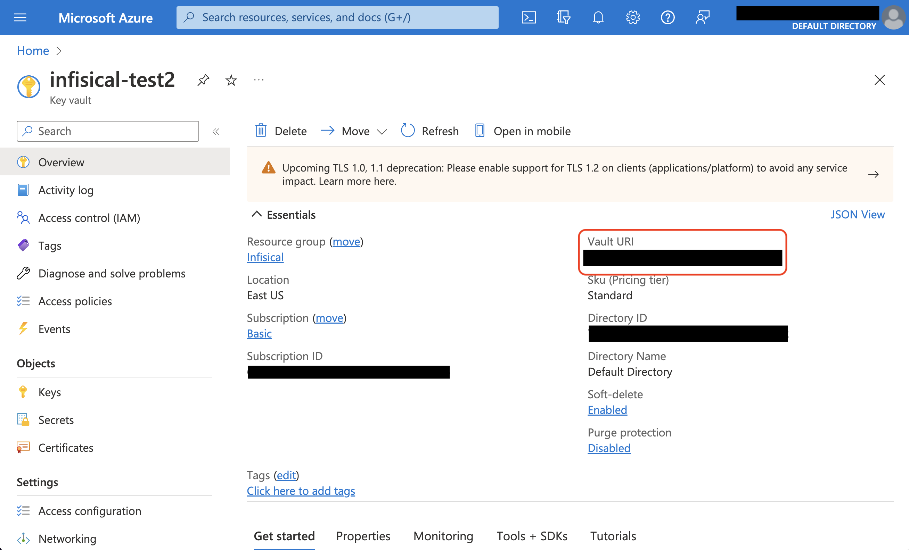
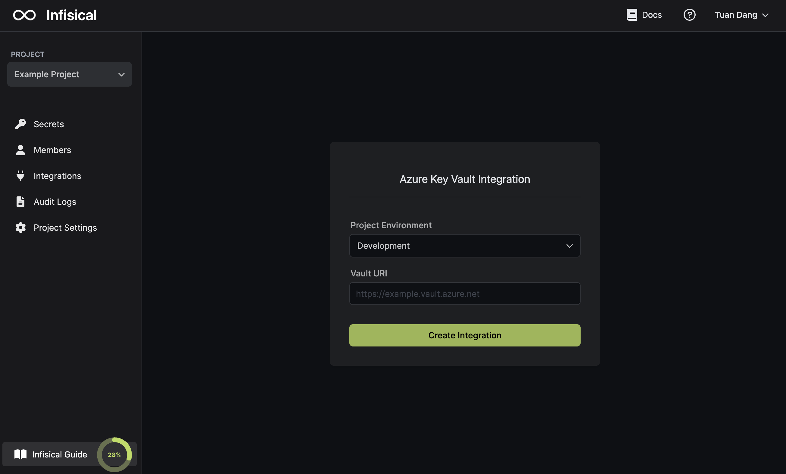
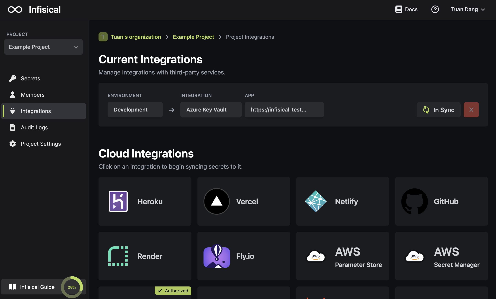

Prerequisites:

- Set up and add envars to [Infisical Cloud](https://app.infisical.com)
- Set up Azure and have an existing key vault

## Navigate to your project's integrations tab

## Authorize Infisical for Azure Key Vault

Press on the Azure Key Vault tile and grant Infisical access to Azure Key Vault.

## Start Integration

Obtain the Vault URI of your key vault in the Overview tab.

Select which Infisical environment secrets you want to sync to your key vault. Then, input your Vault URI from the previous step. Finally, press create integration to start syncing secrets to Azure Key Vault.

<Info>
  If this is your project's first cloud integration, then you'll have to grant
  Infisical access to your project's environment variables. Although this step
  breaks E2EE, it's necessary for Infisical to sync the environment variables to
  the cloud platform.
</Info>
