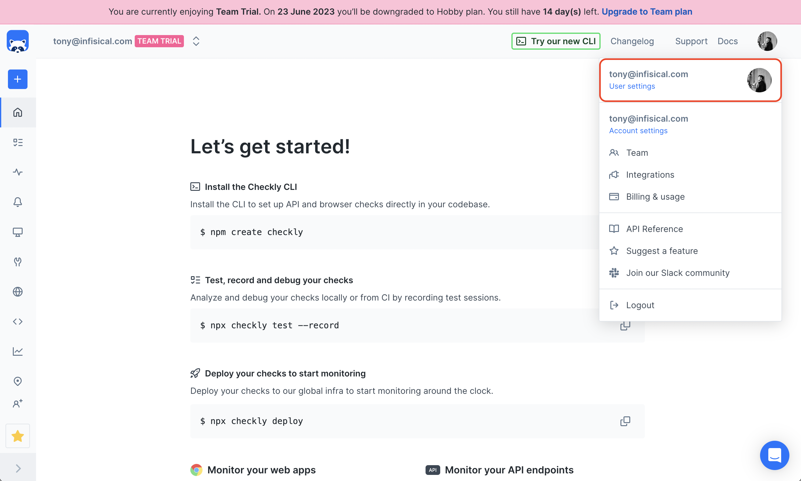
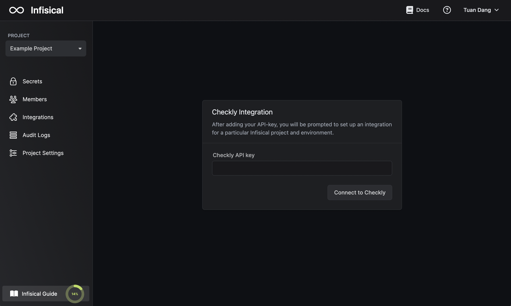
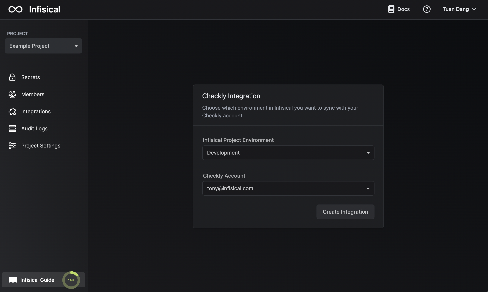

Prerequisites:

- Set up and add envars to [Infisical Cloud](https://app.infisical.com)

<Steps>
  <Step title="Authorize Infisical for Checkly">
    Obtain a Checkly API Key in User Settings > API Keys.

    
    

    Navigate to your project's integrations tab in Infisical.

    

    Press on the Checkly tile and input your Checkly API Key to grant Infisical access to your Checkly account.

    

    <Info>
      If this is your project's first cloud integration, then you'll have to grant
      Infisical access to your project's environment variables. Although this step
      breaks E2EE, it's necessary for Infisical to sync the environment variables to
      the cloud platform.
    </Info>
  </Step>
  <Step title="Start integration">
    Select which Infisical environment secrets you want to sync to Checkly and press create integration to start syncing secrets.

    

    <Note>
      Infisical integrates with Checkly's environment variables at the **global** and **group** levels.
      
      To sync secrets to a specific group, you can select a group from the Checkly Group dropdown; otherwise, leaving it empty will sync secrets globally.
    </Note>

    

    <Info>
      In the new version of the Checkly integration, you are able to specify suffixes that depend on the secrets' environment and path. 
      If you choose to do so, you should utilize such suffixes for ALL Checkly integrations – otherwise the integration system 
      might run into issues with deleting secrets from the wrong environments.
    </Info>
  </Step>
</Steps>