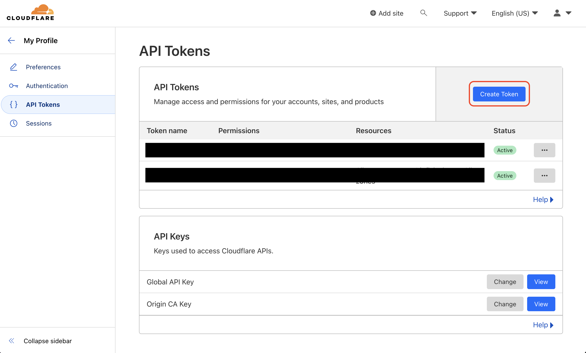
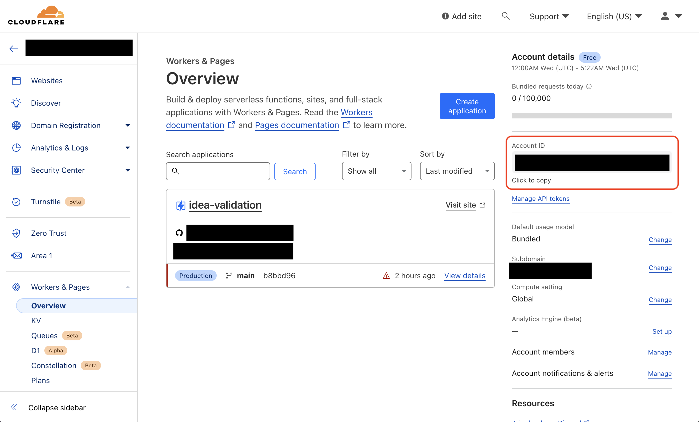

Prerequisites:

- Set up and add envars to [Infisical Cloud](https://app.infisical.com)

<Steps>
  <Step title="Authorize Infisical for Cloudflare Pages">
    Obtain a Cloudflare [API token](https://dash.cloudflare.com/profile/api-tokens) and [Account ID](https://developers.cloudflare.com/fundamentals/get-started/basic-tasks/find-account-and-zone-ids/):

    Create a new [API token](https://dash.cloudflare.com/profile/api-tokens) in My Profile > API Tokens

    
    
    

    Copy your [Account ID](https://developers.cloudflare.com/fundamentals/get-started/basic-tasks/find-account-and-zone-ids/) from Account > Workers & Pages > Overview

    
    
    Navigate to your project's integrations tab in Infisical.

    

    Press on the Cloudflare Pages tile and input your Cloudflare API token and account ID to grant Infisical access to your Cloudflare Pages.

    

  </Step>
  <Step title="Start integration">
    Select which Infisical environment secrets you want to sync to Cloudflare and press create integration to start syncing secrets.

    
    
  </Step>
</Steps>