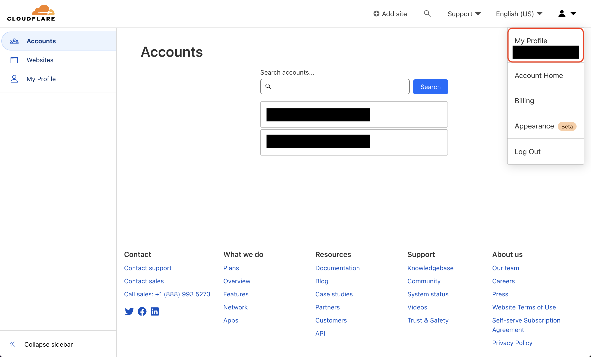

Prerequisites:

- Set up and add envars to [Infisical Cloud](https://app.infisical.com)

## Navigate to your project's integrations tab

## Authorize Infisical for Cloudflare Pages

Obtain a Cloudflare [API token](https://dash.cloudflare.com/profile/api-tokens) and [Account ID](https://developers.cloudflare.com/fundamentals/get-started/basic-tasks/find-account-and-zone-ids/):

1. Create a new [API token](https://dash.cloudflare.com/profile/api-tokens) in My Profile > API Tokens

2. Copy your [Account ID](https://developers.cloudflare.com/fundamentals/get-started/basic-tasks/find-account-and-zone-ids/) from Account > Workers & Pages > Overview

Press on the Cloudflare Pages tile and input your Cloudflare API token and account ID to grant Infisical access to your Cloudflare Pages.

<Info>
  If this is your project's first cloud integration, then you'll have to grant
  Infisical access to your project's environment variables. Although this step
  breaks E2EE, it's necessary for Infisical to sync the environment variables to
  the cloud platform.
</Info>

## Start integration

Select which Infisical environment secrets you want to sync to Cloudflare and press create integration to start syncing secrets.

