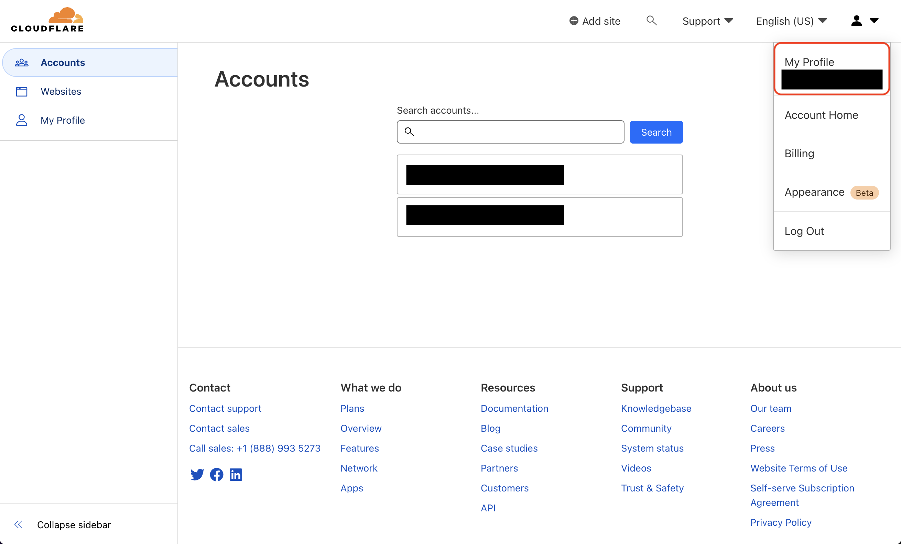
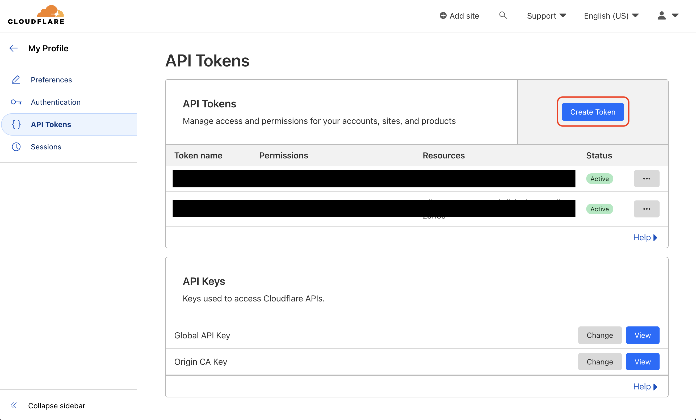
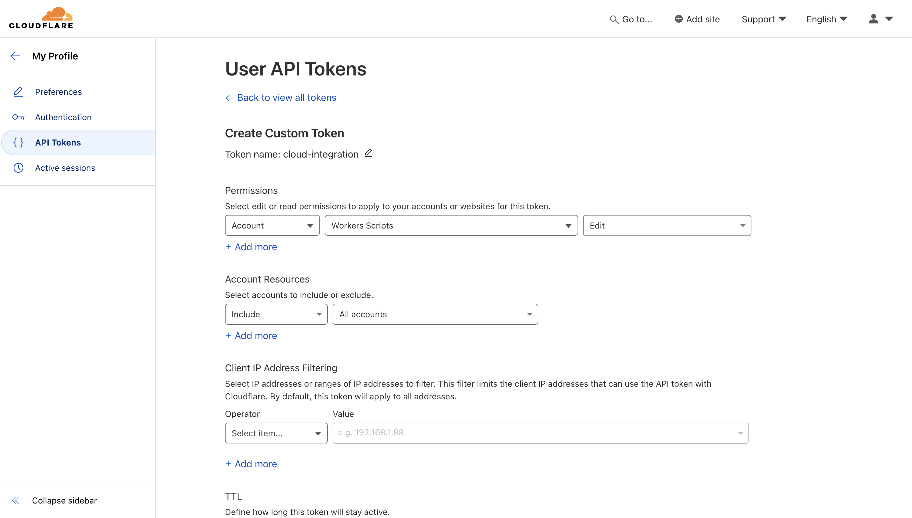
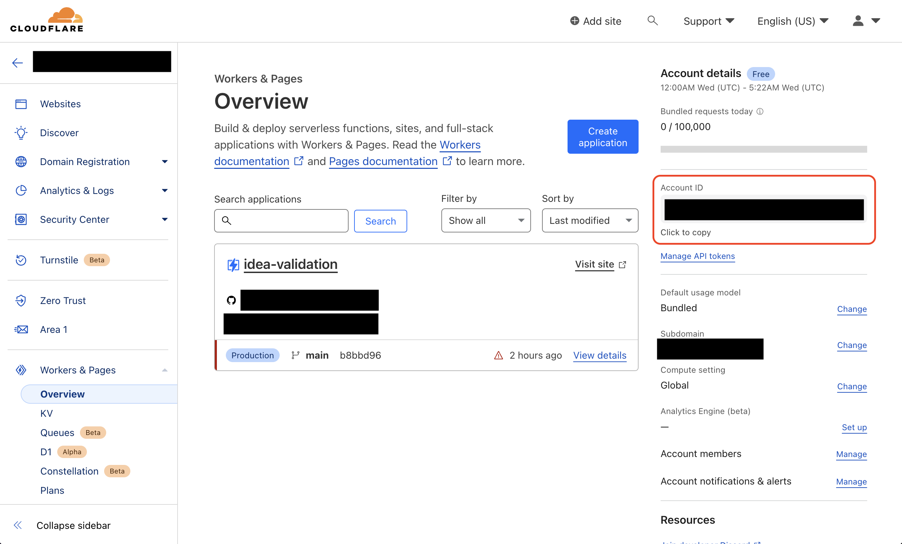
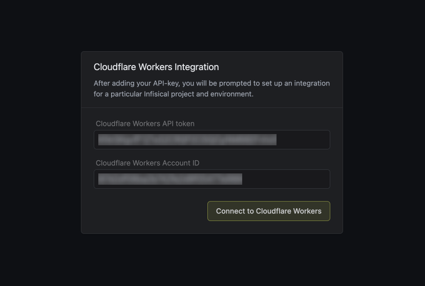
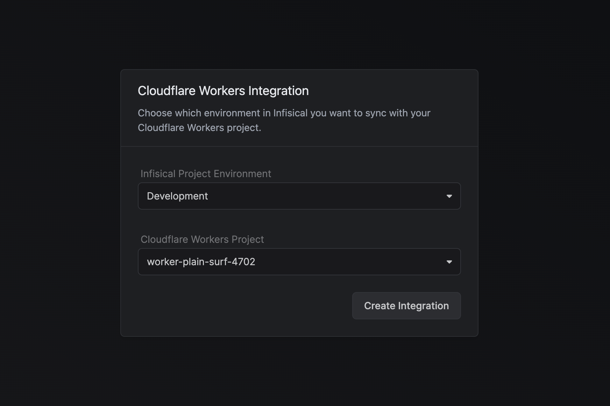

Prerequisites:

- Set up and add envars to [Infisical Cloud](https://app.infisical.com)

<Steps>
  <Step title="Authorize Infisical for Cloudflare Workers">
    Obtain a Cloudflare [API token](https://dash.cloudflare.com/profile/api-tokens) and [Account ID](https://developers.cloudflare.com/fundamentals/get-started/basic-tasks/find-account-and-zone-ids/):

    Create a new [API token](https://dash.cloudflare.com/profile/api-tokens) in My Profile > API Tokens

    
    
    

    Copy your [Account ID](https://developers.cloudflare.com/fundamentals/get-started/basic-tasks/find-account-and-zone-ids/) from Account > Workers & Pages > Overview

    

    Navigate to your project's integrations tab in Infisical.

    

    Press on the Cloudflare Workers tile and input your Cloudflare API token and account ID to grant Infisical access to your Cloudflare Workers.

    

    <Info>
      If this is your project's first cloud integration, then you'll have to grant
      Infisical access to your project's environment variables. Although this step
      breaks E2EE, it's necessary for Infisical to sync the environment variables to
      the cloud platform.
    </Info>

  </Step>
  <Step title="Start integration">
    Select which Infisical environment secrets you want to sync to Cloudflare Workers and press create integration to start syncing secrets.

    

  </Step>
</Steps>
