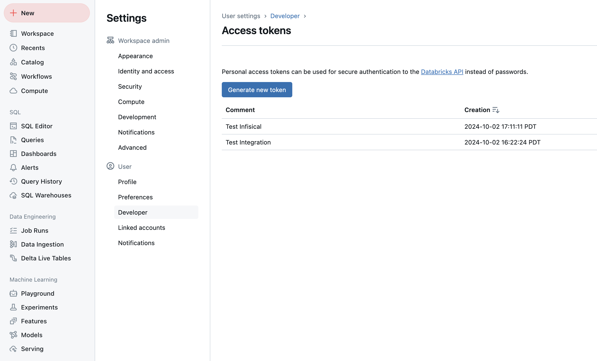
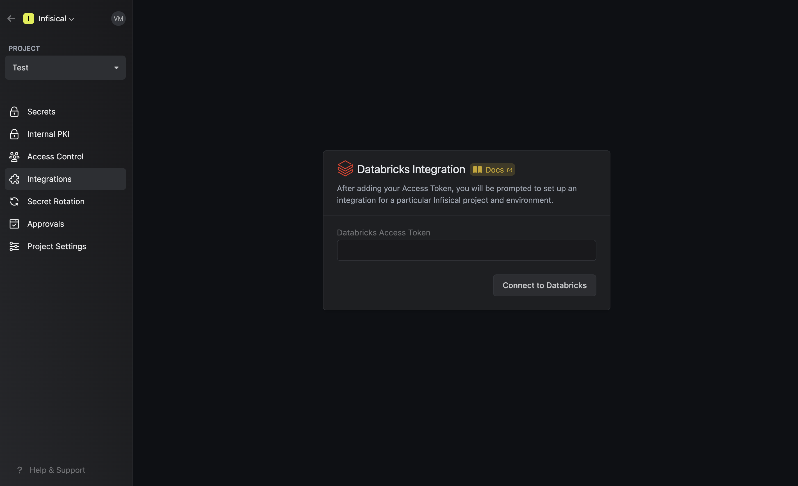
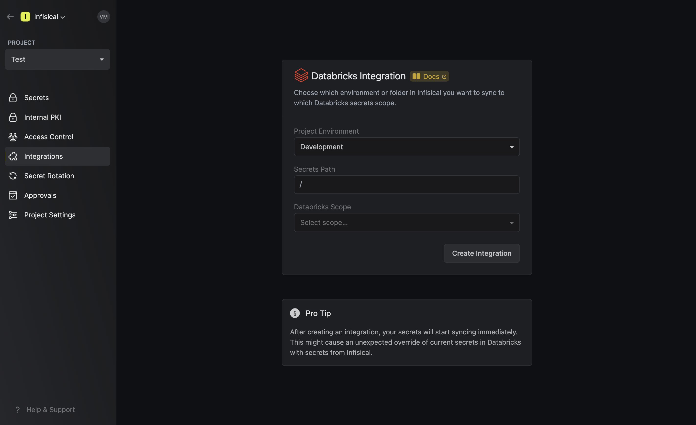
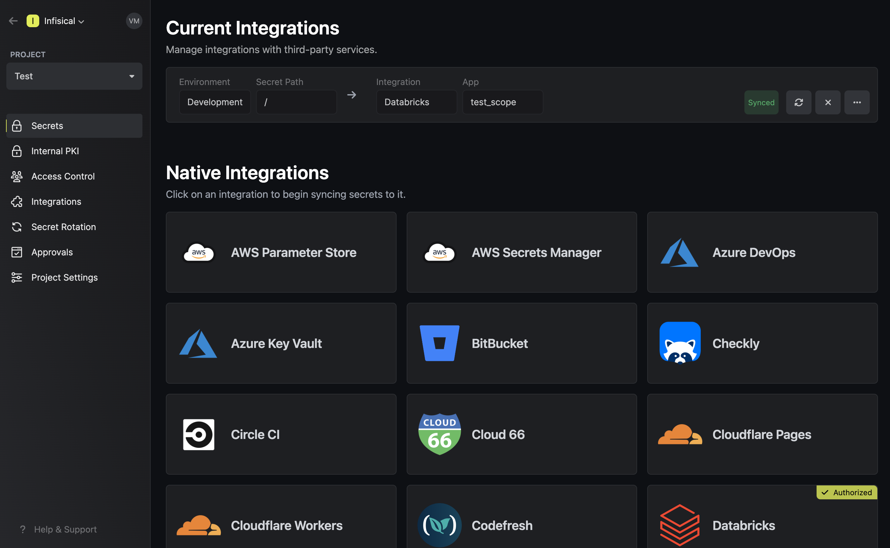

Prerequisites:

- Set up and add secrets to [Infisical Cloud](https://app.infisical.com)

<Steps>
  <Step title="Authorize Infisical for Databricks">
    Obtain a Personal Access Token in **User Settings** > **Developer** > **Access Tokens**.

    

    Navigate to your project's integrations tab in Infisical.

    

    Press on the Databricks tile and enter your Databricks instance URL in the following format: `https://xxx.cloud.databricks.com`. Then, input your Databricks Access Token to grant Infisical the necessary permissions in your Databricks account. 

    

  </Step>
  <Step title="Start integration">
    Select which Infisical environment and secret path you want to sync to which Databricks scope. Then, press create integration to start syncing secrets to Databricks.

    
    
  </Step>
</Steps>