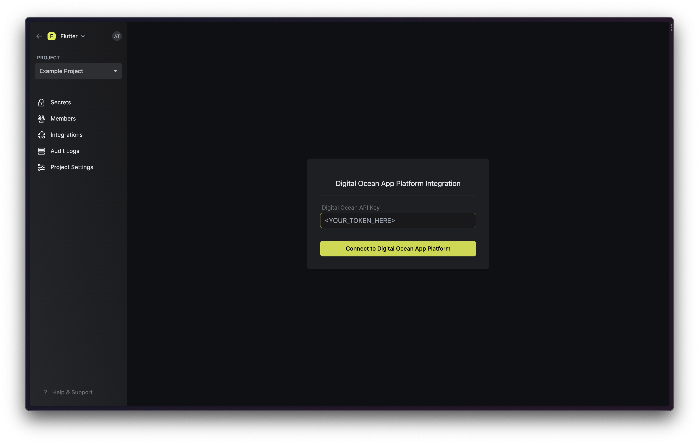
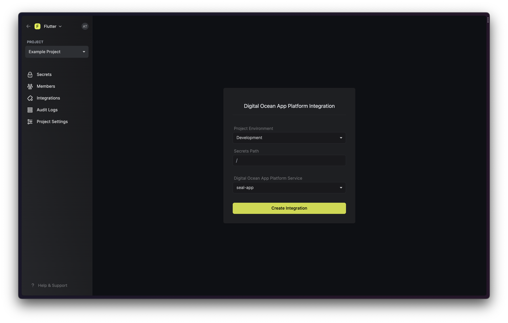

Prerequisites:

- Set up and add envars to [Infisical Cloud](https://app.infisical.com)

## Get your Digital Ocean Personal Access Tokens

On Digital Ocean dashboard, navigate to **API > Tokens** and click on "Generate New Token"

Name it **infisical**, choose **No expiry**, and make sure to check **Write (optional)**. Then click on "Generate Token" and copy your API token.

## Navigate to your project's integrations tab

Click on the **Digital Ocean App Platform** tile and enter your API token to grant Infisical access to your Digital Ocean account.

Then enter your Digital Ocean Personal Access Token here. Then click "Connect to Digital Ocean App Platform".

## Start integration

Select which Infisical environment secrets you want to sync to which Digital Ocean App and click "Create Integration".

Done!

