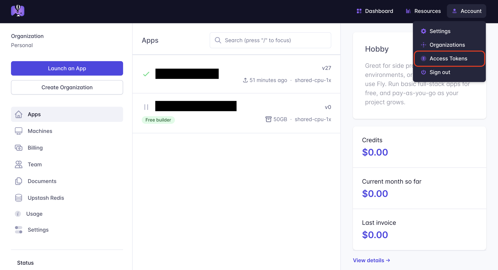
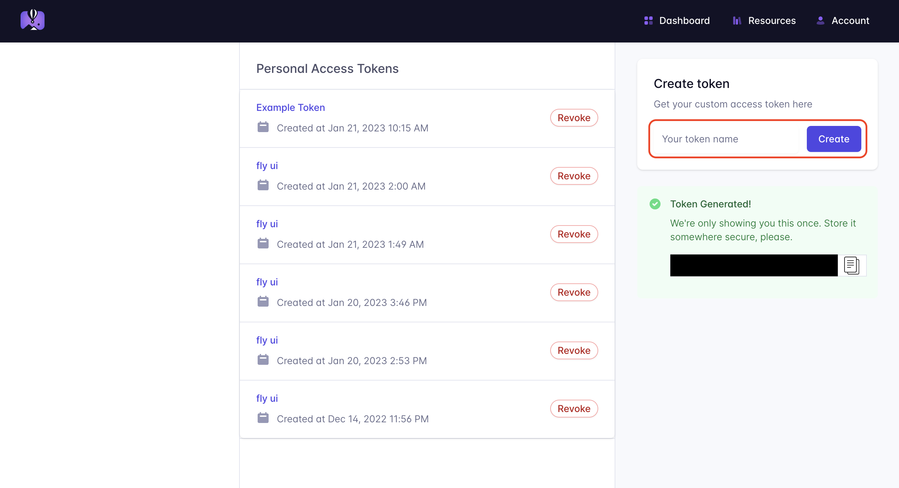
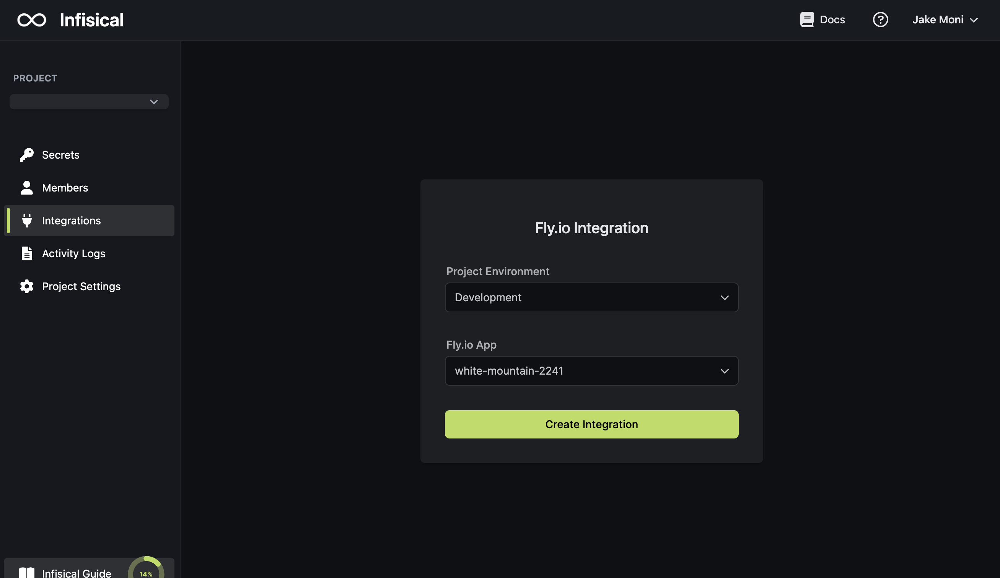

Prerequisites:

- Set up and add envars to [Infisical Cloud](https://app.infisical.com)

## Navigate to your project's integrations tab

## Enter your Fly.io Access Token

Obtain a Fly.io access token in Access Tokens

Press on the Fly.io tile and input your Fly.io access token to grant Infisical access to your Fly.io account.

<Info>
  If this is your project's first cloud integration, then you'll have to grant
  Infisical access to your project's environment variables. Although this step
  breaks E2EE, it's necessary for Infisical to sync the environment variables to
  the cloud platform.
</Info>

## Start integration

Select which Infisical environment secrets you want to sync to which Fly.io app and press create integration to start syncing secrets to Fly.io.

