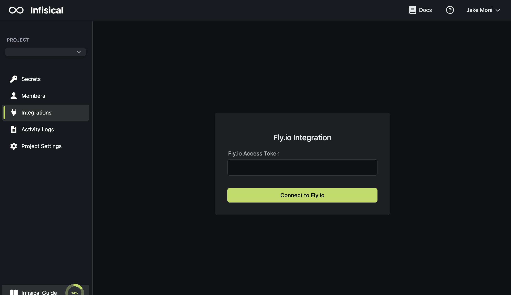
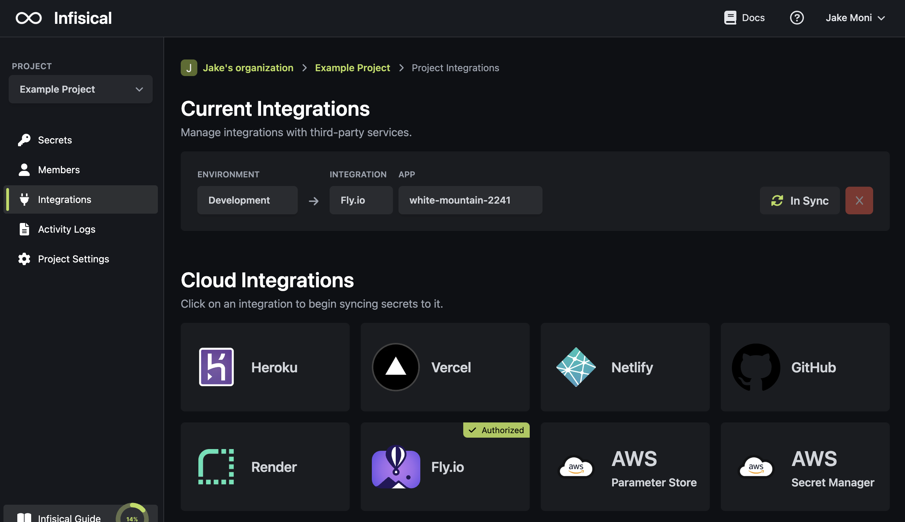

Prerequisites:

- Set up and add envars to [Infisical Cloud](https://app.infisical.com)

<Steps>
  <Step title="Authorize Infisical for Fly.io">
    Obtain a Fly.io access token in Access Tokens

    
    

    Navigate to your project's integrations tab in Infisical.

    

    Press on the Fly.io tile and input your Fly.io access token to grant Infisical access to your Fly.io account.

    

  </Step>
  <Step title="Start integration">
    Select which Infisical environment secrets you want to sync to which Fly.io app and press create integration to start syncing secrets to Fly.io.

    
    
  </Step>
</Steps>