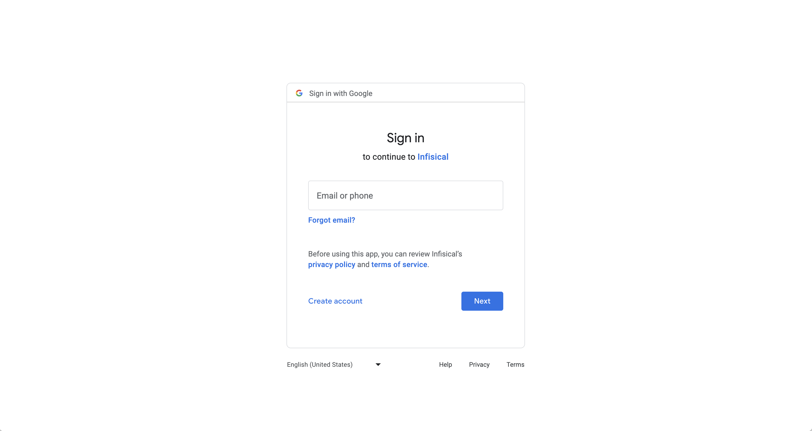
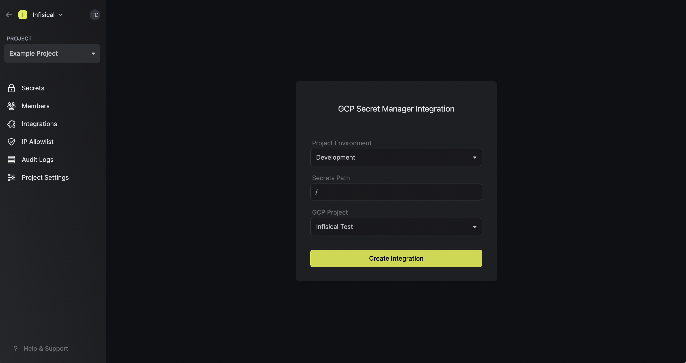
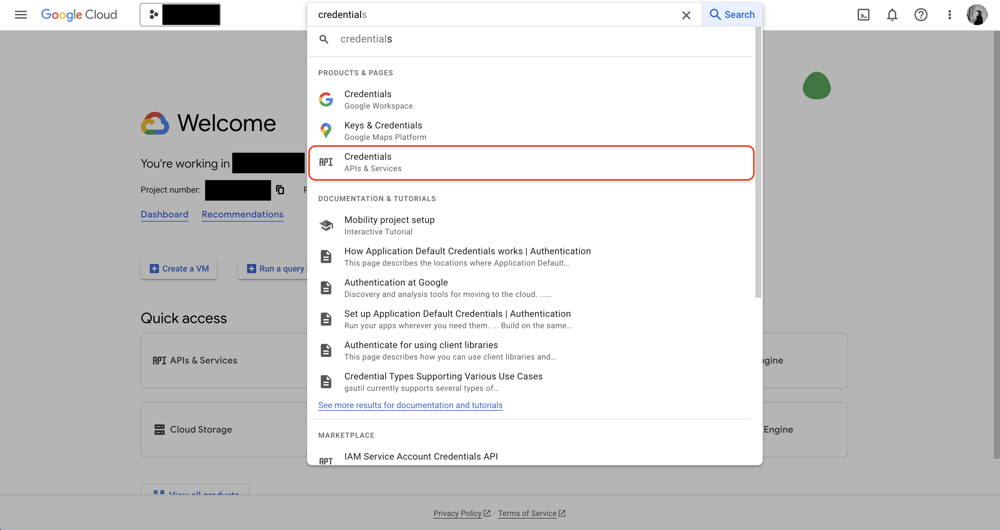
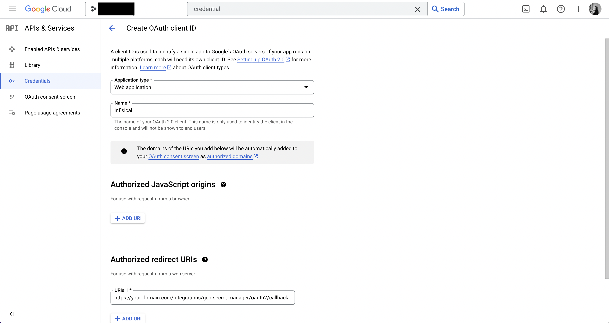

<Tabs>
  <Tab title="Usage">
  Prerequisites:

- Set up and add envars to [Infisical Cloud](https://app.infisical.com)

## Navigate to your project's integrations tab

## Authorize Infisical for GCP

Press on the GCP Secret Manager tile and grant Infisical access to GCP.

<Info>
  If this is your project's first cloud integration, then you'll have to grant
  Infisical access to your project's environment variables. Although this step
  breaks E2EE, it's necessary for Infisical to sync the environment variables to
  the cloud platform.
</Info>

## Start integration

Select which Infisical environment secrets you want to sync to which GCP secret manager project. Lastly, press create integration to start syncing secrets to GCP secret manager.

<Warning>
    Using Infisical to sync secrets to GCP Secret Manager requires that you enable
    the Service Usage API in the Google Cloud project you want to sync secrets to. More on that [here](https://cloud.google.com/service-usage/docs/set-up-development-environment).
</Warning>
  </Tab>
  <Tab title="Self-Hosted Setup">
  Using the GCP Secret Manager integration on a self-hosted instance of Infisical requires configuring an OAuth2 application in GCP
  and registering your instance with it.
  
  ## Create an OAuth2 application in GCP
  
  Navigate to your project API & Services > Credentials to create a new OAuth2 application.
   
    
    
    
    Create the application. As part of the form, add to **Authorized redirect URIs**: `https://your-domain.com/integrations/gitlab/oauth2/callback`.
   
    
   
   ## Add your OAuth2 application credentials to Infisical
   
   Obtain the **Client ID** and **Client Secret** for your GCP OAuth2 application.
   
    
   
   Back in your Infisical instance, add two new environment variables for the credentials of your GCP OAuth2 application:

   - `CLIENT_ID_GCP_SECRET_MANAGER`: The **Client ID** of your GCP OAuth2 application.
   - `CLIENT_SECRET_GCP_SECRET_MANAGER`: The **Client Secret** of your GCP OAuth2 application.
   
  Once added, restart your Infisical instance and use the GCP Secret Manager integration.

  </Tab>
</Tabs>

