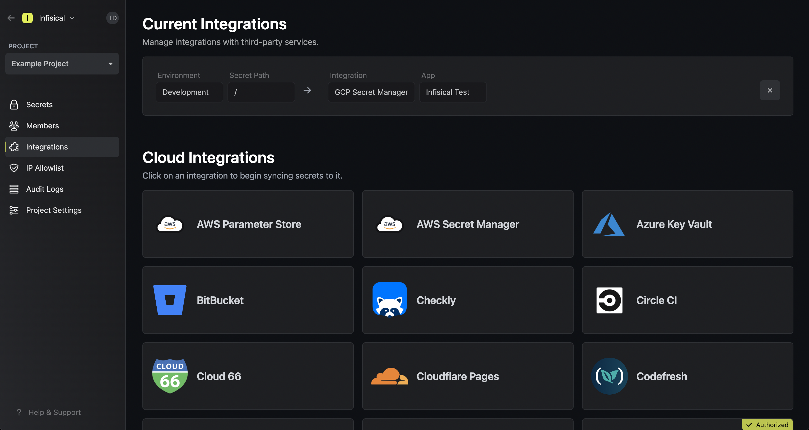

Prerequisites:

- Set up and add envars to [Infisical Cloud](https://app.infisical.com)

## Navigate to your project's integrations tab

## Authorize Infisical for GCP

Press on the GCP Secret Manager tile and grant Infisical access to GCP.

<Info>
  If this is your project's first cloud integration, then you'll have to grant
  Infisical access to your project's environment variables. Although this step
  breaks E2EE, it's necessary for Infisical to sync the environment variables to
  the cloud platform.
</Info>

## Start integration

Select which Infisical environment secrets you want to sync to which GCP secret manager project. Lastly, press create integration to start syncing secrets to GCP secret manager.

<Warning>
    Using Infisical to sync secrets to GCP Secret Manager requires that you enable
    the Service Usage API in the Google Cloud project you want to sync secrets to. More on that [here](https://cloud.google.com/service-usage/docs/set-up-development-environment).
</Warning>