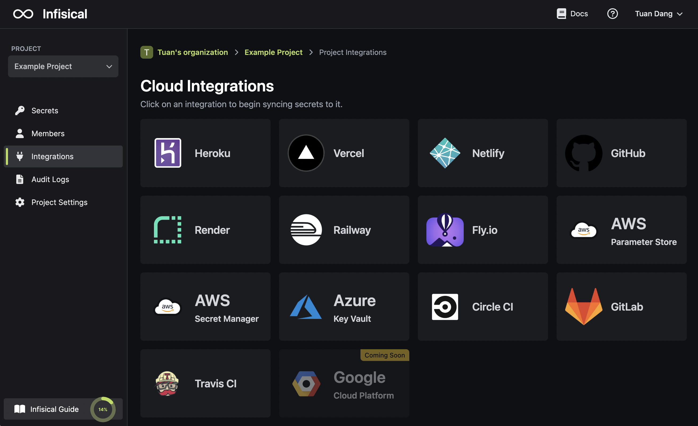

<Note>
    Infisical connects to Vault via the AppRole auth method. 
    
    Currently, each Infisical project can only point and sync secrets to one Vault cluster / namespace
    but with unlimited integrations to different paths within it.

    This tutorial makes use of Vault's UI but, in principle, instructions can executed via
    Vault CLI or API call.
    
    Lastly, you should note that we provide a simple use-case and, in practice, you should adapt and extend it to your own Vault use-case and follow best practices, for instance when defining fine-grained ACL policies.
</Note>

Prerequisites:

- Set up and add envars to [Infisical Cloud](https://app.infisical.com)
- Have experience with [HashiCorp Vault](https://www.vaultproject.io/).

## Navigate to your project's integrations tab



## Prepare Vault

This section mirrors the latter parts of the [Vault quickstart](https://developer.hashicorp.com/vault/tutorials/cloud/getting-started-intro) provided by HashiCorp and uses sample names/values for demonstration.

To begin, navigate to the cluster / namespace that you want to sync secrets to in Vault; we'll use the default `admin` namespace (in practice, we recommend creating a namespace and not using the default `admin` namespace).

### Enable KV Secrets Engine

In Secrets, enable a KV Secrets Engine at a path for Infisical to sync secrets to; we'll use the path `kv`.


### Enable the AppRole auth method

In Access > Auth Methods, enable the AppRole auth method.


### Create an ACL Policy

Now in Policies, create a new ACL policy scoped to the path(s) you wish Infisical to be able to sync secrets to.

We'll call the policy `test` and have it grant access to the `dev` path in the KV Secrets Engine where we will be syncing secrets to from Infisical.

```console
path "kv/data/dev" {
  capabilities = [ "create", "read", "update" ]
}

path "sys/namespaces/*" {
   capabilities = [ "create", "read", "update", "delete", "list" ]
}
```

<Note>
    `kv` comes from the path of the KV Secrets Engine that we enabled and `dev` is the chosen path within it
    that we want to sync secrets to.
</Note>


### Create a role with the policy attached

We now create a `infisical` role with the generated token's time-to-live (TTL) set to 1 hour and can be renewed for up to 4 hours from the time of its creation.

1. Click the Vault CLI shell icon (`>_`) to open a command shell in the browser.


2. Copy the command below.

```console
vault write auth/approle/role/infisical token_policies="test" token_ttl=1h token_max_ttl=4h
```

3. Paste the command into the command shell in the browser and press the enter button.

### Generate a RoleID and SecretID

Finally, we need to generate a **RoleID** and **SecretID** (like a username and password) that Infisical can use
to authenticate with Vault.

1. Click the Vault CLI shell icon (>_) again to open a command shell.

2. Read the RoleID.

```console
vault read auth/approle/role/infisical/role-id
```

Example output:

```console
Key     Value
role_id b6ccdcca-183b-ce9c-6b98-b556b9a0edb9
```

3. Generate a new SecretID of the `infisical` role.

```console
vault write -force auth/approle/role/infisical/secret-id
```

Example output:


```console
Key                Value
secret_id          735a47cc-7a98-77cc-0128-12b1e96a4157
secret_id_accessor 3ab305d1-1eab-df4b-4079-ef7135635c49
...snip...
```

Great. We're now ready to connect Infisical to Vault!

## Enter your Vault instance and authentication details

Back in Infisical, press on the HashiCorp Vault tile and input your Vault instance and `infisical` role RoleID and SecretID.


For additional details on each field:

- Vault Cluster URL: The address of your cluster, either HCP or self-hosted.

If using HCP, you can copy your Cluster URL in the Cluster Overview:


- Vault Namespace: The Vault namespace you wish to connect to.
- Vault RoleID: The RoleID previously created for the `infisical` role.
- Vault SecretID: The SecretID previously created for the `infisical` role.

## Start integration

Select which Infisical environment secrets you want to sync to Vault.

For additional details on each field:

- Vault KV Secrets Engine Path: the path at which you enabled the intended KV Secrets Engine; in this demonstration, we used `kv`.
- Vault Secret(s) Path: the path in the KV Secrets Engine that you wish to sync secrets to.

Press create integration to start syncing secrets to Vault.


