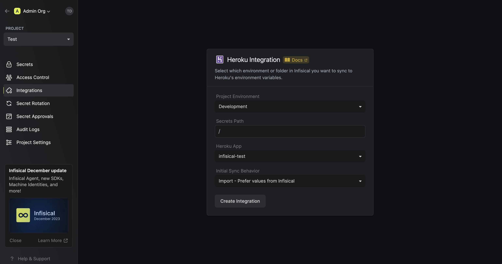
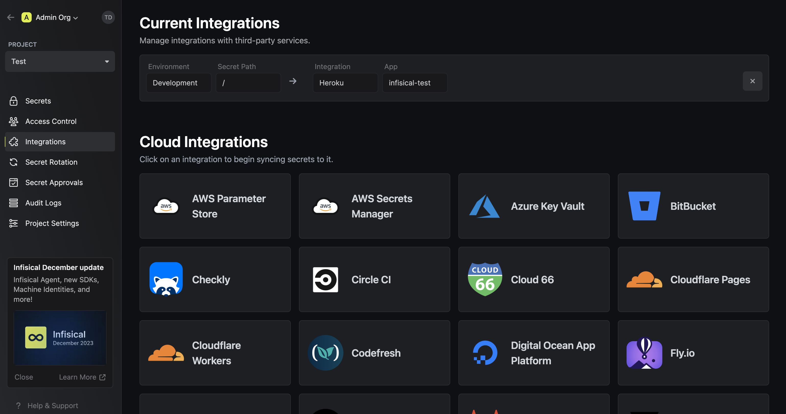
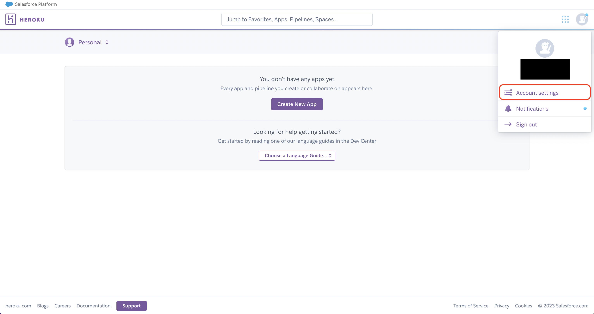
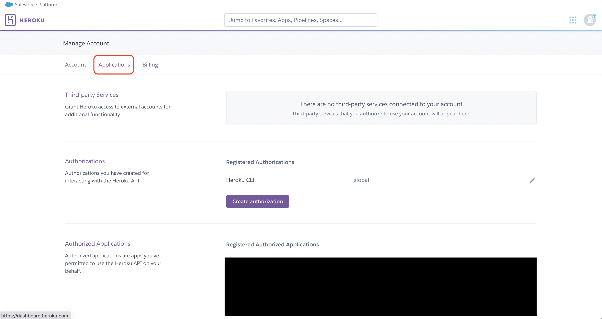
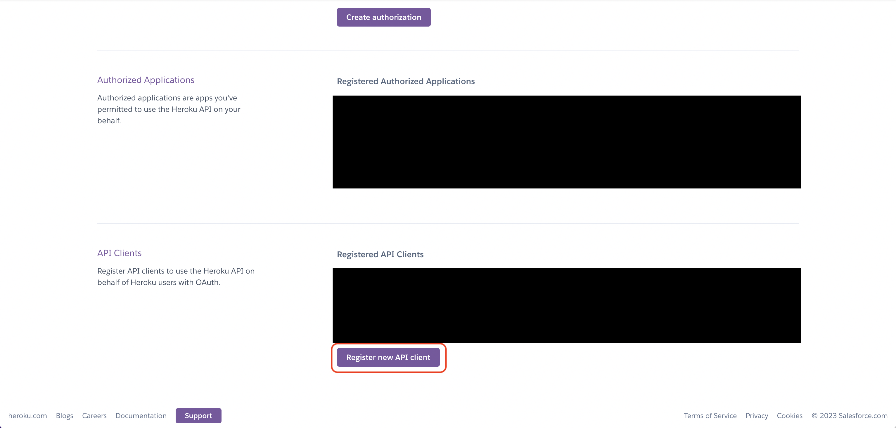
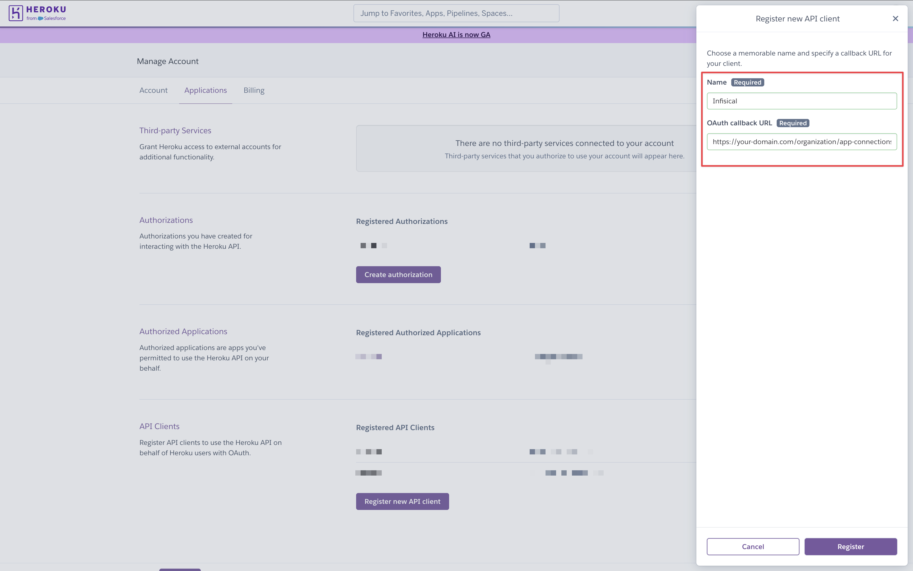
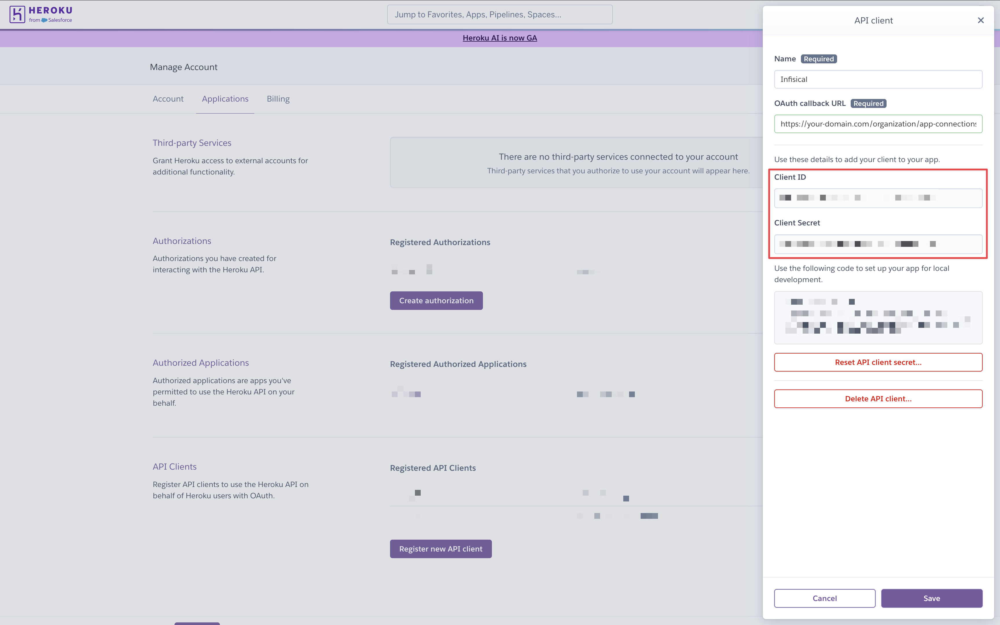

<Tabs>
  <Tab title="Usage">
    Prerequisites:

    - Set up and add envars to [Infisical Cloud](https://app.infisical.com)

    <Steps>
      <Step title="Authorize Infisical for Heroku">
        Navigate to your project's integrations tab in Infisical.

        

        Press on the Heroku tile and grant Infisical access to your Heroku account.

        

      </Step>
      <Step title="Start integration">
        Select which Infisical environment secrets you want to sync to which Heroku app and press create integration to start syncing secrets to Heroku.

        

        Here's some guidance on each field:

        - Project Environment: The environment in the current Infisical project from which you want to sync secrets from.
        - Secrets Path: The path in the current Infisical project from which you want to sync secrets from such as `/` (for secrets that do not reside in a folder) or `/foo/bar` (for secrets nested in a folder, in this case a folder called `bar` in another folder called `foo`).
        - Heroku App: The application in Heroku that you want to sync secrets to.
        - Initial Sync Behavior (default is **Import - Prefer values from Infisical**): The behavior of the first sync operation triggered after creating the integration.
          - **No Import - Overwrite all values in Heroku**: Sync secrets and overwrite any existing secrets in Heroku.
          - **Import - Prefer values from Infisical**: Import secrets from Heroku to Infisical; if a secret with the same name already exists in Infisical, do nothing. Afterwards, sync secrets to Heroku.
          - **Import - Prefer values from Heroku**: Import secrets from Heroku to Infisical; if a secret with the same name already exists in Infisical, replace its value with the one from Heroku. Afterwards, sync secrets to Heroku.

        
      </Step>
    </Steps>
  </Tab>
  <Tab title="Self-Hosted Setup">
    Using the Heroku integration on a self-hosted instance of Infisical requires configuring an API client in Heroku
    and registering your instance with it.
    <Steps>
      <Step title="Create an API client in Heroku">
        Navigate to your user Account settings > Applications to create a new API client.

        
        
        

          Create the API client. As part of the form, set the **OAuth callback URL** to `https://your-domain.com/integrations/heroku/oauth2/callback`.

        
      </Step>
      <Step title="Add your Heroku API client credentials to Infisical">
        Obtain the **Client ID** and **Client Secret** for your Heroku API client.

        

        Back in your Infisical instance, add two new environment variables for the credentials of your Heroku API client.

        - `CLIENT_ID_HEROKU`: The **Client ID** of your Heroku API client.
        - `CLIENT_SECRET_HEROKU`: The **Client Secret** of your Heroku API client.

        Once added, restart your Infisical instance and use the Heroku integration.
      </Step>
    </Steps>
  </Tab>
</Tabs>
