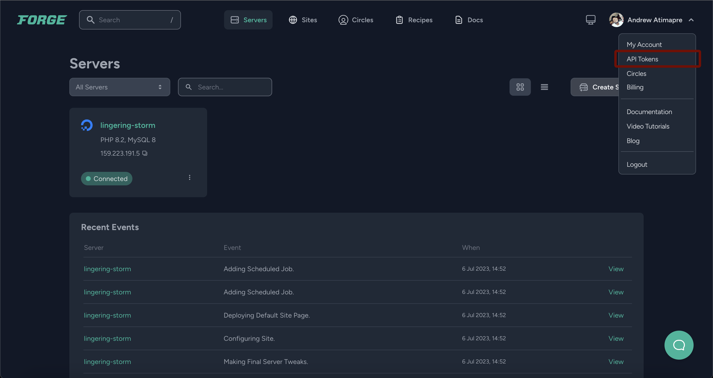
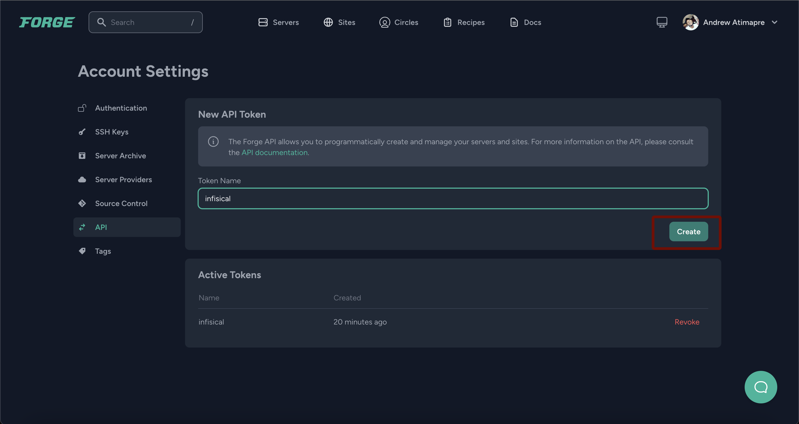
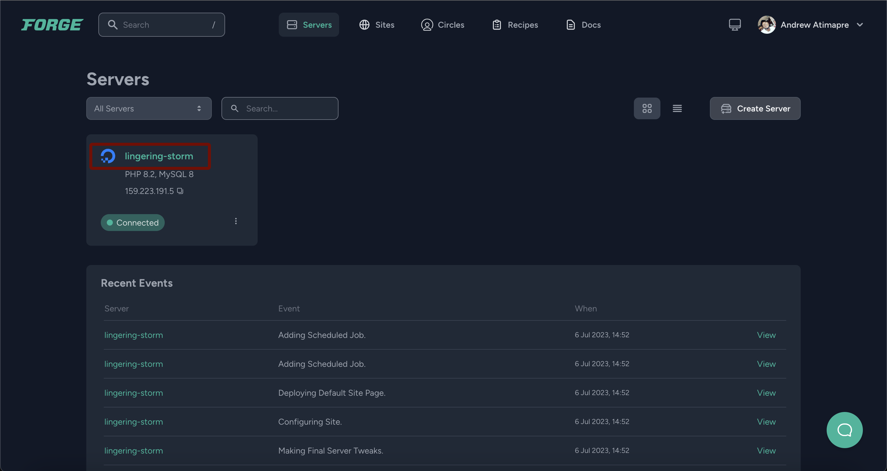
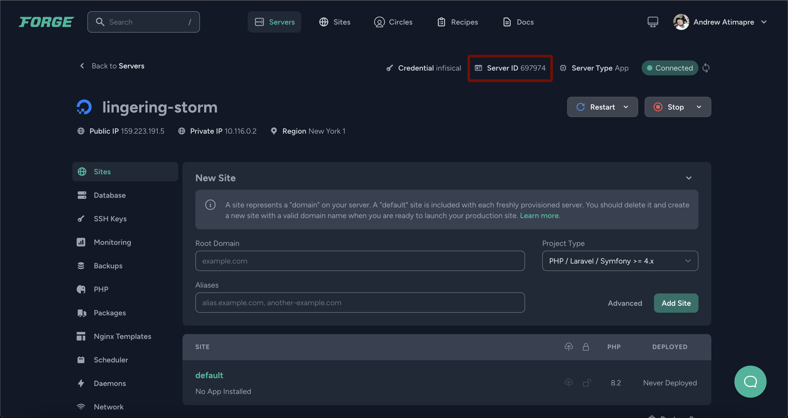
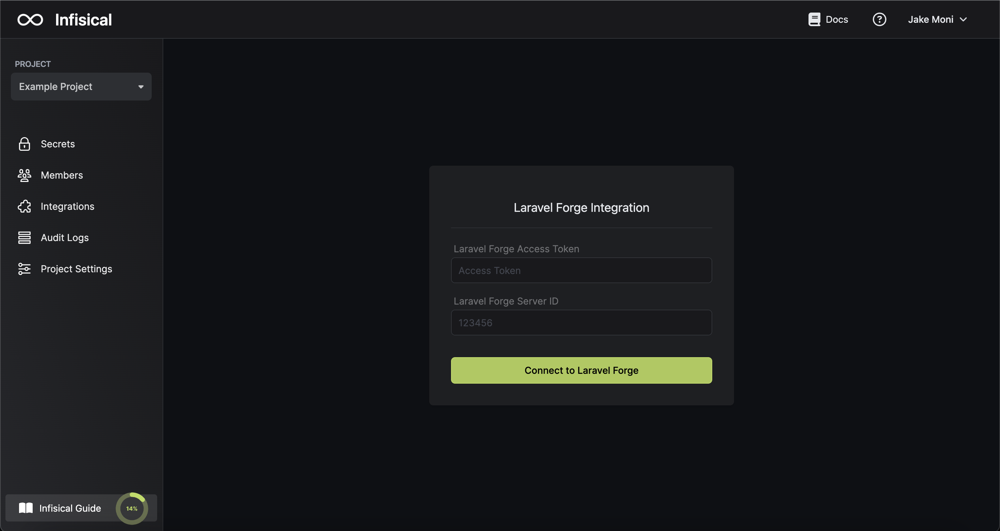
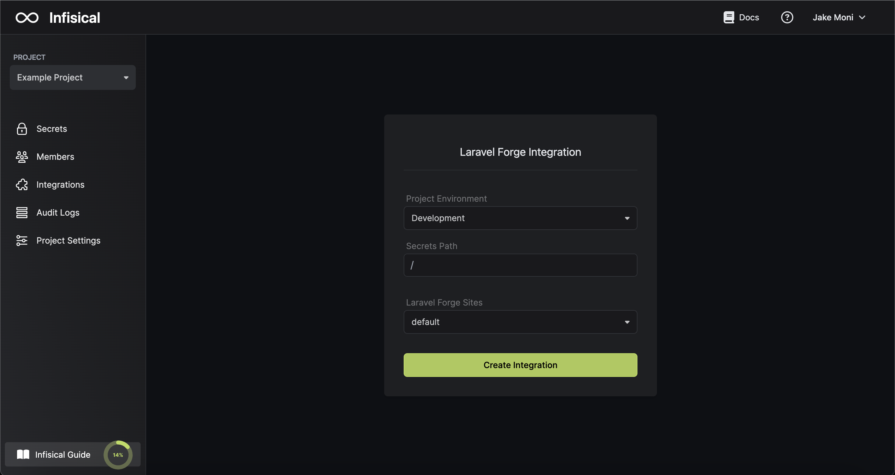

Prerequisites:

- Set up and add envars to [Infisical Cloud](https://app.infisical.com)

<Steps>
  <Step title="Authorize Infisical for Laravel Forge">
    Obtain a Laravel Forge access token in API Tokens

    
    

    Obtain your Laravel Forge Server ID in Servers > Server ID

    
    
    
    Navigate to your project's integrations tab in Infisical.

    

    Press on the Laravel Forge tile and input your Laravel Forge access token and server ID to grant Infisical access to your Laravel Forge account.

    

  </Step>
  <Step title="Start integration">
    Select which Infisical environment secrets you want to sync to which Laravel Forge site and press create integration to start syncing secrets to Laravel Forge.

    
    
  </Step>
</Steps>

