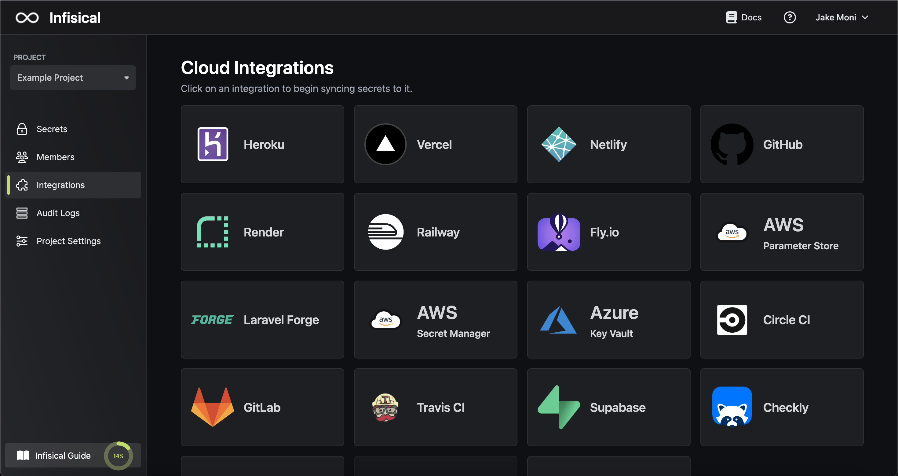
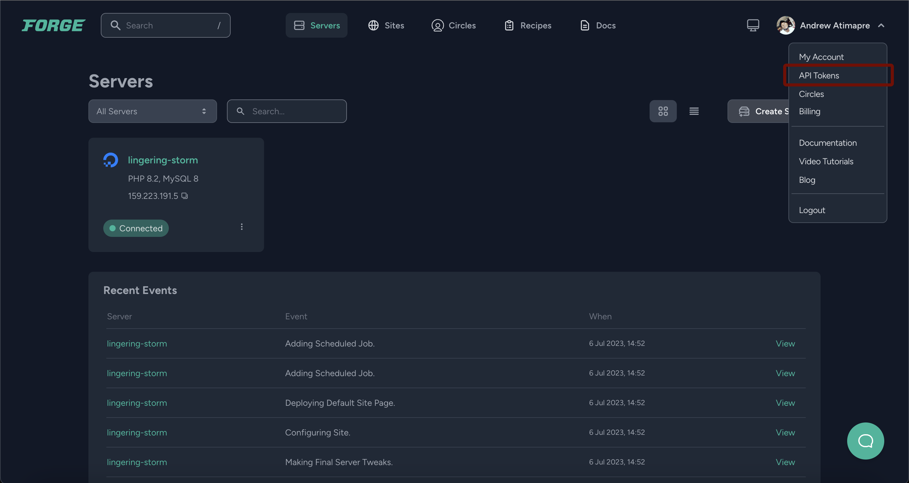
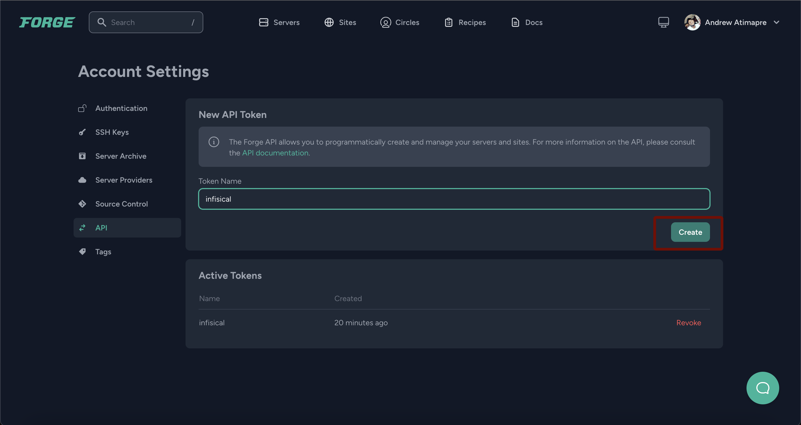
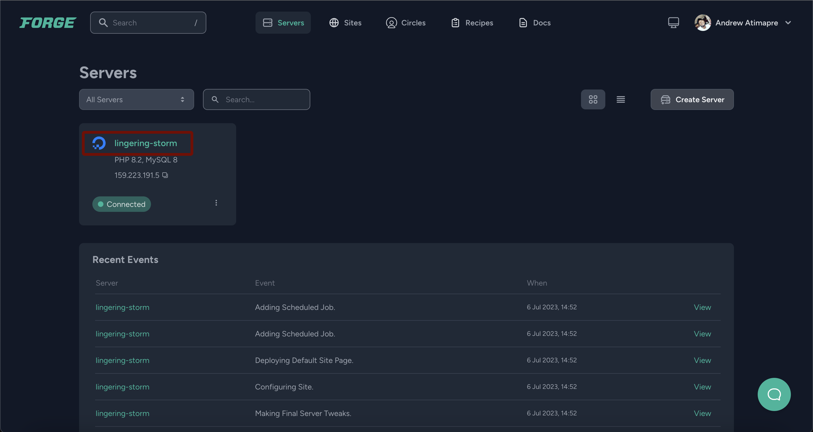
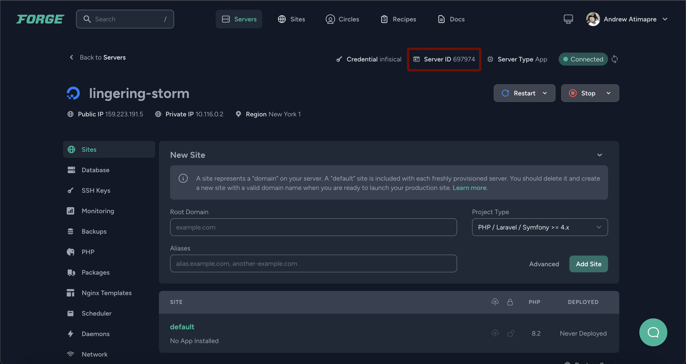
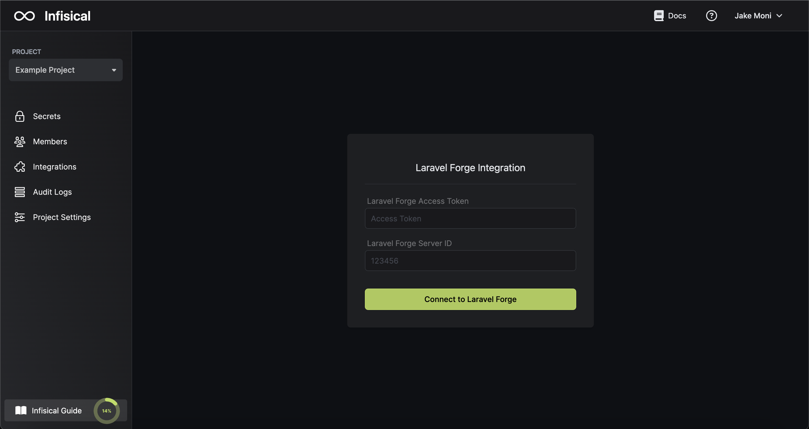
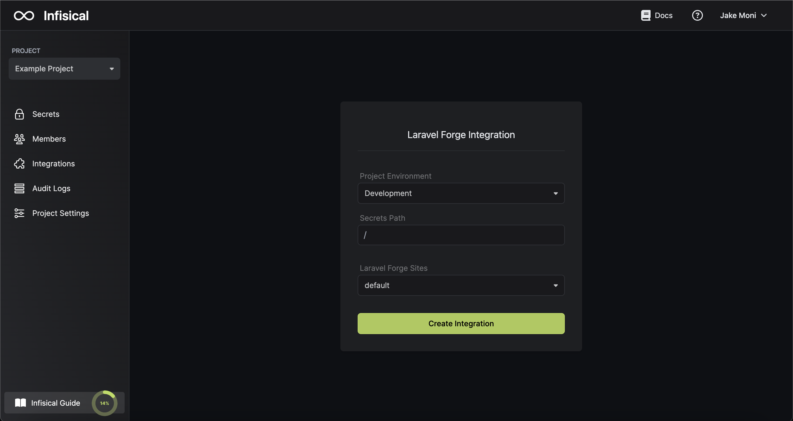

Prerequisites:

- Set up and add envars to [Infisical Cloud](https://app.infisical.com)

## Navigate to your project's integrations tab

## Enter your Laravel Forge Access Token and Server Id

Obtain a Laravel Forge access token in API Tokens

Obtain a Laravel Forge server id in Servers

Press on the Laravel Forge tile and input your Laravel Forge access token and server id to grant Infisical access to your Laravel Forge account.

<Info>
  If this is your project's first cloud integration, then you'll have to grant
  Infisical access to your project's environment variables. Although this step
  breaks E2EE, it's necessary for Infisical to sync the environment variables to
  the cloud platform.
</Info>

## Start integration

Select which Infisical environment secrets you want to sync to which Laravel Forge site and press create integration to start syncing secrets to Laravel Forge.

