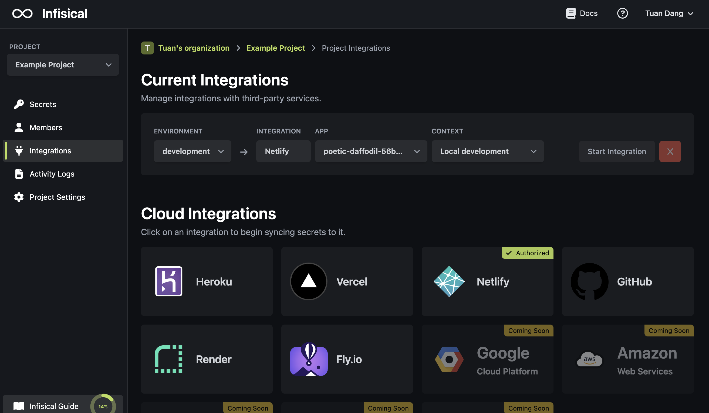

<Warning>
  Infisical integrates with Netlify's new environment variable experience. If
  your site uses Netlify's old environment variable experience, you'll have to
  upgrade it to the new one to use this integration.
</Warning>

Prerequisites:

- Set up and add envars to [Infisical Cloud](https://app.infisical.com)

## Navigate to your project's integrations tab

## Authorize Infisical for Netlify

Press on the Netlify tile and grant Infisical access to your Netlify account.

<Info>
  If this is your project's first cloud integration, then you'll have to grant
  Infisical access to your project's environment variables. Although this step
  breaks E2EE, it's necessary for Infisical to sync the environment variables to
  the cloud platform.
</Info>

## Start integration

Select which Infisical environment secrets you want to sync to which Netlify app and context. Lastly, press create integration to start syncing secrets to Netlify.

