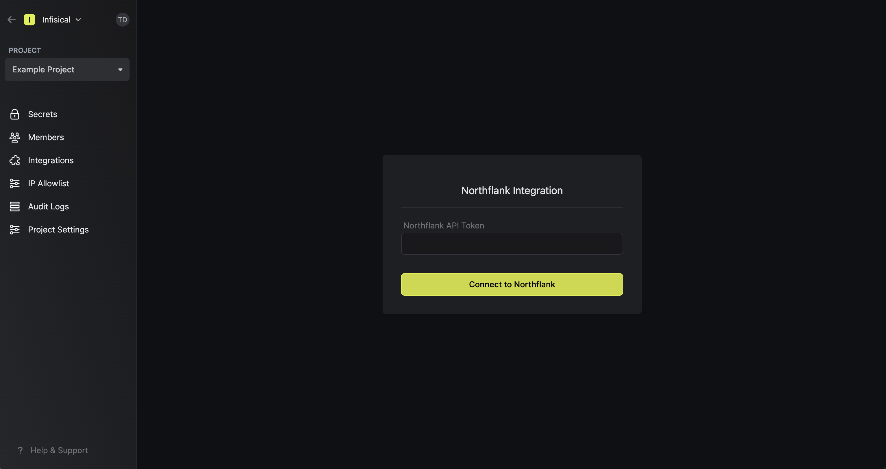
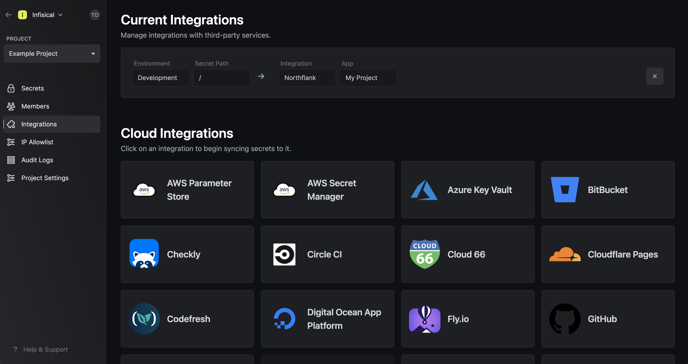

Prerequisites:

- Set up and add envars to [Infisical Cloud](https://app.infisical.com)
- Have a [Northflank](https://northflank.com) project with a secret group ready

## Navigate to your project's integrations tab

## Enter your Northflank API Token

Obtain a Northflank API token in Account settings > API > Tokens

Press on the Northflank tile and input your Northflank API token to grant Infisical access to your Northflank account.

<Info>
  If this is your project's first cloud integration, then you'll have to grant
  Infisical access to your project's environment variables. Although this step
  breaks E2EE, it's necessary for Infisical to sync the environment variables to
  the cloud platform.
</Info>

## Start integration

Select which Infisical environment secrets you want to sync to which Northflank project and secret group. Finally, press create integration to start syncing secrets to Northflank.

