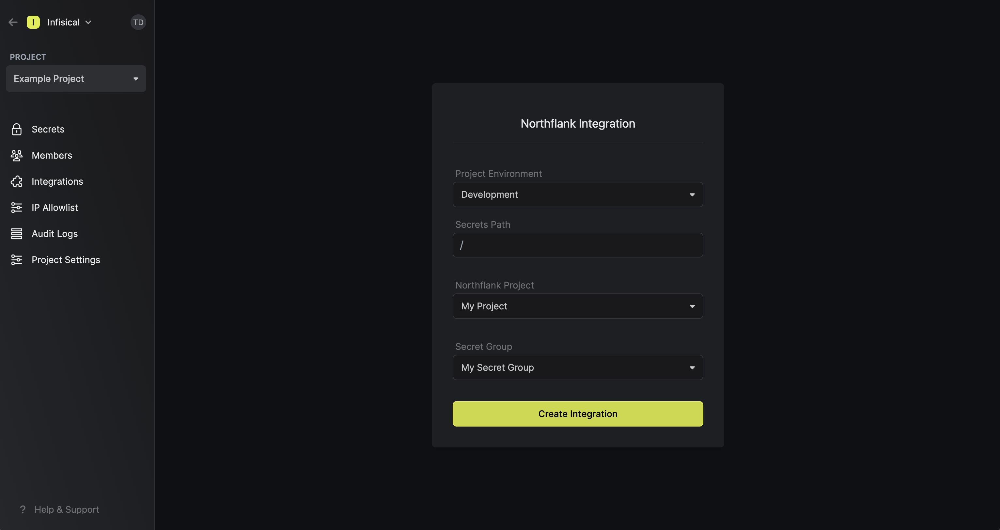

Prerequisites:

- Set up and add envars to [Infisical Cloud](https://app.infisical.com)
- Have a [Northflank](https://northflank.com) project with a secret group ready

<Steps>
  <Step title="Authorize Infisical for Northflank">
    Obtain a Northflank API token in Account settings > API > Tokens

    
    
    
    Navigate to your project's integrations tab in Infisical.

    

    Press on the Northflank tile and input your Northflank API token to grant Infisical access to your Northflank account.

    

  </Step>
  <Step title="Start integration">
    Select which Infisical environment secrets you want to sync to which Northflank project and secret group. Finally, press create integration to start syncing secrets to Northflank.

    
    
  </Step>
</Steps>