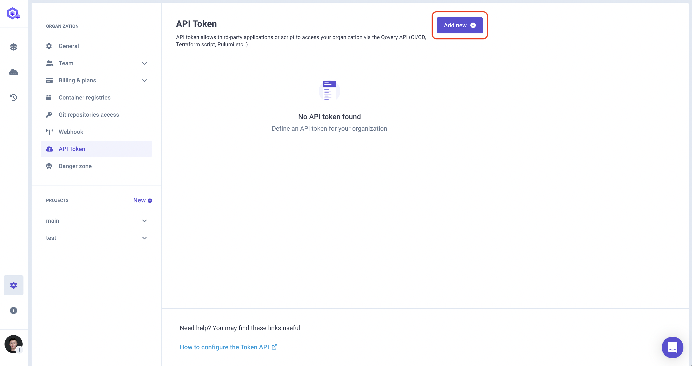
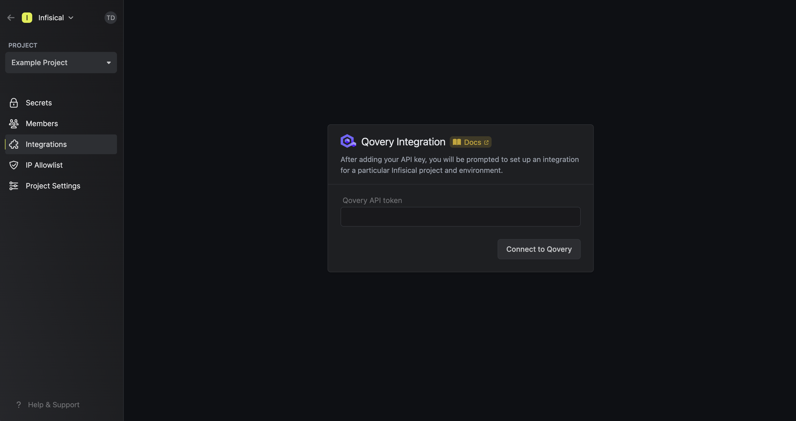
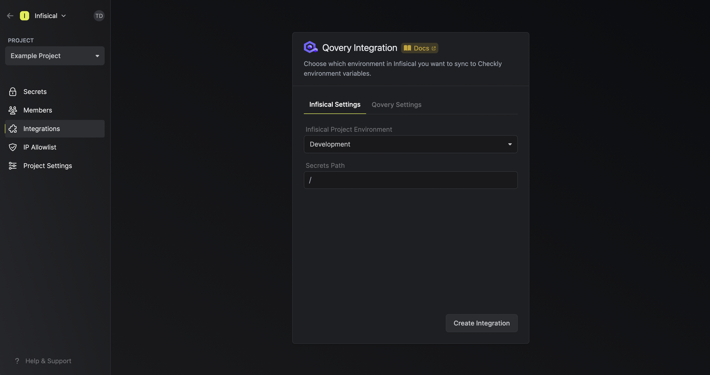
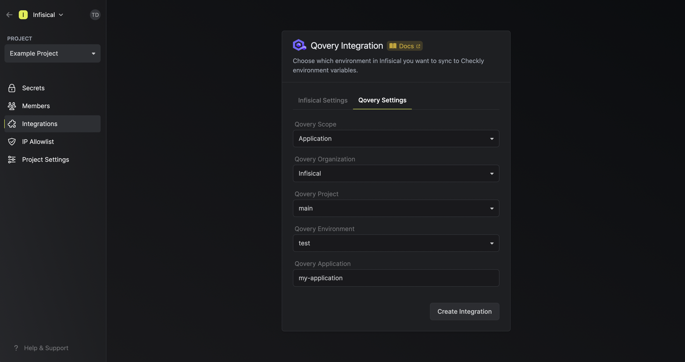
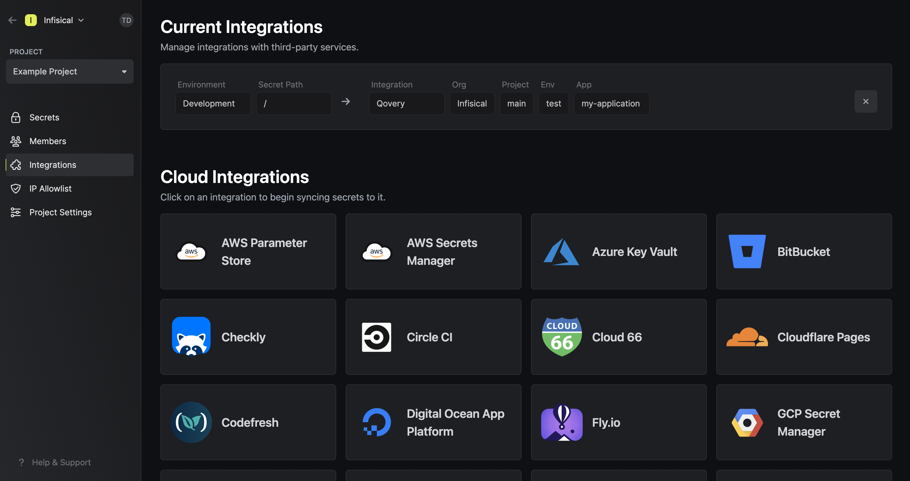

Prerequisites:

- Set up and add envars to [Infisical Cloud](https://app.infisical.com)

<Steps>
  <Step title="Authorize Infisical for Qovery">
    Obtain a Qovery API Token in Settings > API Token.

    

    Navigate to your project's integrations tab in Infisical.

    

    Press on the Qovery tile and input your Qovery API Token to grant Infisical access to your Qovery account.

    

  </Step>
  <Step title="Start integration">
    Select which Infisical environment secrets you want to sync to Qovery and press create integration to start syncing secrets.

    

    

    <Note>
      Infisical supports syncing secrets to various Qovery scopes including applications, jobs, or containers.
    </Note>

    
  </Step>
</Steps>
