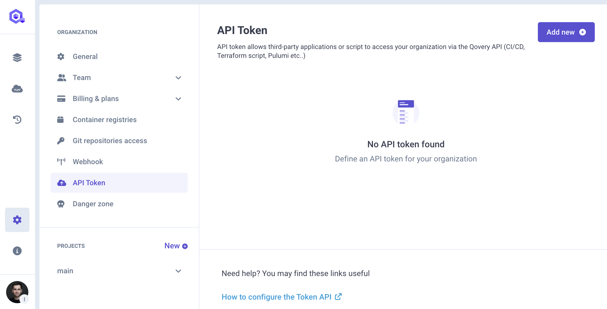
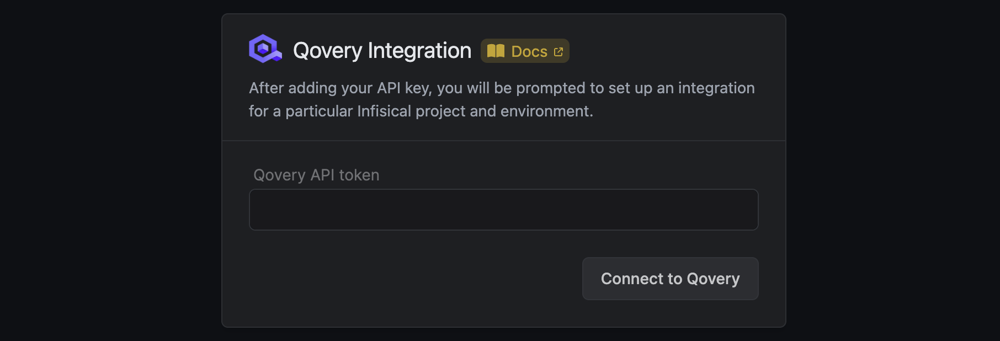
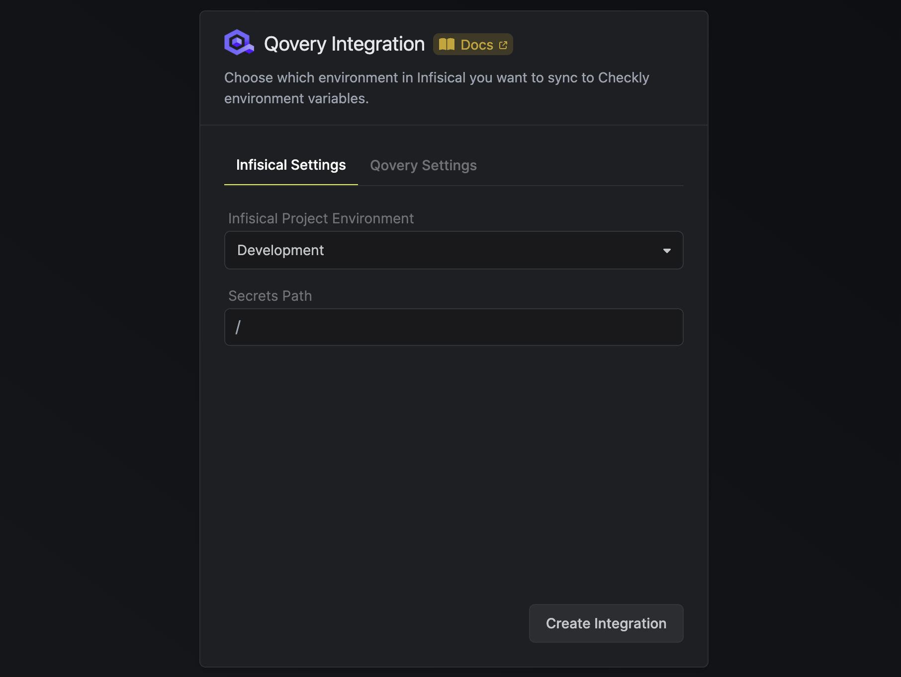
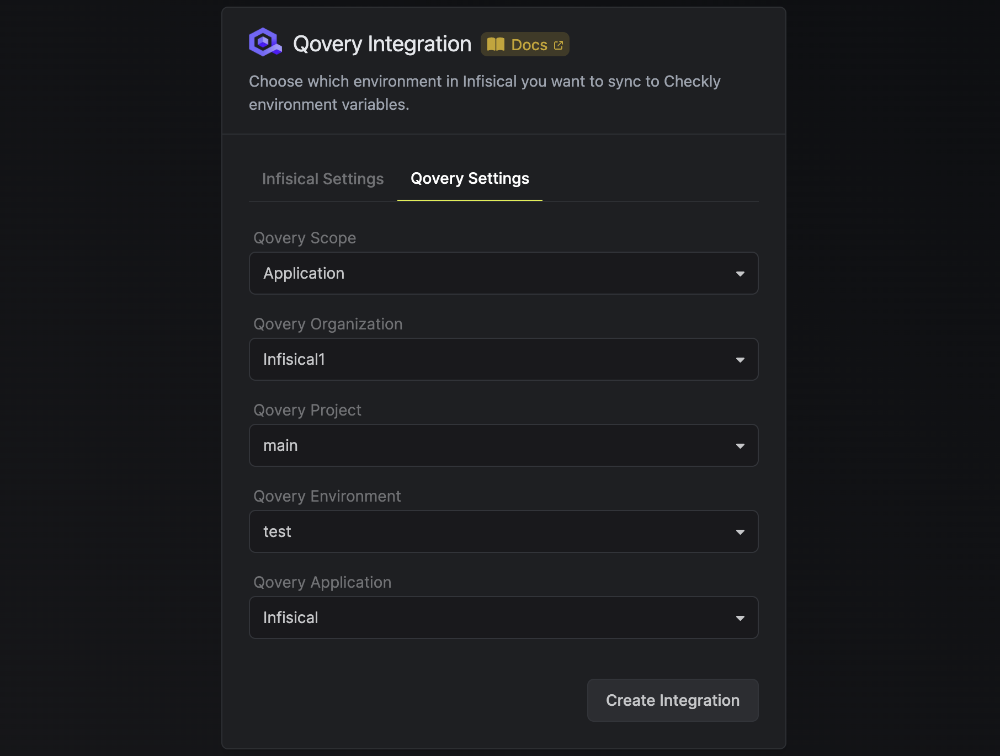

Prerequisites:

- Set up and add envars to [Infisical Cloud](https://app.infisical.com)

## Navigate to your project's integrations tab

## Enter your Qovery API Token

Obtain a Qovery API Token in Settings > API Token.

Press on the Qovery tile and input your Qovery API TOken to grant Infisical access to your Qovery account.

<Info>
  If this is your project's first cloud integration, then you'll have to grant
  Infisical access to your project's environment variables. Although this step
  breaks E2EE, it is necessary for Infisical to sync the environment variables to
  the cloud platform.
</Info>

## Start integration

Select which Infisical environment secrets you want to sync to Qovery and press create integration to start syncing secrets.

Select your Qovery organization, project, and environment to which you want to sync secrets to. Next to that, select which scope you want secrets to (Application, Job, or Container). After you are done, hit "Create Integration."

