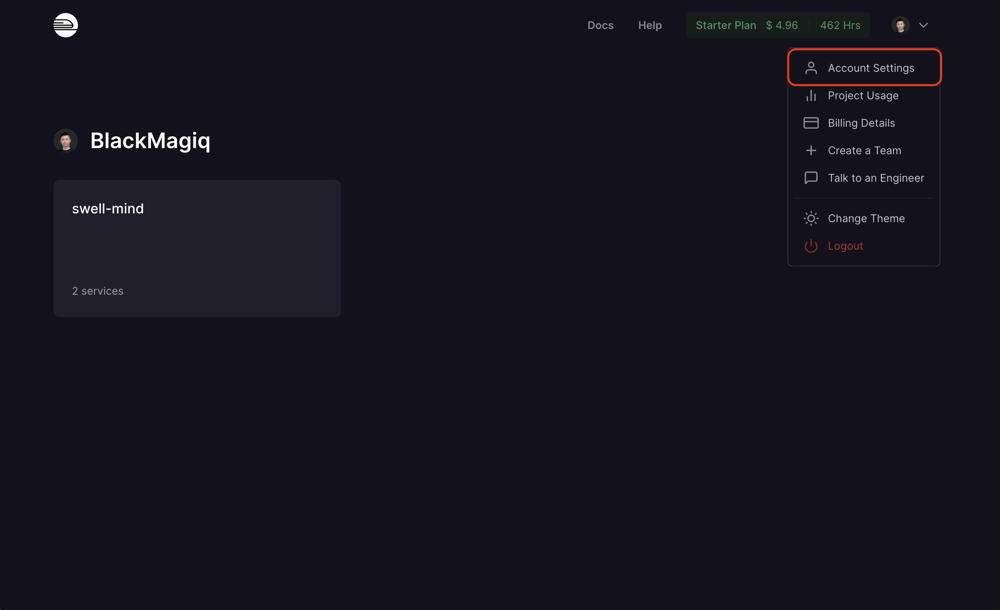
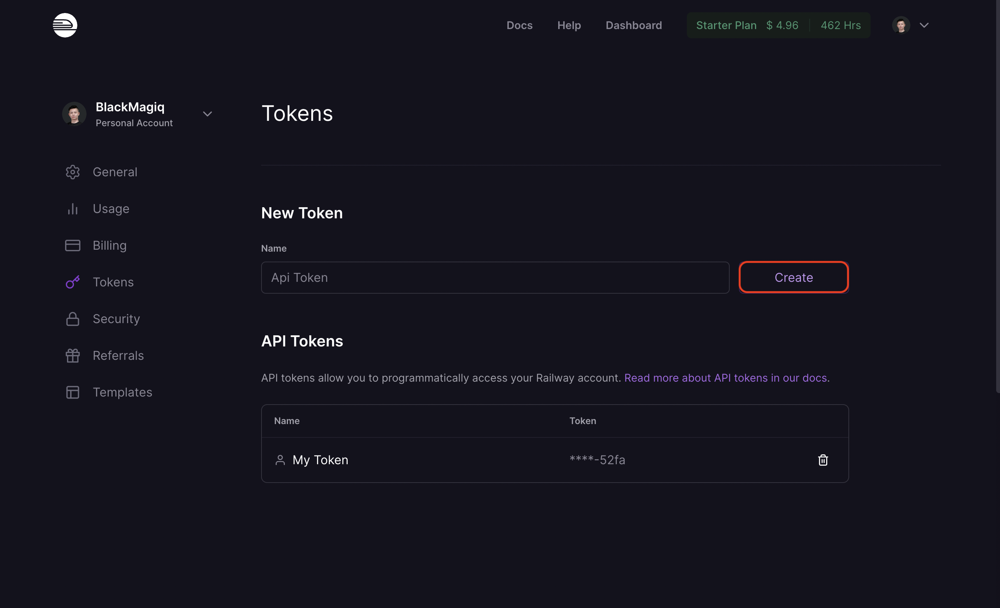
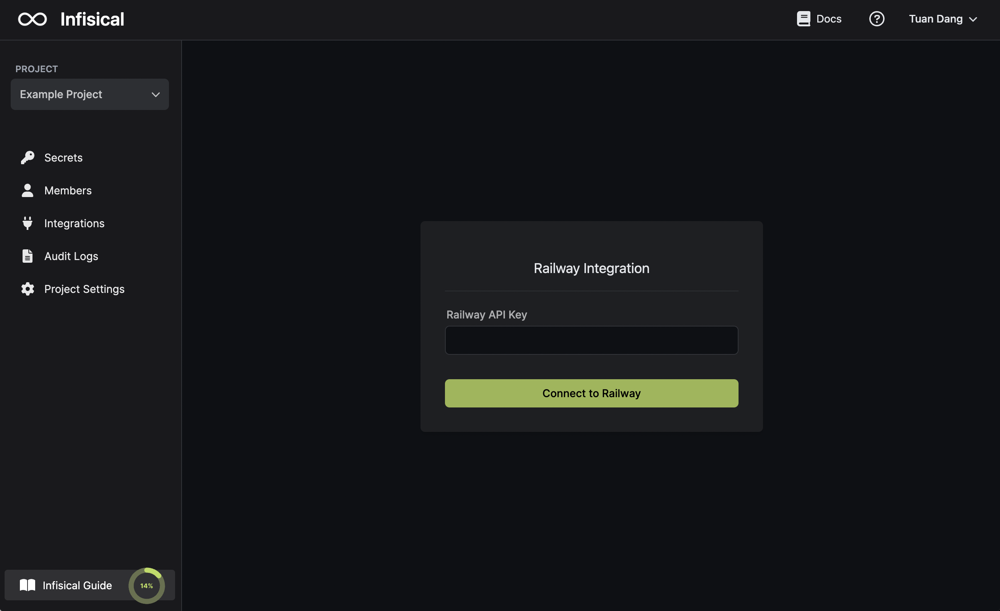
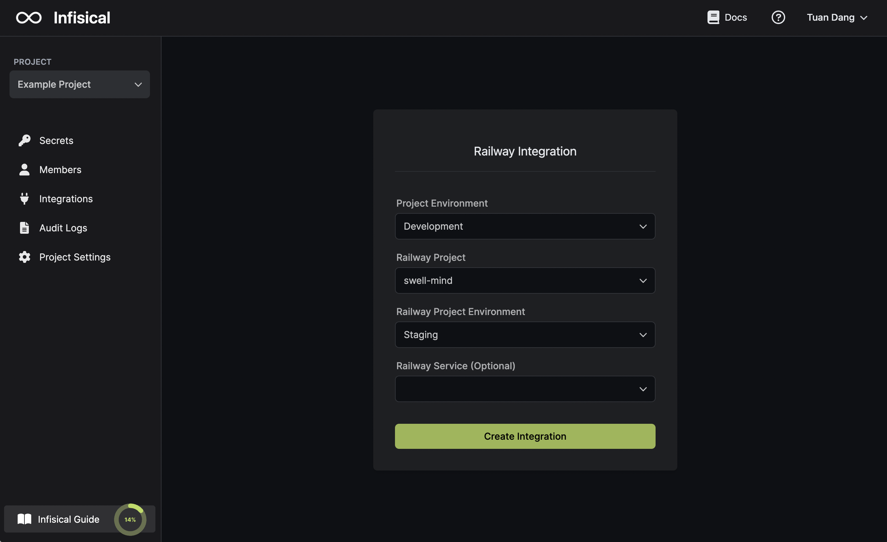
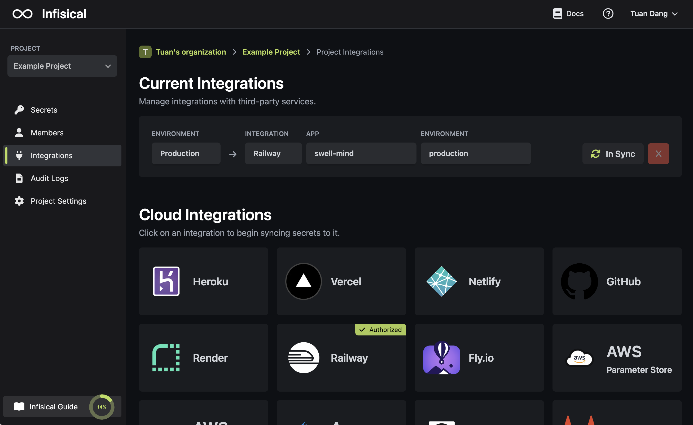

Prerequisites:

- Set up and add envars to [Infisical Cloud](https://app.infisical.com)

## Navigate to your project's integrations tab

## Enter your Railway API Token

Obtain a Railway API Token in your Railway [Account Settings > Tokens](https://railway.app/account/tokens).

<Note>
    If this is your first time creating a Railway API token, then you'll be prompted to join
    Railway's Private Boarding Beta program on the Railway Account Settings > Tokens page. 
    
    Note that Railway project tokens will not work for this integration since they don't work with
    Railway's Public API.
</Note>

Press on the Railway tile and input your Railway API Key to grant Infisical access to your Railway account.

<Info>
  If this is your project's first cloud integration, then you'll have to grant
  Infisical access to your project's environment variables. Although this step
  breaks E2EE, it's necessary for Infisical to sync the environment variables to
  the cloud platform.
</Info>

## Start integration

Select which Infisical environment secrets you want to sync to which Railway project and environment (and optionally service). Lastly, press create integration to start syncing secrets to Railway.

<Note>
  Infisical integrates with both Railway's [shared variables](https://blog.railway.app/p/shared-variables-release) at the project environment level as well as service variables at the service level.
  
  To sync secrets to a specific service in a project, you can select a service from the Railway Service dropdown; otherwise, leaving it empty will sync secrets to the shared variables of that project.
</Note>

