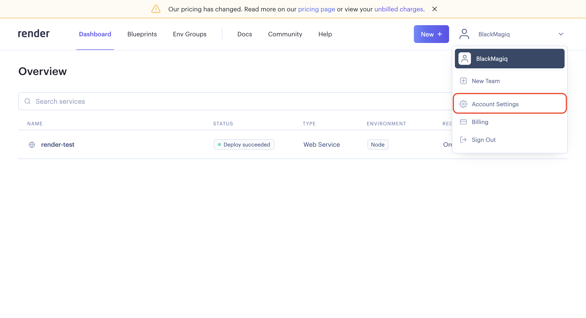
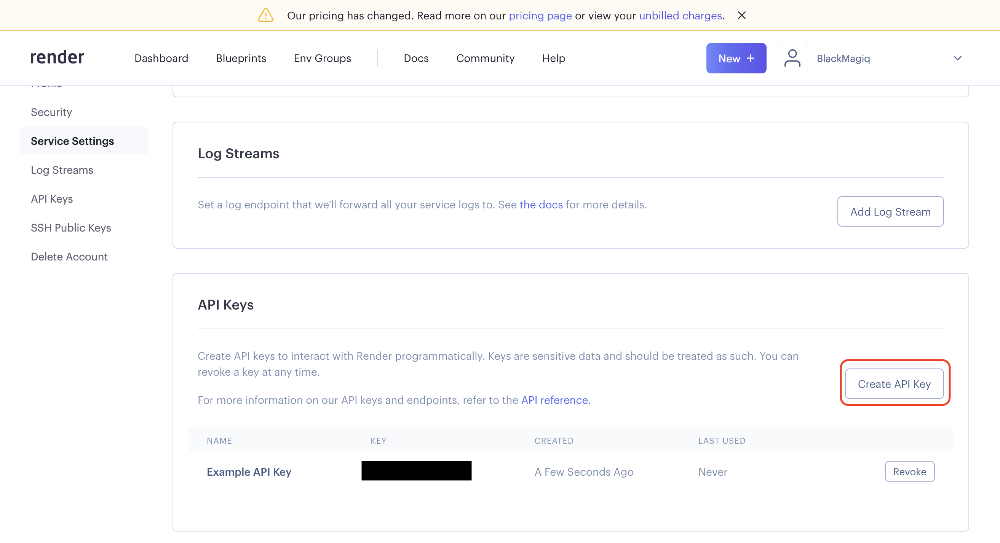
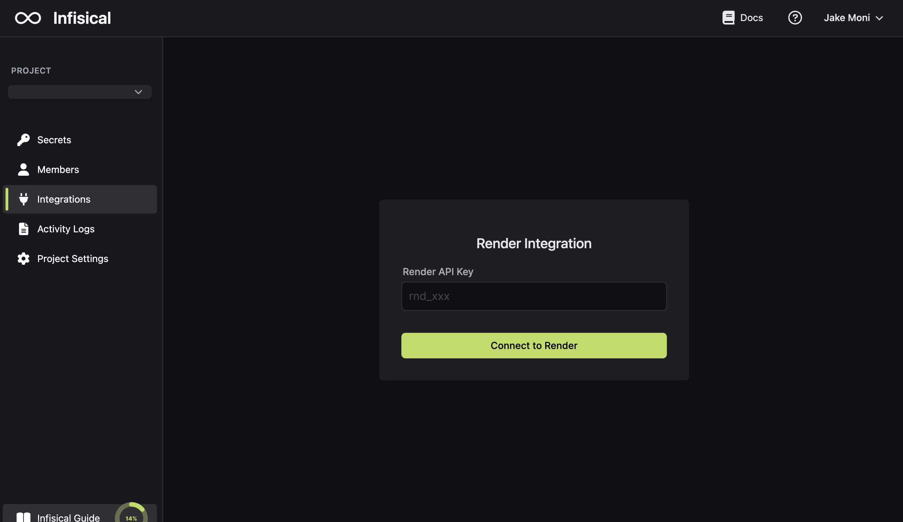
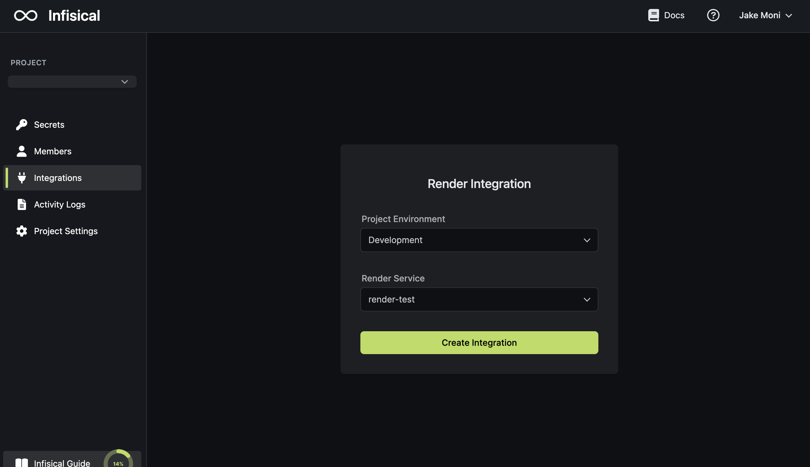
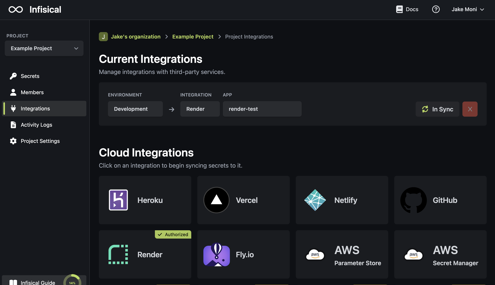

Prerequisites:

- Set up and add envars to [Infisical Cloud](https://app.infisical.com)

<Steps>
  <Step title="Authorize Infisical for Render">
    Obtain a Render API Key in your Render Account Settings > API Keys.

    
    

    Navigate to your project's integrations tab in Infisical.

    

    Press on the Render tile and input your Render API Key to grant Infisical access to your Render account.

    

  </Step>
  <Step title="Start integration">
    Select which Infisical environment secrets you want to sync to which Render service and press create integration to start syncing secrets to Render.

    
    
  </Step>
</Steps>