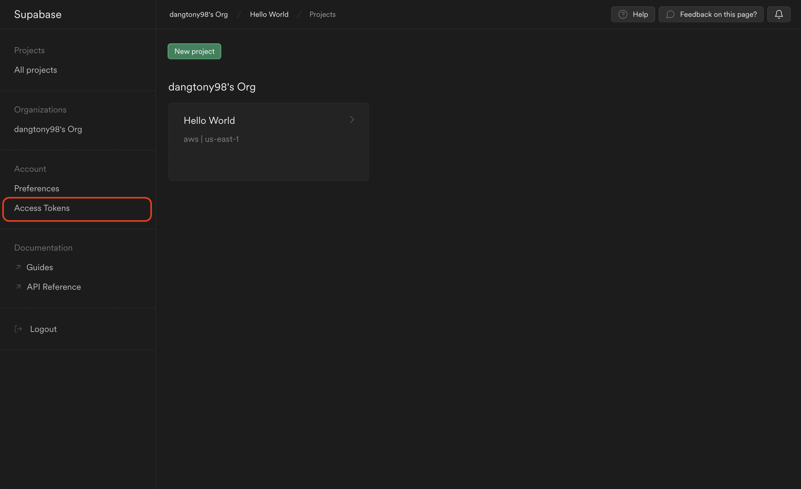
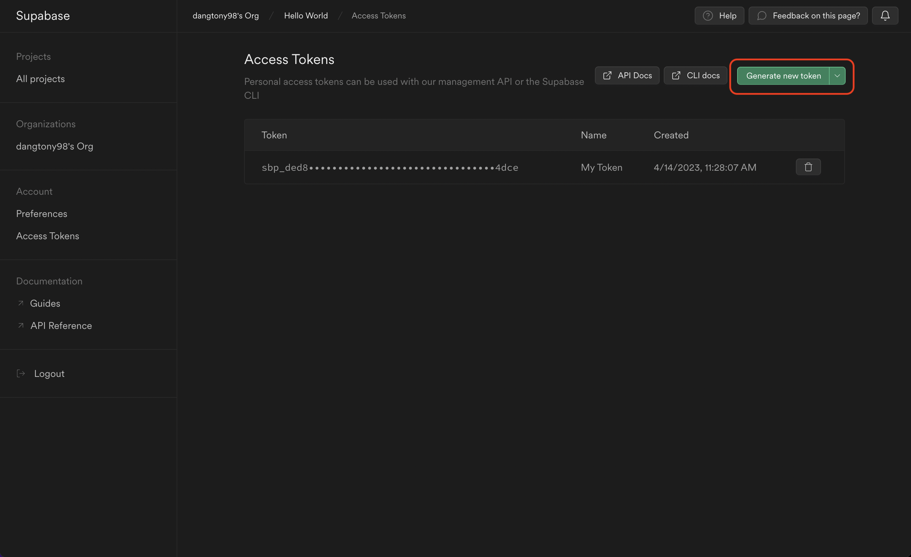
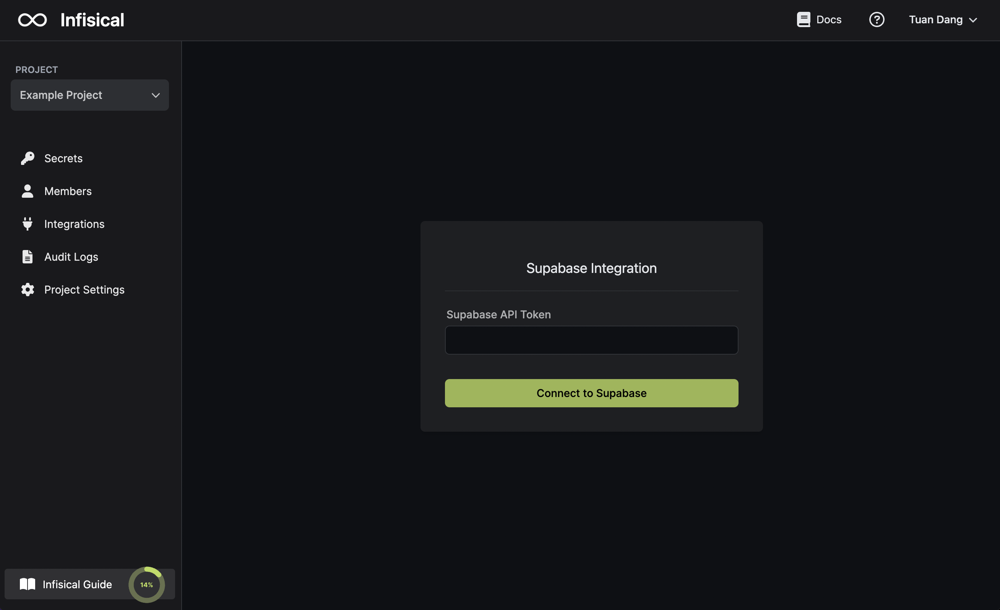
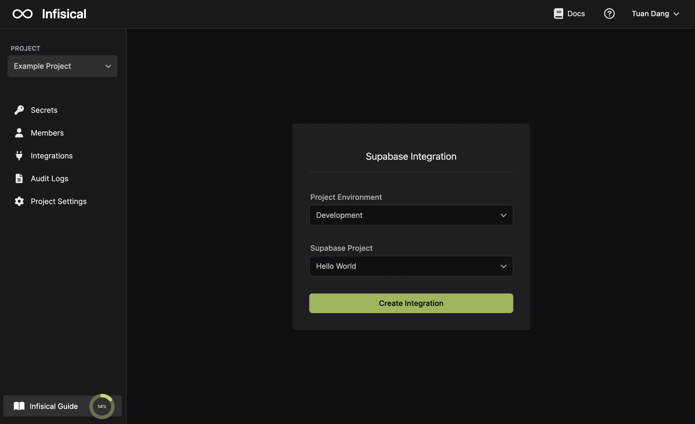
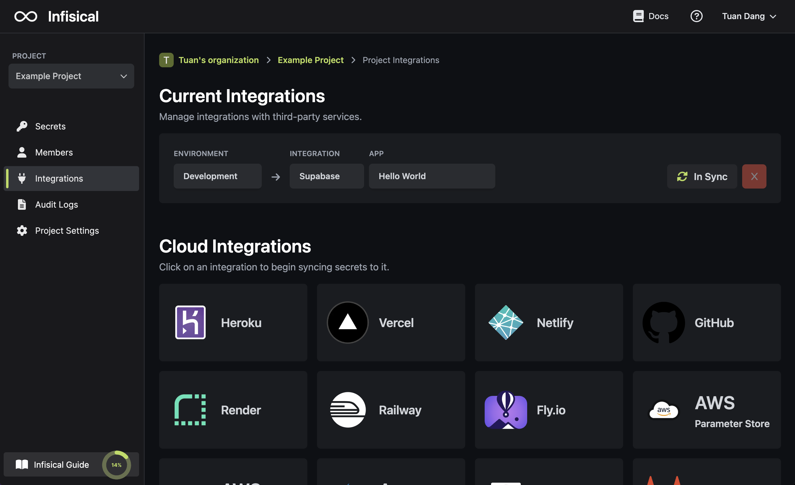

<Note>
    The Supabase integration is useful if your Supabase project uses sensitive-information such as [environment variables in edge functions](https://supabase.com/docs/guides/functions/secrets).
    
    Synced envars can be accessed in edge functions using Deno's built-in handler: `Deno.env.get(MY_SECRET_NAME)`.
</Note>

Prerequisites:

- Have an account and project set up at [Supabase](https://supabase.com/)
- Set up and add envars to [Infisical Cloud](https://app.infisical.com)

<Steps>
  <Step title="Authorize Infisical for Supabase">
    Obtain a Supabase Access Token in your Supabase [Account > Access Tokens](https://app.supabase.com/account/tokens).
    
    
    
    Navigate to your project's integrations tab in Infisical.

    
    
    Press on the Supabase tile and input your Supabase Access Token to grant Infisical access to your Supabase account.

    

  </Step>
  <Step title="Start integration">
    Select which Infisical environment secrets you want to sync to which Supabase project. Lastly, press create integration to start syncing secrets to Supabase.

    

    
  </Step>
</Steps>
