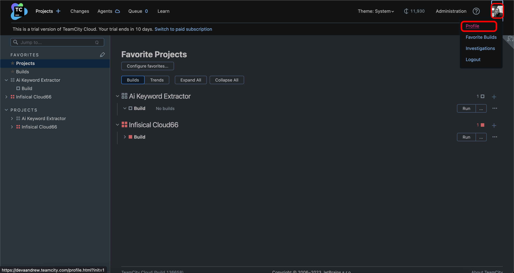
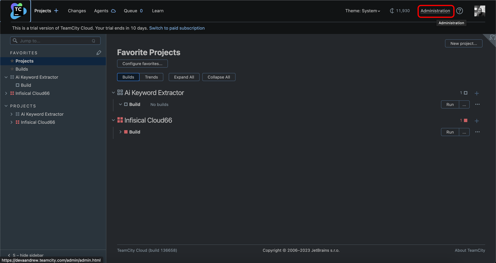
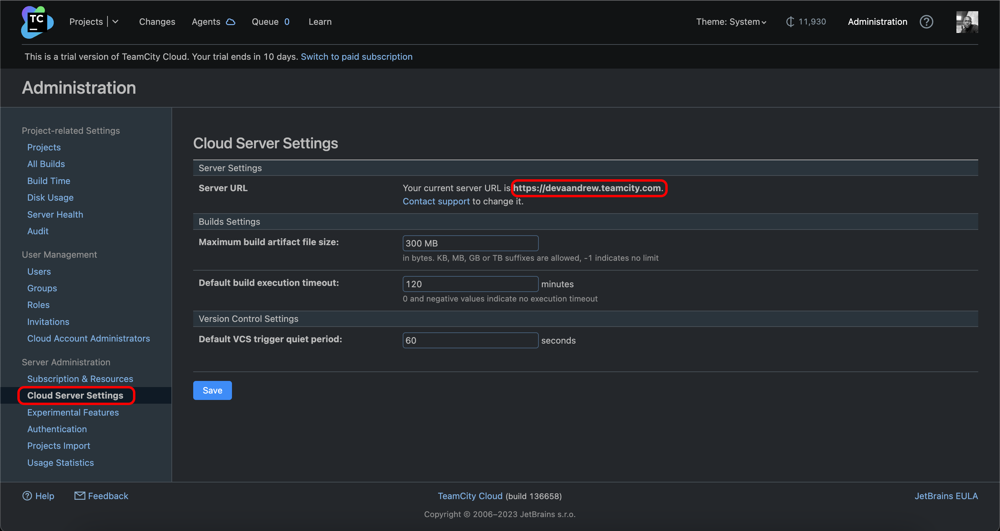
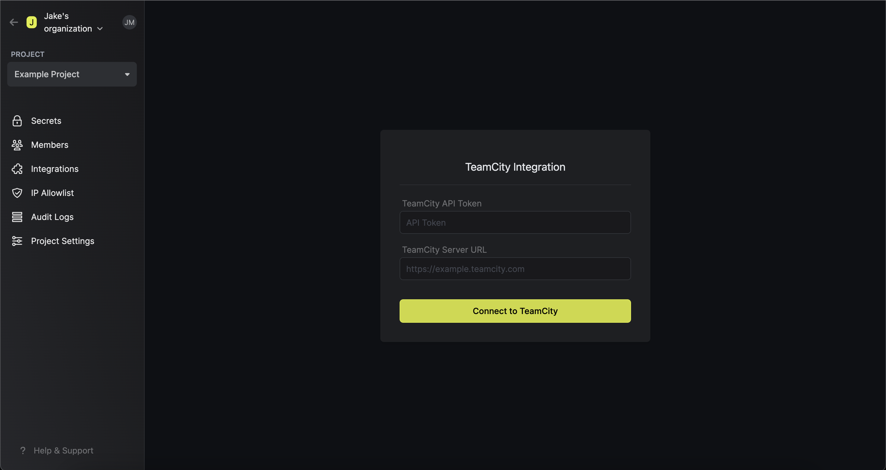
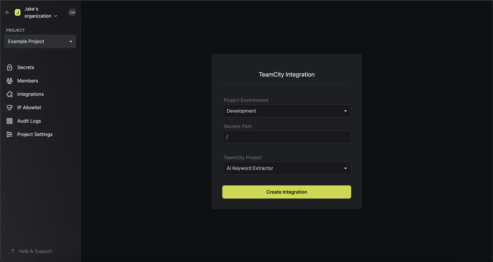
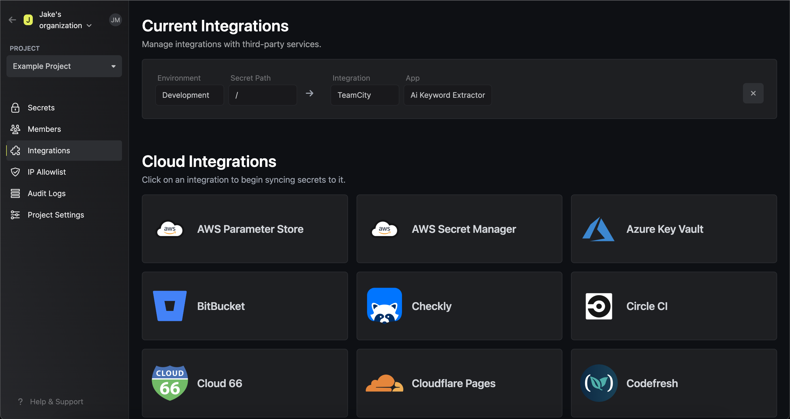

Prerequisites:

- Set up and add envars to [Infisical Cloud](https://app.infisical.com)

## Navigate to your project's integrations tab

## Enter your TeamCity API Token and Server URL

Obtain a TeamCity API Token in Profile > Access Tokens

Obtain your TeamCity Server URL in Administration > Cloud Server Settings > Server URL

Press on the TeamCity tile and input your TeamCity API Token and Server URL to grant Infisical access to your TeamCity account.

<Info>
  If this is your project's first cloud integration, then you'll have to grant
  Infisical access to your project's environment variables. Although this step
  breaks E2EE, it's necessary for Infisical to sync the environment variables to
  the cloud platform.
</Info>

## Start integration

Select which Infisical environment secrets, you want to sync to which TeamCity project and press create integration to start syncing secrets to TeamCity.

