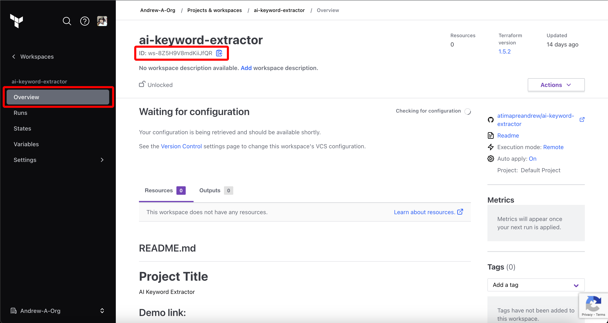
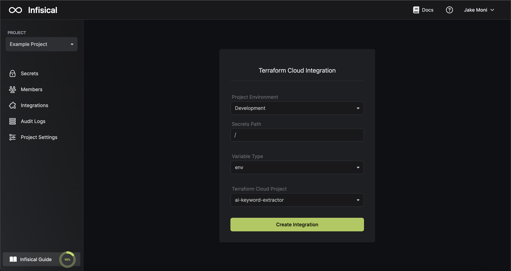

Prerequisites:

- Set up and add envars to [Infisical Cloud](https://app.infisical.com)

## Navigate to your project's integrations tab

## Enter your Terraform Cloud API Token and Workspace Id

Obtain a Terraform Cloud API Token in User Settings > Tokens

Obtain your Terraform Cloud Workspace Id in Projects & Workspaces > Workspace > ID

Press on the Terraform Cloud tile and input your Terraform Cloud API Token and Workspace Id to grant Infisical access to your Terraform Cloud account.

<Info>
  If this is your project's first cloud integration, then you'll have to grant
  Infisical access to your project's environment variables. Although this step
  breaks E2EE, it's necessary for Infisical to sync the environment variables to
  the cloud platform.
</Info>

## Start integration

Select which Infisical environment secrets and Terraform Cloud variable type you want to sync to which Terraform Cloud workspace/project and press create integration to start syncing secrets to Terraform Cloud.

