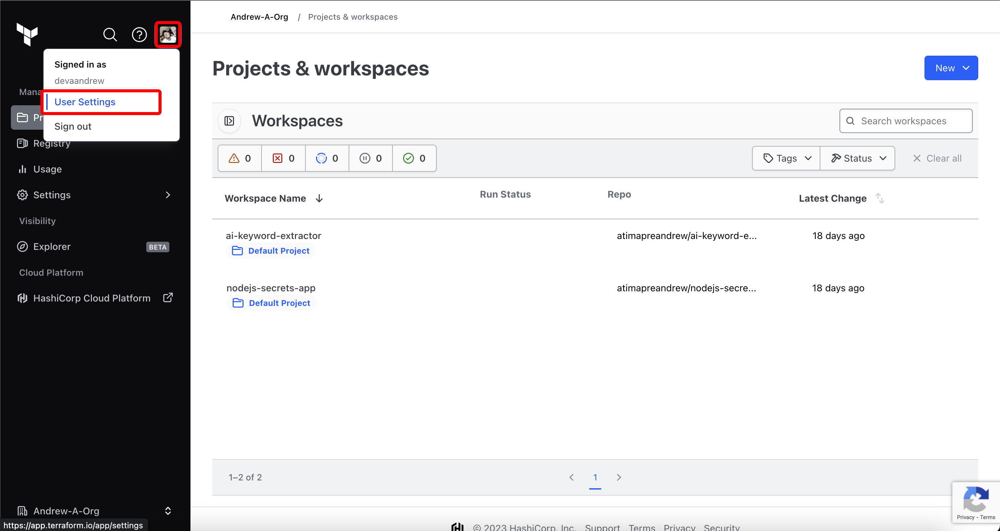
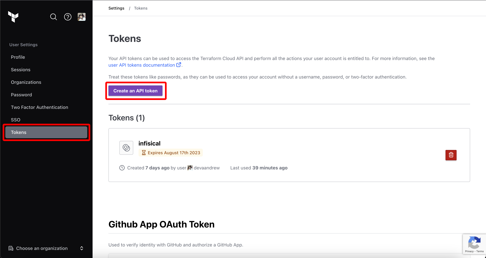
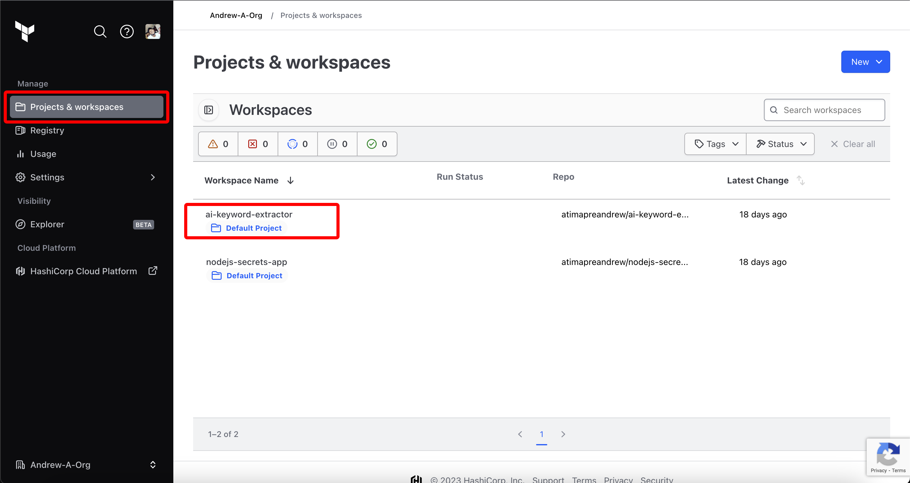
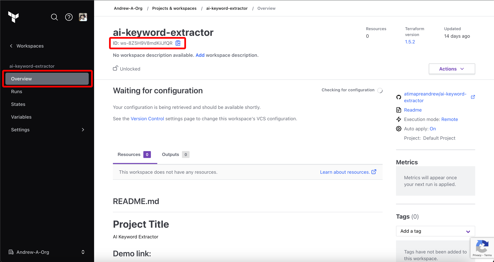
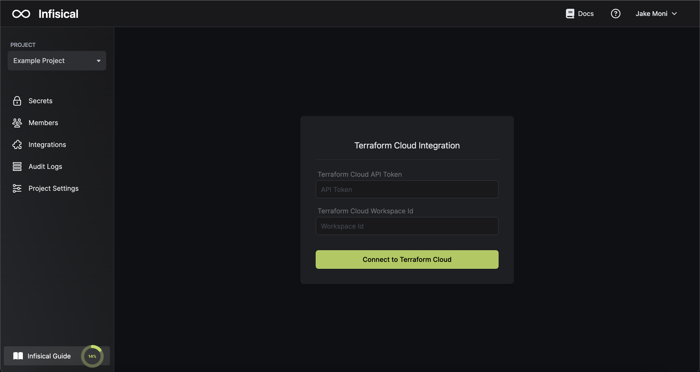
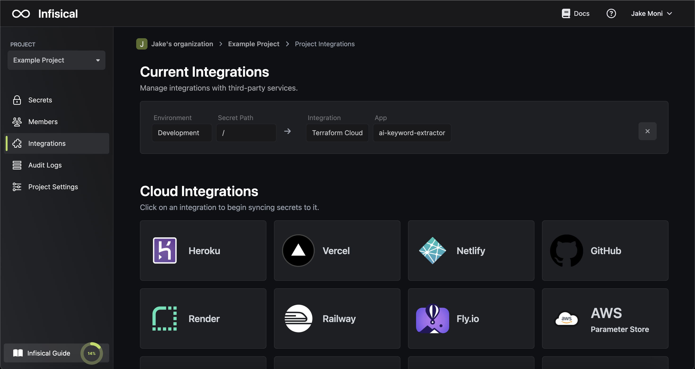

Prerequisites:

- Set up and add envars to [Infisical Cloud](https://app.infisical.com)

<Steps>
  <Step title="Authorize Infisical for Terraform Cloud">
    Obtain a Terraform Cloud API Token in User Settings > Tokens

    
    

    Obtain your Terraform Cloud Workspace Id in Projects & Workspaces > Workspace > ID

    
    

    Navigate to your project's integrations tab in Infisical.

    

    Press on the Terraform Cloud tile and input your Terraform Cloud API Token and Workspace Id to grant Infisical access to your Terraform Cloud account.

    

  </Step>
  <Step title="Start integration">
    Select which Infisical environment secrets and Terraform Cloud variable type you want to sync to which Terraform Cloud workspace/project and press create integration to start syncing secrets to Terraform Cloud.

    
    
  </Step>
</Steps>
