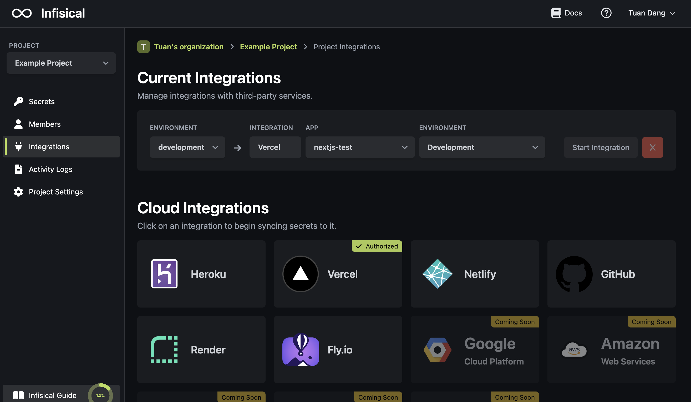

Prerequisites:

- Set up and add envars to [Infisical Cloud](https://app.infisical.com)

## Navigate to your project's integrations tab

## Authorize Infisical for Vercel

Press on the Vercel tile and grant Infisical access to your Vercel account.

## Start integration

Select which Infisical environment secrets you want to sync to which Vercel app and environment. Lastly, press start integration to start syncing secrets to Vercel.

