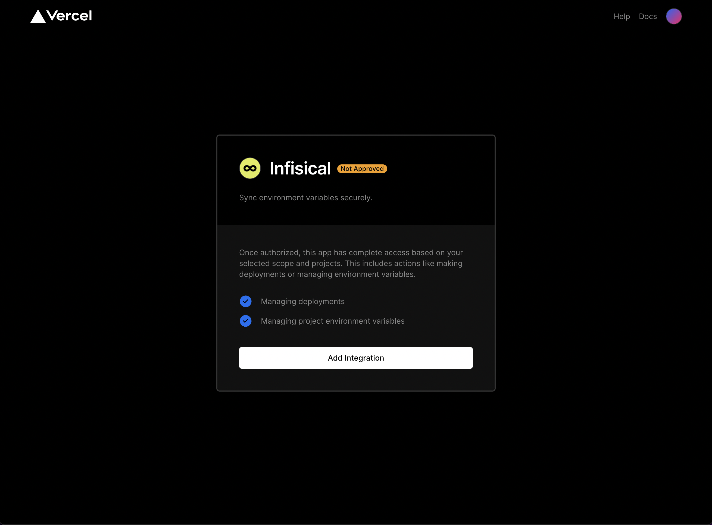
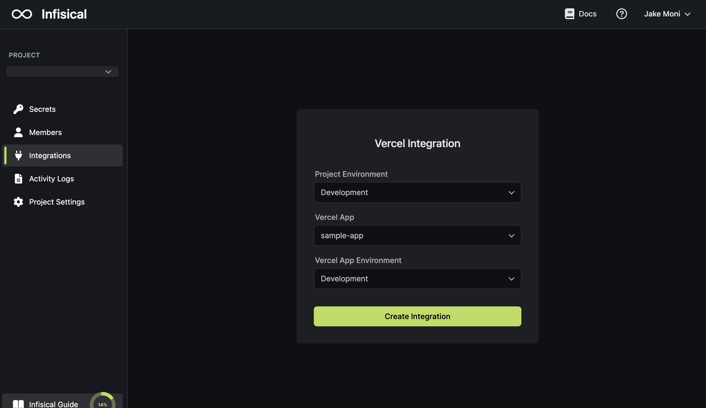
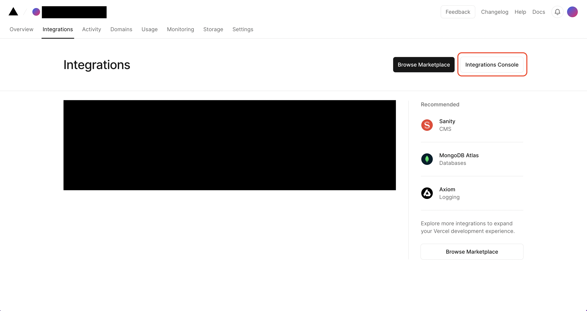
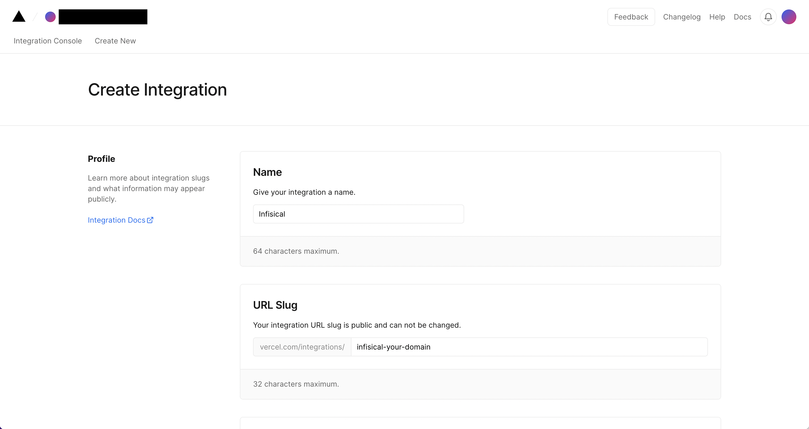
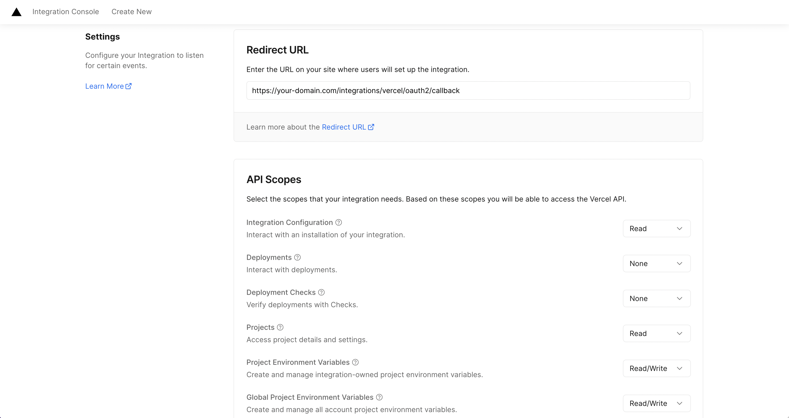
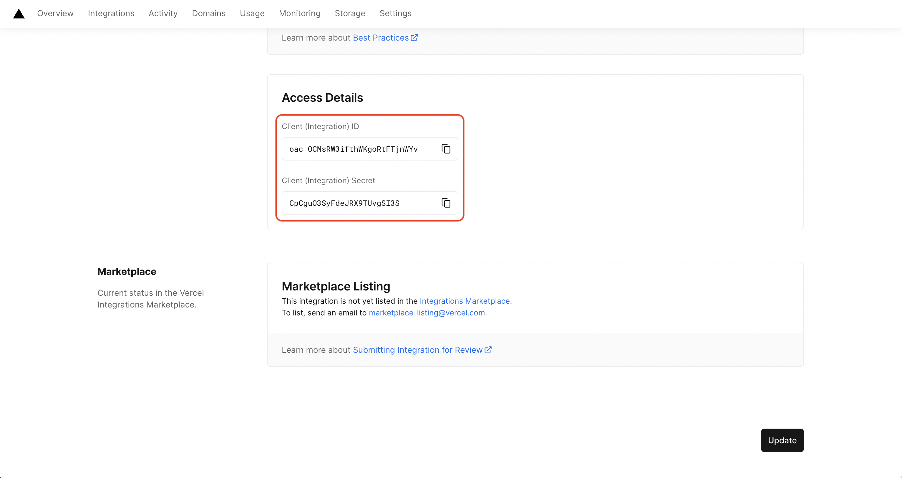

<Tabs>
  <Tab title="Usage">
    Prerequisites:
    - Set up and add envars to [Infisical Cloud](https://app.infisical.com)

    <Steps>
      <Step title="Authorize Infisical for Vercel">
        Navigate to your project's integrations tab in Infisical.

        

        Press on the Vercel tile and grant Infisical access to your Vercel account.

        
      </Step>
      <Step title="Start integration">
        Select which Infisical environment secrets you want to sync to which Vercel app and environment. Lastly, press create integration to start syncing secrets to Vercel.

        
        

        <Info>
          Infisical syncs every envar to Vercel with type `encrypted` unless an existing
          envar with the same name in Vercel exists with a different type. Note that
          Infisical will not be able to update Vercel envars with type `sensitive` since
          they can only be decrypted and modified by Vercel's deployment systems.
        </Info>

        <Warning>
          The following environment variable names are reserved by Vercel and cannot be
          synced: `AWS_SECRET_KEY`, `AWS_EXECUTION_ENV`, `AWS_LAMBDA_LOG_GROUP_NAME`,
          `AWS_LAMBDA_LOG_STREAM_NAME`, `AWS_LAMBDA_FUNCTION_NAME`,
          `AWS_LAMBDA_FUNCTION_MEMORY_SIZE`, `AWS_LAMBDA_FUNCTION_VERSION`,
          `NOW_REGION`, `TZ`, `LAMBDA_TASK_ROOT`, `LAMBDA_RUNTIME_DIR`,
          `AWS_ACCESS_KEY_ID`, `AWS_SECRET_ACCESS_KEY`, `AWS_SESSION_TOKEN`,
          `AWS_REGION`, and `AWS_DEFAULT_REGION`.
        </Warning>
      </Step>
    </Steps>
  </Tab>
  <Tab title="Self-Hosted Setup">
    Using the Vercel integration on a self-hosted instance of Infisical requires configuring an integration in Vercel.
    and registering your instance with it.
    
    <Steps>
      <Step title="Create an integration in Vercel">
        Navigate to Integrations > Integration Console to create a new integration.
  
         
         
        
        Create the application. As part of the form, set a **URL Slug** to a unique slug like `infisical-your-domain` and keep it handy. Also, set **Redirect URL** to `https://your-domain.com/integrations/vercel/oauth2/callback`. Lastly,
        be sure to set the API Scopes according to the second screenshot below.
      
         
         
      </Step>
      <Step title="Add your Vercel integration credentials and information to Infisical">
        Obtain the **Client (Integration) ID** and **Client (Integration) Secret** as well as the **URL Slug** from earlier for your Vercel integration.

         
      
        Back in your Infisical instance, add three new environment variables for the credentials of your Vercel integration.

        - `CLIENT_ID_VERCEL`: The **Client (Integration) ID** of your Vercel integration.
        - `CLIENT_SECRET_VERCEL`: The **Client (Integration) Secret** of your Vercel integration.
        - `CLIENT_SLUG_VERCEL`: The **URL Slug** of your Vercel integration.
        
        Once added, restart your Infisical instance and use the Vercel integration.
      </Step>
    </Steps>
  </Tab>
</Tabs>

