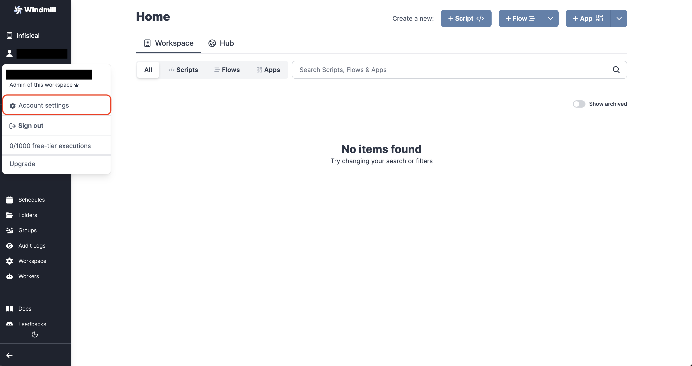
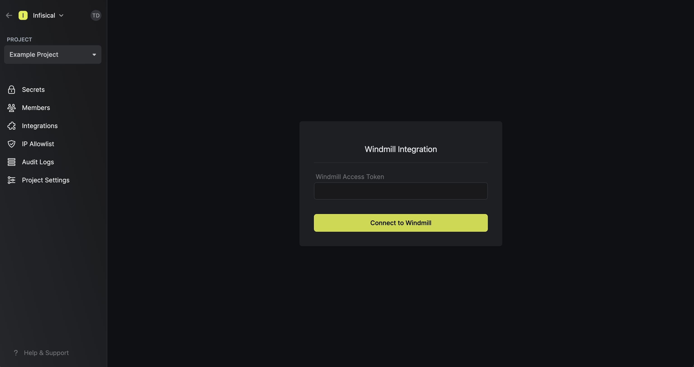

Prerequisites:

- Set up and add envars to [Infisical Cloud](https://app.infisical.com)

## Navigate to your project's integrations tab

## Enter your Windmill Access Token

Obtain a Windmill access token in Access Tokens

Press on the Windmill tile and input your Windmill access token to grant Infisical access to your Windmill account.

<Info>
  If this is your project's first cloud integration, then you'll have to grant
  Infisical access to your project's environment variables. Although this step
  breaks E2EE, it's necessary for Infisical to sync the environment variables to
  the cloud platform.
</Info>

## Start integration

Select which Infisical environment secrets you want to sync to which Windmill workspace and press create integration to start syncing secrets to Windmill.

<Warning>
  Secrets synced to Windmill are subject to the [ownership path
  prefix](https://www.windmill.dev/docs/core_concepts/roles_and_permissions)
  convention of Windmill. Accordingly, all secrets must be prefixed with either
  `u/` or `f/` for user-based and folder-based secret along with the name of the
  secret. Put differently, you must use the full path of the secret as its name
  in Infisical to be considered valid such as `u/user/FOO/BAR`.
</Warning>
