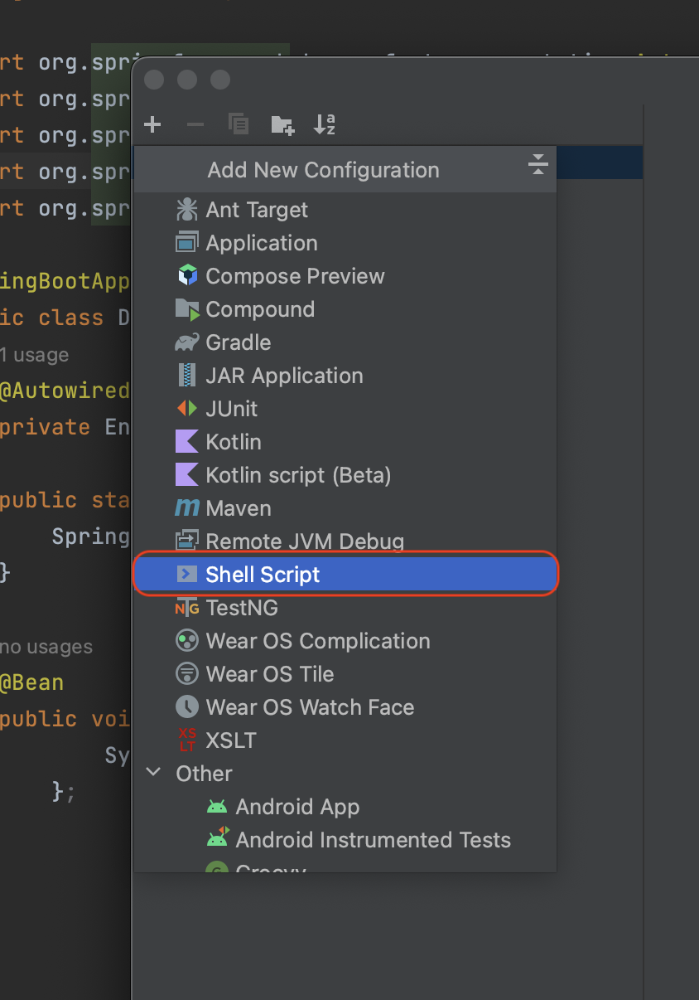

Prerequisites:

- Set up and add your environment variables to [Infisical Cloud](https://app.infisical.com)
- [Install the CLI](/cli/overview)

## Initialize Infisical 
In order for Infisical to know which secrets to fetch, you'll need to first initialize Infisical at the root of your project. 

```bash
# navigate to the root of your of your project 
cd /path/to/project

# then initialize Infisical
infisical init
```


## Start your application with Maven wrapper
To pass in Infisical secrets into your application, we will utilize the Infisical CLI to inject the secrets into the Maven wrapper executable, which is used to launch your application. 
The Maven wrapper executable should already be present in the root directory of your project.

```bash 
infisical run -- ./mvnw spring-boot:run --quiet
```

#### Accessing injected secrets 
```java example.java
  ...
  import org.springframework.core.env.Environment;

  @SpringBootApplication
  public class DemoApplication {
    @Autowired
    private Environment env;

    @Bean
    public void someMethod() {
        System.out.println(env.getProperty("SOME_SECRET_NAME"));
      };
  }
```


## Debugging with secrets 
During the process of debugging your code, it may be necessary to have certain environment variables available. To inject these variables for the purpose of debugging, please follow the instructions provided below.
Note that these instructions are currently only available for IntelliJ.

**Step 1:** On the main tool bar, choose Edit Configuration


**Step 2:** Click the plus icon


**Step 3:** Select Shell Script



**Step 4:** Choose Script Text and then paste in the command below.


```
infisical run -- ./mvnw spring-boot:run -Dspring-boot.run.jvmArguments="-Xdebug -Xrunjdwp:transport=dt_socket,server=y,suspend=n,address=*:5005"
```

**Step 5:** When you need to run a block of code in debug mode, select the Infisical script


