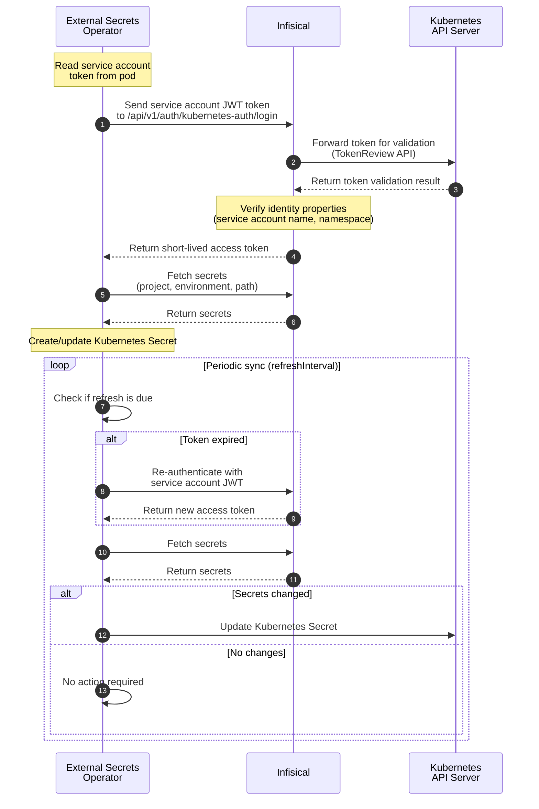

The [External Secrets Operator](https://external-secrets.io/) (ESO) is a Kubernetes operator that integrates external secret management systems with Kubernetes. It reads secrets from external APIs — such as Infisical — and automatically syncs them into [Kubernetes Secrets](https://kubernetes.io/docs/concepts/configuration/secret/), keeping them up to date on a configurable refresh interval.

Instead of using Infisical's native [Kubernetes Operator](/integrations/platforms/kubernetes/overview) to manage secrets, you can configure ESO as an alternative that leverages the broader ESO ecosystem and its [provider model](https://external-secrets.io/latest/provider/infisical/). This guide walks through setting up ESO to authenticate with Infisical using [Kubernetes Auth](/documentation/platform/identities/kubernetes-auth), allowing your workloads to access secrets without storing long-lived credentials.

The short video below provides a guided overview of setting up the External Secrets Operator with Infisical, helping you build the right mental model before diving into the diagram and setup steps.

<div style={{ position: "relative", paddingBottom: "56.25%", height: 0, overflow: "hidden", maxWidth: "100%" }}>
  <iframe src="https://www.youtube.com/embed/Wnh9mF_BpWo" title="YouTube video player" style={{ position: "absolute", top: 0, left: 0, width: "100%", height: "100%", border: 0 }} allow="accelerometer; autoplay; clipboard-write; encrypted-media; gyroscope; picture-in-picture; web-share" allowfullscreen />
</div>

## Diagram

The following sequence diagram illustrates the authentication and secret sync workflow when using the External Secrets Operator with Infisical via Kubernetes Auth.



## Prerequisites

Before you begin, ensure you have:

- A Kubernetes cluster (v1.19+) with `kubectl` configured
- Helm v3 installed
- An [Infisical account](https://app.infisical.com) with a [project](/documentation/platform/project) containing the secrets you want to sync

## Guide

In the following steps, we explore an end-to-end workflow for syncing secrets from Infisical into Kubernetes using the External Secrets Operator with Kubernetes Auth.

<Steps>
  <Step title="Install the External Secrets Operator">
    Install ESO in your cluster using Helm:

    ```bash
    helm repo add external-secrets https://charts.external-secrets.io
    helm repo update

    helm install external-secrets external-secrets/external-secrets \
      --namespace external-secrets \
      --create-namespace \
      --set installCRDs=true
    ```

    Verify the installation:

    ```bash
    kubectl get pods -n external-secrets
    ```

    You should see the external-secrets pods running.
  </Step>

  <Step title="Obtain a token reviewer JWT">
    Infisical validates service account tokens via the Kubernetes [TokenReview API](https://kubernetes.io/docs/reference/kubernetes-api/authentication-resources/token-review-v1/). To enable this, you need a token reviewer JWT that grants Infisical the [`system:auth-delegator`](https://kubernetes.io/docs/reference/access-authn-authz/rbac/#other-component-roles) ClusterRole.

    The [Kubernetes Auth guide](/documentation/platform/identities/kubernetes-auth#guide) covers three options for obtaining this token: a dedicated reviewer service account, using the client JWT as the reviewer, or using a gateway as the reviewer. Choose the option that best fits your environment.

    If you prefer a dedicated reviewer service account, create the following resources:

    ```yaml
    # rbac-setup.yaml
    ---
    apiVersion: v1
    kind: ServiceAccount
    metadata:
      name: infisical-token-reviewer
      namespace: default
    ---
    apiVersion: rbac.authorization.k8s.io/v1
    kind: ClusterRoleBinding
    metadata:
      name: infisical-token-reviewer-binding
    roleRef:
      apiGroup: rbac.authorization.k8s.io
      kind: ClusterRole
      name: system:auth-delegator
    subjects:
      - kind: ServiceAccount
        name: infisical-token-reviewer
        namespace: default
    ---
    apiVersion: v1
    kind: Secret
    type: kubernetes.io/service-account-token
    metadata:
      name: infisical-token-reviewer-token
      namespace: default
      annotations:
        kubernetes.io/service-account.name: infisical-token-reviewer
    ```

    ```bash
    kubectl apply -f rbac-setup.yaml
    ```

    Retrieve the token reviewer JWT:

    ```bash
    kubectl get secret infisical-token-reviewer-token \
      -n default \
      -o jsonpath='{.data.token}' | base64 --decode
    ```

    Keep this JWT token handy — you will need it when configuring the machine identity in the next step.
  </Step>

  <Step title="Create a machine identity with Kubernetes Auth">
    Next, follow the [Kubernetes Auth guide](/documentation/platform/identities/kubernetes-auth) to create a [machine identity](/documentation/platform/identities/machine-identities) with Kubernetes Auth enabled.

    When configuring the auth method, set:

    - **Kubernetes Host**: Your Kubernetes API server URL (obtain with `kubectl cluster-info`)
    - **Token Reviewer JWT**: The token from the previous step
    - **Allowed Service Account Names**: `external-secrets` (the ESO service account)
    - **Allowed Namespaces**: `external-secrets` (the namespace where ESO is installed)

    After creation, add the identity to the project containing the secrets you want to sync. Navigate to **Project Settings** > **Access Control** > **Machine Identities** and add the identity with at minimum read access to secrets.

    Copy the **Identity ID** — you will need it in the next step.
  </Step>

  <Step title="Store the Identity ID in Kubernetes">
    Create a Kubernetes Secret containing the machine identity ID:

    ```yaml
    # infisical-identity-secret.yaml
    apiVersion: v1
    kind: Secret
    metadata:
      name: infisical-kubernetes-auth
      namespace: external-secrets
    type: Opaque
    stringData:
      identityId: "<your-machine-identity-id>"
    ```

    Replace `<your-machine-identity-id>` with the Identity ID from the previous step.

    ```bash
    kubectl apply -f infisical-identity-secret.yaml
    ```
  </Step>

  <Step title="Create a SecretStore">
    Create a [SecretStore](https://external-secrets.io/latest/api/secretstore/) that configures ESO to authenticate with Infisical using the identity from the previous steps:

    ```yaml
    # secret-store.yaml
    apiVersion: external-secrets.io/v1
    kind: SecretStore
    metadata:
      name: infisical
      namespace: default
    spec:
      provider:
        infisical:
          hostAPI: https://app.infisical.com
          auth:
            kubernetesAuthCredentials:
              identityId:
                key: identityId
                name: infisical-kubernetes-auth
                namespace: external-secrets
          secretsScope:
            projectSlug: your-project-slug
            environmentSlug: dev
            secretsPath: /
            recursive: false
            expandSecretReferences: true
    ```

    Update the following fields:
    - `hostAPI`: Your Infisical instance URL (use `https://app.infisical.com` for [Infisical Cloud](https://app.infisical.com), or your instance URL for [self-hosted](/self-hosting/overview) deployments)
    - `projectSlug`: Your Infisical project slug (found in Project Settings)
    - `environmentSlug`: The [environment](/documentation/platform/project#project-environments) to fetch secrets from (e.g., `dev`, `staging`, `prod`)

    ```bash
    kubectl apply -f secret-store.yaml
    ```

    Verify the SecretStore is ready:

    ```bash
    kubectl get secretstore infisical -n default
    ```

    The status should show `Valid: True`.

    <Note>
      To share the same Infisical configuration across multiple namespaces, use a [ClusterSecretStore](https://external-secrets.io/latest/api/clustersecretstore/) instead. The configuration is identical, but the `kind` is `ClusterSecretStore` and the resource is not namespace-scoped.
    </Note>
  </Step>

  <Step title="Create an ExternalSecret">
    Create an [ExternalSecret](https://external-secrets.io/latest/api/externalsecret/) to sync secrets from Infisical into a Kubernetes Secret:

    ```yaml
    # external-secret.yaml
    apiVersion: external-secrets.io/v1
    kind: ExternalSecret
    metadata:
      name: my-app-secrets
      namespace: default
    spec:
      refreshInterval: 1h
      secretStoreRef:
        kind: SecretStore
        name: infisical
      target:
        name: my-app-secrets
        creationPolicy: Owner
      dataFrom:
        - find:
            name:
              regexp: ".*"
    ```

    To fetch specific secrets instead of all secrets, replace the `dataFrom` block with:

    ```yaml
      data:
        - secretKey: DATABASE_URL
          remoteRef:
            key: DATABASE_URL
        - secretKey: API_KEY
          remoteRef:
            key: API_KEY
    ```

    ```bash
    kubectl apply -f external-secret.yaml
    ```

    Verify the ExternalSecret is syncing:

    ```bash
    kubectl get externalsecret my-app-secrets -n default
    ```

    The status should show `SecretSynced: True`.
  </Step>

  <Step title="Verify the setup">
    Confirm that the Kubernetes Secret was created with your Infisical secrets:

    ```bash
    kubectl get secret my-app-secrets -n default -o jsonpath='{.data}' | jq
    ```

    The secret data contains base64-encoded values. To decode a specific value:

    ```bash
    kubectl get secret my-app-secrets -n default \
      -o jsonpath='{.data.YOUR_SECRET_KEY}' | base64 --decode
    ```
  </Step>
</Steps>

## Troubleshooting

<AccordionGroup>
  <Accordion title="SecretStore shows 'Invalid' status">
    Inspect the SecretStore events for details:

    ```bash
    kubectl describe secretstore infisical -n default
    ```

    Common causes:
    - Incorrect Identity ID in the Kubernetes Secret
    - The [machine identity](/documentation/platform/identities/machine-identities) has not been added to the project
    - Incorrect `projectSlug` or `environmentSlug`
    - Network connectivity issues between your cluster and Infisical
  </Accordion>

  <Accordion title="ExternalSecret not syncing">
    Check the ExternalSecret status and events:

    ```bash
    kubectl describe externalsecret my-app-secrets -n default
    ```

    Ensure the referenced SecretStore is valid:

    ```bash
    kubectl get secretstore infisical -n default
    ```
  </Accordion>

  <Accordion title="Authentication failures">
    Verify that:
    - The ESO service account name matches the **Allowed Service Account Names** configured on the [machine identity](/documentation/platform/identities/kubernetes-auth) in Infisical
    - The ESO namespace matches the **Allowed Namespaces** configured on the machine identity
    - The token reviewer JWT is valid and the associated service account has the `system:auth-delegator` [ClusterRole](https://kubernetes.io/docs/reference/access-authn-authz/rbac/#other-component-roles) binding
    - The Kubernetes API server is reachable from Infisical (relevant for [self-hosted](/self-hosting/overview) deployments)
  </Accordion>
</AccordionGroup>

## Related Documentation

- [Kubernetes Auth](/documentation/platform/identities/kubernetes-auth) — Detailed configuration for Kubernetes-native authentication
- [Machine Identities](/documentation/platform/identities/machine-identities) — Understanding machine identities in Infisical
- [Kubernetes Operator](/integrations/platforms/kubernetes/overview) — Infisical's native Kubernetes operator alternative
- [External Secrets Operator Infisical Provider](https://external-secrets.io/latest/provider/infisical/) — ESO's official Infisical provider documentation
